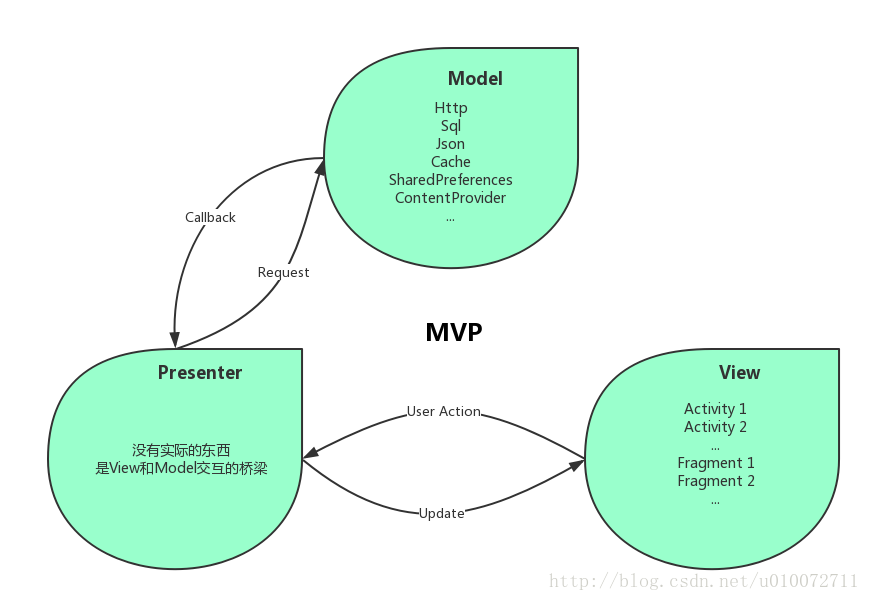
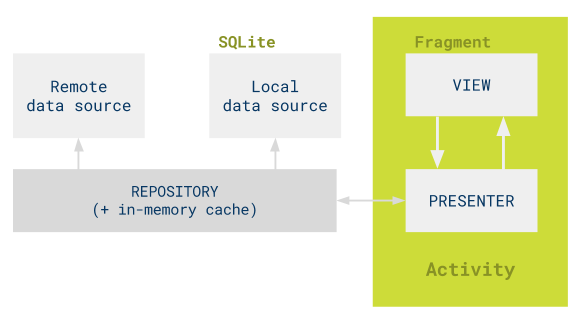

------

# TODO

1. [《Android虚拟机》--内存分配策略](https://www.cnblogs.com/anni-qianqian/p/7683072.html)
2. [Android内存泄漏终极解决篇（下）](https://www.jb51.net/article/77899.htm)
3. [Android NDK开发——C代码回调Java代码callback](https://blog.csdn.net/gnnulzy/article/details/78031311)
4. [Android Hook框架Xposed详解](https://www.cnblogs.com/lkislam/p/4859959.html)

----

## Android UI组件


### RecyclerView

参考链接

1.[RecyclerView 必知必会](https://mp.weixin.qq.com/s/CzrKotyupXbYY6EY2HP_dA)


## 设计模式

### 单例模式 Singleton

#### 单例模式的特点

**优点**

单例模式在内存中只有一个实例

1. 对于对象需要频繁地创建和销毁时，可以减少内存开支，减少系统性能开销
2. 可以避免对资源的多重占用
3. 单例模式可以在系统设置全局访问点，优化和共享资源的访问。

**缺点**

1. 一般没有接口 扩展困难，若要扩展内需要修改代码。 （这与开闭原则时对立的）
2. 单例模式如果持有Contex 那么容易引发内存泄漏，此时要注意传递给单例对象最好是 ApplicationContext。


#### 单例模式设计的时候要考虑的问题

1. 保证只有一个实例  使构造函数为private
2. 同步。  保证并发调用，返回的是同一个实例
3. 实例延时创建，尽可能使用的时候才进行创建。
4. 反序列化时的情况


#### 单例模式实现的几种方式

##### 1饿汉模式

```java
//饿汉式
public class Singleton1 {
    private final static Singleton1 INSTANCE =new Singleton1();

    private Singleton1(){

    }

    public Singleton1 getInstance(){
        return INSTANCE;
    }

}
```


存在的问题： 在类加载时就完成了初始化，所以类加载比较慢，但获取对象的速度快 


##### 2.懒汉模式

```java
//懒汉式
public class Singleton2 {

    private Singleton2 instance;

    public synchronized Singleton2 getInstance(){
        if(instance == null){
            instance =  new Singleton2();
        }
        return instance;
    }

    private  Singleton2(){

    }
}

```

存在的问题：   同步开销比较大

##### 3.DCL模式

```java

public class SingletonDCL {

    private SingletonDCL instance;

    private SingletonDCL(){}

    public SingletonDCL getInstance(){

        if(instance == null){
            synchronized (SingletonDCL.class){
                if(instance == null){
                    instance =  new SingletonDCL();
                }
            }
        }

        return instance;

    }
}
```


##### 4.静态内部类方式实现

```java
public class Singleton4 {

    private static class SingletonHolder{
        final static Singleton4 instance =  new Singleton4();
    }

    private Singleton4(){
    }

    public Singleton4 getInstance(){
        return SingletonHolder.instance;
    }

    // 防止反序列化获取多个对象的漏洞。
    // 无论是实现Serializable接口，或是Externalizable接口，当从I/O流中读取对象时，readResolve()方法都会被调用到。
    // 实际上就是用readResolve()中返回的对象直接替换在反序列化过程中创建的对象。
    private Object readResolve() throws ObjectStreamException {
        return SingletonHolder.instance;
    }

}

```


这种方式同样利用了classloder的机制来保证初始化instance时只有一个线程，它跟第三种和第四种方式不同的是（很细微的差别）：第三种和第四种方式是只要Singleton类被装载了，那么instance就会被实例化（没有达到lazy loading效果），而这种方式是Singleton类被装载了，instance不一定被初始化。因为SingletonHolder类没有被主动使用，只有显示通过调用getInstance方法时，才会显示装载SingletonHolder类，从而实例化instance。 


##### 5.枚举方式

```java
public enum  Singleton5 {
    INSTANCE;
    public void doSth(){

    }
}
```


简单，线程安全，

但是  用法给用class实现的略有不同


##### 6.使用容器map实现

```java
import java.util.HashMap;
import java.util.Map;


public class SingletonManager {
    private static Map<String,Object>  objectMap = new HashMap<String,Object>();

    private SingletonManager(){}

    public static void registerService(String key,Object instance){
        if(!objectMap.containsKey(key)){
            objectMap.put(key,instance);
        }
    }

    public static  Object getService(String key){
        return objectMap.get(key);
    }
}
```

看使用场景

#### 总结

平常推荐DCL模式  静态内部类模式


#### 参考链接

1. [单例模式的漏洞，通过反射和序列化、反序列化来破解单例，以及如何避免这些漏洞](https://www.cnblogs.com/shangxinfeng/p/6754345.html)


# Android 开源项目


https://yalantis.com/blog/how-we-used-micro-transitions-for-smooth-android-to-do-list-animations/

[安利一波androidView视觉开源控件 每个都值得学习哦](https://mp.weixin.qq.com/s/a2BfSY_VHmMCfquoD_gG9Q)


### ToDoList


1. [ToDoList菜单](https://github.com/Yalantis/ToDoList)


### **SmoothProgressBar**  

参考链接

1. [SmoothProgressBar](https://github.com/castorflex/SmoothProgressBar)


### 个人页面的设置


https://github.com/lygttpod/SuperTextView


# Android进阶


内存泄漏的几种常见型式


### Snackbar

https://www.jianshu.com/p/487dca941e15

### SwipeRefreshLayout及其扩展使用

Google官方Widget,实现下拉刷新的效果。该控件继承自ViewGroup在support-v4兼容包下，需support library的版本到19.1以上。 

#### 特点

- 在竖直滑动时想要刷新页面可以用SwipeRefreshLayout来实现。它通过设置OnRefreshListener来监听界面的滑动从而实现刷新。也可以通过一些方法来设置SwipeRefreshLayout是否可以刷新。如：setRefreshing(true)，展开刷新动画。setRefreshing(false)，取消刷新动画。setEnable(false)下拉刷新将不可用。
- 使用这个布局要想达到刷新的目的，需要在这个布局里包裹可以滑动的子控件，如ListView等，并且只能有一个子控件。


```java
/**
 * The SwipeRefreshLayout should be used whenever the user can refresh the
 * contents of a view via a vertical swipe gesture. The activity that
 * instantiates this view should add an OnRefreshListener to be notified
 * whenever the swipe to refresh gesture is completed. The SwipeRefreshLayout
 * will notify the listener each and every time the gesture is completed again;
 * the listener is responsible for correctly determining when to actually
 * initiate a refresh of its content. If the listener determines there should
 * not be a refresh, it must call setRefreshing(false) to cancel any visual
 * indication of a refresh. If an activity wishes to show just the progress
 * animation, it should call setRefreshing(true). To disable the gesture and
 * progress animation, call setEnabled(false) on the view.
 * <p>
 * This layout should be made the parent of the view that will be refreshed as a
 * result of the gesture and can only support one direct child. This view will
 * also be made the target of the gesture and will be forced to match both the
 * width and the height supplied in this layout. The SwipeRefreshLayout does not
 * provide accessibility events; instead, a menu item must be provided to allow
 * refresh of the content wherever this gesture is used.
 * </p>
 */
```

#### 主要方法


- isRefreshing() 
   判断当前的状态是否是刷新状态。
- setColorSchemeResources(int… colorResIds) 
   设置下拉进度条的颜色主题，参数为可变参数，并且是资源id，最多设置四种不同的颜色，每转一圈就显示一种颜色。
- setOnRefreshListener(SwipeRefreshLayout.OnRefreshListener listener) 
   设置监听，需要重写onRefresh()方法，顶部下拉时会调用这个方法，在里面实现请求数据的逻辑，设置下拉进度条消失等等。
- setProgressBackgroundColorSchemeResource(int colorRes) 
   设置下拉进度条的背景颜色，默认白色。
- setRefreshing(boolean refreshing) 
   设置刷新状态，true表示正在刷新，false表示取消刷新。


#### 参考链接

1. [SwipeRefreshLayout及其扩展使用](https://blog.csdn.net/huaxun66/article/details/74614792)


### 0x03 Toolbar的使用


```java
public class MainActivity extends AppCompatActivity {
 
    @Override
    protected void onCreate(Bundle savedInstanceState) {
        super.onCreate(savedInstanceState);
        setContentView(R.layout.activity_main);
 
        Toolbar toolbar = (Toolbar) findViewById(R.id.toolbar);
 
        // Logo
        toolbar.setLogo(R.mipmap.push_4);
 
        // 主标题
        toolbar.setTitle("Title");
 
        // 副标题
        toolbar.setSubtitle("Sub Title");
 
        //设置toolbar
        setSupportActionBar(toolbar);
 
        //左边的小箭头（注意需要在setSupportActionBar(toolbar)之后才有效果）
        toolbar.setNavigationIcon(R.mipmap.back);
 
        //菜单点击事件（注意需要在setSupportActionBar(toolbar)之后才有效果）
        toolbar.setOnMenuItemClickListener(onMenuItemClick);
    }
}
```


参考链接

1. [关于Toolbar你需要知道的各种sao姿势。（操作篇）](https://www.jianshu.com/p/42400092f848)
2. [Toolbar的简单使用](https://blog.csdn.net/monalisatearr/article/details/78415585)


### 0x02 Fragment、FragmentTransaction


#### android.support.v4.app.Fragment和android.app.Fragment区别

1. 最低支持版本不同
    android.app.Fragment 兼容的最低版本是android:minSdkVersion="11" 即3.0版
    android.support.v4.app.Fragment 兼容的最低版本是android:minSdkVersion="4" 即1.6版

2. fragment android.support.v4.app.Fragment 需要引入包android-support-v4.jar 

3.  FragmentManager 在Activity中获取的方法不同 

   android.app.Fragment   需继承Activity ，使用getFragmentManager() 

   android.support.v4.app.Fragment   需要继承android.support.v4.app.FragmentActivity  使用getSupportFragmentManager ()

4. v4.fragment使用<fragment>标签的时候就 ,Activity 需继承 FragmentActivity  

    

   

    

#### Android Support兼容包 **support-v4**  v7 v13的应用场景

##### **support-v4** 

用在API lever 4(即Android 1.6)或者更高版本之上。它包含了相对更多的内容，而且用的更为广泛，例如：Fragment，NotificationCompat，LoadBroadcastManager，ViewPager，PageTabAtrip，Loader，FileProvider 等
 Gradle引用方法：

```
compile 'com.android.support:support-v4:21.0.3'
```

##### **support-v7**  

 这个包是为了考虑API level 7(即Android 2.1)及以上版本而设计的，但是v7是要依赖v4这个包的，v7支持了Action Bar以及一些Theme的兼容。  

Gradle引用方法: 

```
compile 'com.android.support:appcompat-v7:21.0.3'
```

 

**support-v13** 

这个包的设计是为了API level 13(即Android 3.2)及更高版本的，一般我们都不常用，平板开发中能用到 

 

 

#### 参考链接

1. [Android Fragment动态添加 FragmentTransaction FragmentManager](https://www.cnblogs.com/Claire6649/p/5997632.html)
2. [android.support.v4.app.Fragment和android.app.Fragment区别](https://www.jianshu.com/p/db28adde1c39)


## Todo0x01 MVP模式

Presenter [prɪˈzentər]

#### 1、MVP模式是什么

1. MVP  全称：Model-View-Presenter ；MVP 是从经典的模式MVC演变而来，它们的基本思想有相通的地方；
2. Controller/Presenter负责逻辑的处理，Model提供数据，View负责显示。


#### 2、MVP模式与MVC的比较

**MVC结构示意图**


**MVP结构**





MVC和MVP的**主要区别**

1. **Activity职责不同**，Activity在MVP中是View层，在MVC中是Controller层，这是MVC和MVP很主要的一个区别，可以说Android从MVC转向MVP开发也主要是优化Activity的代码，避免Activity的代码臃肿庞大。 

2. **View层不同**，MVC的View层指的是XML布局文件或者是用Java自定义的View，MVP的View层是Activity或者Fragment。使用传统的MVC，其中的View，对应的是各种Layout布局文件，但是这些布局文件中并不像Web端那样强大，能做的事情非常有限。MVP的View层Activity在实际项目中，随着逻辑的复杂度越来越大，Activity臃肿的缺点仍然体现出来了，因为Activity中还是充满了大量与View层无关的代码，比如各种事件的处理派发，就如MVC中的那样View层和Controller代码耦合在一起无法自拔。 

3. **控制层不同**，MVC的控制层是Activity，或者是Fragment，Controller对应的是Activity，而Activity中却又具有操作UI的功能，我们在实际的项目中也会有很多UI操作在这一层，也做了很多View中应该做的事情，当然Controller层Activity中也包含Controller应该做的事情，比如各种事件的派发回调，而且在一层中我们会根据事件再去调用Model层操作数据，所以这种MVC的方式在实际项目中，Activity所在的Controller是非常重的，各层次之间的耦合情况也比较严重，不方便单元测试。MVP的控制层是Presenter，里面没有很多的实际东西，主要是做Model和View层的交互。

   **关系链不同**，MVP中Model层与View是没有关系的，彼此不会通讯和操作，Model与View的通讯都是Presenter层来传达的。但是在MVC中，Model层和View是曾在交互的。比如我们自定义的View控件里面肯定是要使用Model的数据的，View也要根据不同的Model数据做出不同的展现！这点尤其是体现在自定义的View中，自定义View需要设置数据，用户操作了自定义控件需要改变数据，View要操作Model怎么办？有人说把Controller传到自定义的View啊，现实是不可能没一个自定义View都去持有Controller的引用，其实在MVP中就不会这么尴尬，接口就可以完成。

   **适用范围不同**，在Android中，MVP和MVC都用自己的适用情况，使用MVP可以更好的解耦三大模块，模块之间比较清晰，也很方便使用MVP来组件化架构整体项目。但是MVC也是有用武之地的，在组件化的Module或者中间件我们可以使用MVC来做，Module或者中间件不会存在很复杂的View层，使用MVC可以更加方便我们实现功能。

   **交互方式不同**，MVP中通讯交互基本都是通过接口的，MVC中的通讯交互很多时候都是实打实的调用对象的方法，简单粗暴！

   **实现方法不同**  ，MVC和MVP的Model几乎一样的，都是处理数据，只要不在Activity或者Fragment中请求数据，其他的所有控制都放在Activity或者Fragment中，这样写就基本是MVC的模式，这样写不麻烦，但是很容易把Activity写出上万行代码。用MVP的时候我们需要写很多View和Presenter接口来实现模块之间的通讯，会增加很多类。


### **网络流行对比段子：**

**（1）相同点：** 
​     **优点：** 
​         1.降低耦合度 
​         2.模块职责划分明显 
​         3.利于测试驱动开发 
​         4.代码复用 
​         5.隐藏数据 
​         6.代码灵活性 
​     **缺点：** 
​             额外的代码复杂度及学习成本。

**（2）不同点：** 
​     **MVP模式：** 
​         1.View不直接与Model交互，而是通过与Presenter交互来与Model间接交互 
​         2.Presenter与View的交互是通过接口来进行的，更有利于添加单元测试 
​         3.通常View与Presenter是一对一的，但复杂的View可能绑定多个Presenter来处理逻辑，业务相似的时候也可以多同个View共享一个Presenter。 
​     **MVC模式：** 
​         1.View可以与Model直接交互 
​         2.Controller是基于行为的，并且可以被多个View共享 
​         3.Controller可以负责决定显示哪个View

不管Activity在MVP中是View层，还是Activity在MVC中是Controller层，都无法避免Activity的代码量越来越大。我们可以根据项目的实际情况尽量优化，MVP和MVC只是一种编码思想，**再说再牛逼的架构都抵不过产品的傻逼需求！**

#### 示例场景应用分析

为充分学习这个架构，下面分析一个场景使用mvp架构如何设计

需求

一个番茄时钟TODO的主操作页面，响应以下操作

1. 增加 修改一个任务
2. 引导到其他界面 如： 任务详情，用户历史任务时间效率分析界面
3. 提交一次番茄时钟

##### 使用MVP设计





Fragment作为View，View和Presenter通过Activity来进行关联，Presenter对数据的调用是通过TasksRepository来完成的，而TasksRepository维护着它自己的数据源和实现。 

因此这个整体是这样一个对应关系

- Model ：   TasksRepository   以及具体的数据获取部分
- presenter：定义数据的操作的具体实现，为View响应操作
- View：  通过Fragment 继承接口契约类的View接口实现

辅助的模块

1. Activity在项目中是一个全局的控制者，负责创建view以及presenter实例，并将二者联系起来。 而presenter负责实例化Model  即TasksRepository   
2. 契约类（接口） public interface TasksContract    使用契约类来统一管理view与presenter的所有的接口，这种方式使得view与presenter中有哪些功能，一目了然，维护起来也很方便 


#### 


基本思想：

MVP把Activity中的UI逻辑抽象成View接口，把业务逻辑抽象成Presenter接口，Model类还是原来的Model,实体类，用于保存实例数据 。


在MVP中View并不直接使用Model，它们之间的通信是通过Presenter (MVC中的Controller)来进行的，所有的交互都发生在Presenter内部，

Presenter完全把Model和View进行了分离，主要的程序逻辑在Presenter里实现。而且，Presenter与具体的View是没有直接关联的，而是通过接口进行交互，从而使得在变更View时候可以保持Presenter的不变，可以多次复用。

在MVP里，应用程序的逻辑主要在Presenter来实现，其中的View是很薄的一层，只应该有简单的Set/Get的方法，用户输入和设置界面显示的内容，除此就不应该有更多的内容，绝不容许直接访问Model。

MVP主要解决就是把逻辑层抽出来成P层，要是遇到需求逻辑上的更改就可以只需要修改P层了或者遇到逻辑上的大改我们可以直接重写一个P也可以，很多开发人员把所有的东西都写在了Activity/Fragment里面这样一来遇到频繁改需求或者逻辑越来越复杂的时候，Activity /Fragment里面就会出现过多的混杂逻辑导致出错，所以MVP模式对于APP来对控制逻辑和UI的解耦来说是一个不错的选择。

#### 举例：

假设这是一个登陆界面

Presenter中实现：  逻辑方面的功能，如对账号密码的是否为空判断以及正则表达式判断

View负责显示：

1. 让ProgressDialog显示出来，

2. 显示主界面

3. 提示失败Toast。

   ​

model层中：   网络请求，


上面一张简单的MVP模式的UML图，从图中可以看出，使用MVP，至少需要经历以下步骤：

1. 创建IPresenter接口，把所有业务逻辑的接口都放在这里，并创建它的实现PresenterCompl（在这里可以方便地查看业务功能，由于接口可以有多种实现所以也方便写单元测试）
2. 创建IView接口，把所有视图逻辑的接口都放在这里，其实现类是当前的Activity/Fragment
3. 由UML图可以看出，Activity里包含了一个IPresenter，而PresenterCompl里又包含了一个IView并且依赖了Model。Activity里只保留对IPresenter的调用，其它工作全部留到PresenterCompl中实现
4. Model并不是必须有的，但是一定会有View和Presenter

通过上面的介绍，MVP的主要特点就是把Activity里的许多逻辑都抽离到View和Presenter接口中去，并由具体的实现类来完成。这种写法多了许多IView和IPresenter的接口，在某种程度上加大了开发的工作量，刚开始使用MVP的小伙伴可能会觉得这种写法比较别扭，而且难以记住。其实一开始想太多也没有什么卵用，只要在具体项目中多写几次，就能熟悉MVP模式的写法，理解TA的意图，以及享♂受其带来的好处。


#### 参考链接

1. [两张图看懂Android开发中MVC与MVP的区别](https://blog.csdn.net/u010072711/article/details/77132403)
2. [Android App的设计架构：MVC,MVP,MVVM与架构经验谈](https://www.cnblogs.com/wytiger/p/5305087.html)
3. [Android官方MVP架构项目解析](https://www.jianshu.com/p/389c9ae1a82c)


1. [Android MVP Pattern](https://www.cnblogs.com/changyiqiang/p/6044618.html)
2. [最适合android的MVP模式](https://www.jianshu.com/p/bbb3b77d47eb)
3. https://github.com/googlesamples/android-architecture
4. 


# 历史文章


------


### Android 错误集锦

1. #### Conflict with dependency 'com.google.code.gson:gson' in project ':app'. Resolved versions for app (2.8.2) and test app (2.8.0) differ

```
Error:Conflict with dependency 'com.google.code.gson:gson' in project ':app'. Resolved versions for app (2.8.2) and test app (2.8.0) differ. See http://g.co/androidstudio/app-test-app-conflict for details.
```

retrofit 中使用gson  与测试框架中的 gson版本差异问题


http://mvnrepository.com/artifact/com.google.code.gson/gson/2.8.0


------


### android 底部导航栏框架

#### BottomNavigation

https://github.com/Ashok-Varma/BottomNavigation

#### BottomNavigationViewEx

[BottomNavigationViewEx](https://github.com/ittianyu/BottomNavigationViewEx) 


参考链接

1. [五种方式实现Android底部导航栏](https://blog.csdn.net/student9128/article/details/53435737)


布局文件


### 侧滑菜单DrawerLayout

1. 在android support.v4 中有一个抽屉视图控件DrawerLayout。
2. 使用这个控件，可以生成通过在屏幕上水平滑动打开或者关闭菜单，能给用户一个不错的体验效果。
3. DrawerLayout分为侧边菜单和主内容区两部分，侧边菜单可以根据手势展开与隐藏，主内容区的部分可以随着菜单的点击而变化。DrawerLayout其实是一个控件，跟LinearLayout差不多，直接使用即可。

属性

drawerPosition：`指定 drawer 将从屏幕的一侧滑动。`

drawerWidth :`指定 drawer 的宽度，即从窗口的边缘拉到视图更精确的宽度。`

keyboardDismissMode :`确定键盘是否响应拖动被驳回。 `

```
'none' (默认值), 拖动不影响键盘。
'on-drag', 拖动开始，键盘被驳回。
```

onDrawerClose :`导航视图关闭时调用函数。`

onDrawerOpen :`导航视图打开时调用函数。`

onDrawerSlide ：`与导航视图交互时调用函数。`

onDrawerStateChanged ：`当 Drawer 状态发生变化时调用函数，drawer 有 3 种状态: `

```
 idle -- 表示与导航视图没有交互
 dragging -- 表示目前有与导航视图的交互 
 settling -- 表示有与导航视图的交互，并且导航视图正在的关闭或打开。
```

renderNavigationView ：`导航图将被渲染到屏幕的一侧，并且可以拉出。`


#### CoordinatorLayout   

CoordinatorLayout是一个“加强版”的 FrameLayout，它主要有两个用途：
 （1） 用作应用的顶层布局管理器
 （2） 通过为子View指定 behavior 实现自定义的交互行为。
 在我们做 Material Design 风格的app时通常都使用 CoordinatorLayout 作为布局的根节点，以便实现特定的UI交互行为

 

FrameLayout(帧布局)可以说是六大布局中最为简单的一个布局,这个布局直接在屏幕上开辟出一块空白的区域,当我们往里面添加控件的时候,会默认把他们放到这块区域的左上角,而这种布局方式却没有任何的定位方式,所以它应用的场景并不多;帧布局的大小由控件中最大的子控件决定,如果控件的大小一样大的话,那么同一时刻就只能看到最上面的那个组件!后续添加的控件会覆盖前一个! 

 

 

 

 


### T0x11  Android官方数据库框架 Room 


Room持久性库提供了SQLite的抽象层，以便在充分利用SQLite的同时允许流畅的数据库访问。 和常规的ORM框架一样，让Entity对应数据库表，然后通过添加编译期注解来进行表和字段的配置 。

#### Room优点

1. SQL查询在编译时即会验证，**检查每个@Query和@Entity等**    不会有运行时的错误风险。
2. 较少的目标代码
3. 和LiveData集成

#### Room的使用

##### 1、在build.gradle中增加依赖

```
compile 'android.arch.persistence.room:runtime:1.0.0'
annotationProcessor 'android.arch.persistence.room:compiler:1.0.0'
```

##### 2、创建JavaBean 对应数据库中的一个表

```java
/**
 * Immutable model class for a Task.
 */
@Entity(tableName = "tasks")
public final class Task {

    @PrimaryKey
    @NonNull
    @ColumnInfo(name = "entryid")
    private final String mId;

    @Nullable
    @ColumnInfo(name = "title")
    private final String mTitle;

    @Nullable
    @ColumnInfo(name = "description")
    private final String mDescription;

    @ColumnInfo(name = "completed")
    private final boolean mCompleted;

    /**
     * Use this constructor to create a new active Task.
     *
     * @param title       title of the task
     * @param description description of the task
     */
    @Ignore
    public Task(@Nullable String title, @Nullable String description) {
        this(title, description, UUID.randomUUID().toString(), false);
    }

    /**
     * Use this constructor to create an active Task if the Task already has an id (copy of another
     * Task).
     *
     * @param title       title of the task
     * @param description description of the task
     * @param id          id of the task
     */
    @Ignore
    public Task(@Nullable String title, @Nullable String description, @NonNull String id) {
        this(title, description, id, false);
    }

    /**
     * Use this constructor to create a new completed Task.
     *
     * @param title       title of the task
     * @param description description of the task
     * @param completed   true if the task is completed, false if it's active
     */
    @Ignore
    public Task(@Nullable String title, @Nullable String description, boolean completed) {
        this(title, description, UUID.randomUUID().toString(), completed);
    }

    /**
     * Use this constructor to specify a completed Task if the Task already has an id (copy of
     * another Task).
     *
     * @param title       title of the task
     * @param description description of the task
     * @param id          id of the task
     * @param completed   true if the task is completed, false if it's active
     */
    public Task(@Nullable String title, @Nullable String description,
                @NonNull String id, boolean completed) {
        mId = id;
        mTitle = title;
        mDescription = description;
        mCompleted = completed;
    }

    @NonNull
    public String getId() {
        return mId;
    }

    @Nullable
    public String getTitle() {
        return mTitle;
    }

    @Nullable
    public String getTitleForList() {
        if (!Strings.isNullOrEmpty(mTitle)) {
            return mTitle;
        } else {
            return mDescription;
        }
    }

    @Nullable
    public String getDescription() {
        return mDescription;
    }

    public boolean isCompleted() {
        return mCompleted;
    }

    public boolean isActive() {
        return !mCompleted;
    }

    public boolean isEmpty() {
        return Strings.isNullOrEmpty(mTitle) &&
               Strings.isNullOrEmpty(mDescription);
    }

    @Override
    public boolean equals(Object o) {
        if (this == o) return true;
        if (o == null || getClass() != o.getClass()) return false;
        Task task = (Task) o;
        return Objects.equal(mId, task.mId) &&
               Objects.equal(mTitle, task.mTitle) &&
               Objects.equal(mDescription, task.mDescription);
    }

    @Override
    public int hashCode() {
        return Objects.hashCode(mId, mTitle, mDescription);
    }

    @Override
    public String toString() {
        return "Task with title " + mTitle;
    }
}

```

- 这里需要使用`@Entity`来注解该类

- 至少要有一个主键`@PrimaryKey` 

- @Entity(tableName = "table_name**") 注解POJO类，定义数据表名称;

  @PrimaryKey 定义主键，如果一个Entity使用的是复合主键，可以通过@Entity注解的primaryKeys 属性定义复合主键：@Entity(primaryKeys = {"firstName", "lastName"})

  @ColumnInfo(name = “column_name”) 定义数据表中的字段名

  @Ignore 用于告诉Room需要忽略的字段或方法

  建立索引：在@Entity注解的indices属性中添加索引字段。例如：indices = [{@Index(value](mailto:{@Index(value) = {"first_name", "last_name"}, unique = true), ...}, unique = true可以确保表中不会出现{"first_name", "last_name"} 相同的数据


##### 3、创建 *DAO*(Data Access Object数据访问对象 ）

```java
/**
 * Data Access Object for the tasks table.
 */
@Dao
public interface TasksDao {

    /**
     * Select all tasks from the tasks table.
     *
     * @return all tasks.
     */
    @Query("SELECT * FROM Tasks")
    List<Task> getTasks();

    /**
     * Select a task by id.
     *
     * @param taskId the task id.
     * @return the task with taskId.
     */
    @Query("SELECT * FROM Tasks WHERE entryid = :taskId")
    Task getTaskById(String taskId);

    /**
     * Insert a task in the database. If the task already exists, replace it.
     *
     * @param task the task to be inserted.
     */
    @Insert(onConflict = OnConflictStrategy.REPLACE)
    void insertTask(Task task);

    /**
     * Update a task.
     *
     * @param task task to be updated
     * @return the number of tasks updated. This should always be 1.
     */
    @Update
    int updateTask(Task task);

    /**
     * Update the complete status of a task
     *
     * @param taskId    id of the task
     * @param completed status to be updated
     */
    @Query("UPDATE tasks SET completed = :completed WHERE entryid = :taskId")
    void updateCompleted(String taskId, boolean completed);

    /**
     * Delete a task by id.
     *
     * @return the number of tasks deleted. This should always be 1.
     */
    @Query("DELETE FROM Tasks WHERE entryid = :taskId")
    int deleteTaskById(String taskId);

    /**
     * Delete all tasks.
     */
    @Query("DELETE FROM Tasks")
    void deleteTasks();

    /**
     * Delete all completed tasks from the table.
     *
     * @return the number of tasks deleted.
     */
    @Query("DELETE FROM Tasks WHERE completed = 1")
    int deleteCompletedTasks();
}

```

- 使用`@Dao`注解该接口
-  `@Insert`, `@Update`, `@Delete`,`@Query`代表我们常用的`插入`、`更新`、`删除`、`查询`数据库操作


##### 4、**创建数据库** 


```java
@Database(entities = {Task.class}, version = 1,exportSchema = true)
public abstract class ToDoDatabase extends RoomDatabase {

    private static ToDoDatabase INSTANCE;

    public abstract TasksDao taskDao();

    private static final Object sLock = new Object();

    public static ToDoDatabase getInstance(Context context) {
        synchronized (sLock) {
            if (INSTANCE == null) {
                INSTANCE = Room.databaseBuilder(context.getApplicationContext(),
                        ToDoDatabase.class, "Tasks.db")
                        .build();
            }
            return INSTANCE;
        }
    }

}
```

这里使用`@Database`注解该类并添加了**表名**、**数据库版本**（每当我们改变数据库中的内容时它都会增加） 


##### 5、数据库使用

```

```


#### 参考链接

1. [LiveData是什么]([Android官方架构组件介绍之LiveData](https://www.cnblogs.com/zqlxtt/p/6887940.html))   一个生命感知组件
2. [Android—Room数据库（介绍）](https://www.jianshu.com/p/cfde3535233d)


find  ./  -name  "*.java" |xargs  -i  -n 1  ls  {}

sed 's/com.example.android.architecture.blueprints.todoapp/com.colour.time.todo/g'

```
find  ./  -name  "*.java" |xargs  -i  -n 1  sed -i  's/com.example.android.architecture.blueprints.todoapp/com.colour.time.todo/g' {}
```


```
<!--android:background="?attr/colorPrimary"-->
```

### [注册JNI函数的两种方式

1. [注册JNI函数的两种方式 ](https://blog.csdn.net/wwj_748/article/details/52347341)


## Activity的四种启动模式


1. standard：默认启动模式，每次启动Activity时都会创建一个新的Actiity，并放入任务栈。
2. singleTop：栈顶复用，当任务栈的栈顶正好存在该Activity的实例，就会重用该实例，否则重新创建新的实例放入栈顶。
3. singleTask：全栈复用，当任务栈中存在该Activity的实例，就会重用该实例（会调用实例的onNewIntent）。重用时，会让该实例回到栈顶，在他之上的实例将会被移除任务栈。
4. singleInstance：将启动的Activity放在一个新创建的任务栈中，并让多个应用共享栈中该Activity的实例。

 

 当一个应用中的Activity供多种方式调用启动，但是希望任务栈中只有一个Activity实例。这样就需要将这个Activity launchMode设置为singleTask。第一次打开会执行onCreate--onStart--onResume，之后如果该Activity没有被destroy，重新打开执行onNewIntent--onRestart--onStart--onResume。

​        当调用到onNewIntent(intent)的时候，需要在onNewIntent()中使用setIntent(intent)赋值给Activity的Intent.否则，后续的getIntent()都是得到老的Intent。

#### Activity 生命周期

打开一个Activity：onCreate---onStart--onResume

back键返回：onPause--onStop--onDestory

按home键或者打开其他Activity：onPause--onStop   再次打开  onReStart--onStart--onResume

打开Activity样式的弹框：onPause

Activity中打开一个普通的对话框，不会对该Activity的生命周期有影响。

 

 

 

 

 

 

 

 


### 0x10   Fragment 的生命周期

Fragment每个生命周期方法的意义、作用 

1. setUserVisibleHint()：设置Fragment可见或者不可见时会调用此方法。
2. getUserVisibleHint()获得Fragment的状态是可见还是不可见的，如果可见则进行懒加载操作。 
3. onAttach()：执行该方法时，Fragment与Activity已经完成绑定 
4. onCreate()：初始化Fragment。可通过参数savedInstanceState获取之前保存的值。 
5. onCreateView()：初始化Fragment的布局。加载布局和findViewById的操作通常在此函数内完成，但是不建议执行耗时的操作，比如读取数据库数据列表。 
6. onActivityCreated()：执行该方法时，与Fragment绑定的Activity的onCreate方法已经执行完成并返回，在该方法内可以进行与Activity交互的UI操作，所以在该方法之前Activity的onCreate方法并未执行完成，如果提前进行交互操作，会引发空指针异常。 
7. onStart()：执行该方法时，Fragment由不可见变为可见状态。 
8. onResume()：执行该方法时，Fragment处于活动状态，用户可与之交互。 
9. onPause()：执行该方法时，Fragment处于暂停状态，但依然可见，用户不能与之交互
10. onSaveInstanceState()：保存当前Fragment的状态。该方法会自动保存Fragment的状态，比如EditText键入的文本，即使Fragment被回收又重新创建，一样能恢复EditText之前键入的文本。 
11. onStop()：执行该方法时，Fragment完全不可见。 
12. onDestroyView()：销毁与Fragment有关的视图，但未与Activity解除绑定，依然可以通过onCreateView方法重新创建视图。通常在ViewPager+Fragment的方式下会调用此方法。 
13. onDestroy()：销毁Fragment。通常按Back键退出或者Fragment被回收时调用此方法。 
14. onDetach()：解除与Activity的绑定。在onDestroy方法之后调用。 


参考链接

1. [Android Fragment 非常详细的一篇](https://www.jianshu.com/p/11c8ced79193)


### 0x09  Retrofit网络库的使用

#### 常见Android 网络库对比


#### 使用 Retrofit 的步骤共有7个：

##### **步骤1：**添加Retrofit库的依赖 

```
    // Retrofit库
    compile 'com.squareup.retrofit2:retrofit:2.0.2'
    compile 'com.squareup.okhttp3:okhttp:3.1.2'
    // Okhttp库
    compile 'com.squareup.retrofit2:converter-gson:2.0.2'
```

 **步骤2：**创建 接收服务器返回数据 的类 
 **步骤3：**创建 用于描述网络请求 的接口 
 **步骤4：**创建 Retrofit 实例 
 **步骤5：**创建 网络请求接口实例 并 配置网络请求参数 
 **步骤6：**发送网络请求（异步 / 同步）

> 封装了 数据转换、线程切换的操作

**步骤7：** 处理服务器返回的数据


#### 参考链接

1. [Retrofit官网](http://square.github.io/retrofit/#download)
2. [这是一份很详细的 Retrofit 2.0 使用教程（含实例讲解](https://blog.csdn.net/carson_ho/article/details/73732076)
3. [](https://www.cnblogs.com/guilin-hu/p/5706916.html)
4. [Retrofit自定义GsonConverter](https://www.jianshu.com/p/5b8b1062866b)


### 0x08Android 屏幕适配

#### 要解决什么问题

1. 使得效果在Android不同尺寸、不同分辨率的手机上具备相同的显示效果 ，保证用户体验；
2. 使得“布局”、“布局组件”、“图片资源”、“用户界面流程”匹配**不同的屏幕尺寸** 


#### How

基本理念，每一个布局或者视图元素，尽可能支持更多的机型，实在支持不了则为特定的机型配置相应的布局或者资源

1. 使用相对类的布局 尽量使布局元素自适应屏幕尺寸
2. 需要为不同屏幕尺寸的设备设计不同的布局  布局别名


#### 常用的概念

1. 屏幕尺寸  手机对角线的物理尺寸 ，常见的尺寸有5寸、5.5寸、6寸等   （1英寸=2.54cm ）
2. 屏幕分辨率 手机在横向、纵向上的像素点数总和。 常见的分辨率：320x480、480x800、720x1280、1080x1920     px（pixel），1px=1像素点 
3. 屏幕像素密度  每英寸的像素点数   dpi（dots per ich）  
4. 密度无关像素  density-independent pixel，叫dp或dip，与终端上的实际物理像素密度无关。 dp，可以保证在不同屏幕像素密度的设备上显示相同的效果 

 

 

| 密度类型             | 代表的分辨率（px） | 屏幕像素密度（dpi） |
| -------------------- | ------------------ | ------------------- |
| 低密度（ldpi）       | 240x320            | 120                 |
| 中密度（mdpi）       | 320x480            | 160                 |
| 高密度（hdpi）       | 480x800            | 240                 |
| 超高密度（xhdpi）    | 720x1280           | 320                 |
| 超超高密度（xxhdpi） | 1080x1920          | 480                 |
|                      |                    |                     |

 


#### 参考链接

1. [Android 屏幕适配：最全面的解决方案](https://www.jianshu.com/p/ec5a1a30694b)


### 0x07 Android View的绘制流程


1. 当 Activity 接收到焦点的时候，它会被请求绘制布局,
2. 该请求由 Android framework 处理.绘制是从根节点开始，对布局树进行 measure 和 draw。
3. 整个 View 树的绘图流程在`ViewRoot.java`类的`performTraversals()`函数展开，
4. 该函数所做 的工作可简单概况为是否需要重新计算视图大小(measure)、是否需要重新安置视图的位置(layout)、以及是否需要重绘(draw)， 


#### **measure 和 layout** 

从整体上来看 Measure 和 Layout 两个步骤的执行： 


树的遍历是有序的，由父视图到子视图，每一个 ViewGroup 负责测绘它所有的子视图，而最底层的 View 会负责测绘自身。 

1. measure 过程由`measure(int, int)`方法发起，从上到下有序的测量 View，
2. 在 measure 过程的最后，每个视图存储了自己的尺寸大小和测量规格。
3.  layout 过程由`layout(int, int, int, int)`方法发起，也是自上而下进行遍历。在该过程中，每个父视图会根据 measure 过程得到的尺寸来摆放自己的子视图。  
4.  measure 过程会为一个 View 及所有子节点的 mMeasuredWidth 和 mMeasuredHeight 变量赋值，该值可以通过 `getMeasuredWidth()`和`getMeasuredHeight()`方法获得。
5. 而且这两个值必须在父视图约束范围之内，这样才可以保证所有的父视图都接收所有子视图的测量。
6. 如果子视图对于  Measure 得到的大小不满意的时候，父视图会介入并设置测量规则进行第二次 measure。
7. 比如，父视图可以先根据未给定的  dimension 去测量每一个子视图，如果最终子视图的未约束尺寸太大或者太小的时候，父视图就会使用一个确切的大小再次对子视图进行  measure。 


#### **measure 过程传递尺寸的两个类**  

- ViewGroup.LayoutParams （View 自身的布局参数）  
- MeasureSpecs 类（父视图对子视图的测量要求）


#### ViewGroup.LayoutParams

这个类我们很常见，就是用来指定视图的高度和宽度等参数。对于每个视图的 height 和 width，你有以下选择：  

- 具体值   
- MATCH_PARENT 表示子视图希望和父视图一样大(不包含 padding 值)   
- WRAP_CONTENT 表示视图为正好能包裹其内容大小(包含 padding 值)    

ViewGroup 的子类有其对应的 ViewGroup.LayoutParams 的子类。比如 RelativeLayout 拥有的 ViewGroup.LayoutParams 的子类 RelativeLayoutParams。 

#### MeasureSpecs

测量规格，包含测量要求和尺寸的信息，有三种模式:    

- UNSPECIFIED
  父视图不对子视图有任何约束，它可以达到所期望的任意尺寸。比如 ListView、ScrollView，一般自定义 View 中用不到，
- EXACTLY
  父视图为子视图指定一个确切的尺寸，而且无论子视图期望多大，它都必须在该指定大小的边界内，对应的属性为 match_parent 或具体值，比如 100dp，父控件可以通过`MeasureSpec.getSize(measureSpec)`直接得到子控件的尺寸。
- AT_MOST
  父视图为子视图指定一个最大尺寸。子视图必须确保它自己所有子视图可以适应在该尺寸范围内，对应的属性为  wrap_content，这种模式下，父控件无法确定子 View  的尺寸，只能由子控件自己根据需求去计算自己的尺寸，这种模式就是我们自定义视图需要实现测量逻辑的情况。


TODO


#### 参考链接

1. [公共技术点之 View 绘制流程](http://www.codekk.com/blogs/detail/54cfab086c4761e5001b253f)
2. [深入理解Android之View的绘制流程](https://www.jianshu.com/p/060b5f68da79)

### 0x06 Android 事件分发机制


#### 事件分发的对象 及事件分发要解决的问题

1. **点击事件（Touch事件）** 
2. 当用户触摸屏幕时（`View` 或 `ViewGroup`派生的控件），将产生点击事件（`Touch`事件 ）
3. `Touch`事件的相关细节（发生触摸的位置、时间等）被封装成`MotionEvent`对象 
4. 从手指接触屏幕 至 手指离开屏幕，这个过程产生的一系列事件 ，事件列都是以`DOWN`事件开始、`UP`事件结束，中间有无数的MOVE事件 
5. 即当一个点击事件（`MotionEvent` ）产生后，系统需把这个事件传递给一个具体的 `View` 去处理 

#### 事件在哪些对象之间进行传递？

1. **Activity、ViewGroup、View** 

2. `Android`的`UI`界面由`Activity`、`ViewGroup`、`View` 及其派生类组成 

3. Activity 控制声明周期，处理事件

4. View  所有UI组件的基类

5. ViewGroup  一组View的集合

6. 1个点击事件发生后，事件先传到`Activity`、再传到`ViewGroup`、最终再传到 `View` 

7. 

   


#### 事件分发机制

1. `Android`事件分发流程 = **Activity -> ViewGroup -> View** 
2. 本质上是 `Activity`事件分发机制、`ViewGroup`事件分发机制、`View`事件分发机制 、


#### Activity的事件分发机制

1. 当一个点击事件发生时，事件最先传到`Activity`的`dispatchTouchEvent()`进行事件分发 
2. `Activity` 会调用其中的ViewGroup  并调用  ViewGroup.dispatchTouchEvent()   （传递给了viewGroup）
3. `Activity`   中如果   ViewGroup.dispatchTouchEvent()   返回true  则结束。否则调用Activity.onTouchEvent（）  然后结束事件分发。

#### ViewGroup事件分发

1. 而  ViewGroup.dispatchTouchEvent()  中 利用函数ViewGroup.onInterceptTouchEvent() 判断是否已经被拦截
2. 如果拦截了  则调用父类的 ViewGroup.dispatchTouchEvent()  ，调用自身的 onTouch()  onTouchEvent()事件，结束
3. 如果没有被拦截  则继续向北点击的子View控件传递调用View控件的 dispatchTouchEvent()  结束


#### View事件分发机制

1.  `View`事件分发机制从`dispatchTouchEvent()`开始 
2.  调用View.onTouch()  其返回值表示 事件是否被消费
3. 如果为True  调用 dispatchTouchEvent() 返回 
4. 如果为false   调用onTouchEvent() ->调用performClick()
5. 调用onClick()  调用setOnClickListener()为控件注册的点击时间  结束
6. `onTouch（）`的执行 先于  `onClick（）` 


#### 参考链接

1. [Android事件分发机制详解：史上最全面、最易懂](https://www.jianshu.com/p/38015afcdb58)


### 0x05app保活的机制


1. 对于Android6.0以及以下的大部分机型还是有效果的，

2. 但是Android7.0和Android8.0基本上所有机型全部阵亡，

3. 大部分后台进程在锁屏后无法存活超过20分钟。 

4. 和手机厂商关系比较大，测试结果显示，oppo/vivo这两家厂商进程保活最困难，小米和三星比较宽松。其他的机型居中。 

5. 鉴于目前国内大部分手机基本都到7.0了，进程保活暂时可以说是宣告失败了。

6. 除了加入厂商白名单之外我不认为有真正可行的方案，

   

#### 常规办法

1. 提高进程回收的优先级
2. 提高service的优先级 ，设置android:priority=”1000” 数字越小，优先级越低
3. 把service写成系统服务   设置persistent属性为true 
4. 利用ANDROID的系统广播检查Service的运行状态 


#### 常见的Android 的广播

1. Intent.ACTION_TIME_TICK，这个广播每分钟发送一次 
2. ACTION_SCREEN_OOF和ACTION_USER_PRESENT   屏幕解锁 需要动态注册
3. 电池变化  网络状态变化
4. 


#### Android 进程回收的优先级

- ##### Foreground process 前台进程 

  （1）Activity正在与用户进程交互（Activity的onResume已经被调用）  

  （2）与正在和用户交互的Activity绑定的Service   

  （3）Service运行在前台——Service中调用了startForeground函数   

  （4）Service正在执行生命周期回调函数（onCreate,onStart,onDestory）   

  （5）BroadcastReceiver正在执行onReceive方法 

- ##### Visible process 可视进程 

  1. Activity没有运行在前台，但是用户仍然可见 
  2. 与一个可视的Activity绑定的服务所在的进程 

- ##### Service process  服务进程  

  例如，音乐播放、网络下载数据 

- ##### Background process  后台进程 

  当Activity不可见的时候，它的进程属于后台进程（Activity的onStop方法被调用） 

- ##### Empty process 空进程 

  没有包含活动应用组件的进程为空进程，也就是进程的应用组件已经运行完毕 


参考链接

1. [干货！Android的保活的两种解决方案](https://blog.csdn.net/pan861190079/article/details/72773549)
2. [android进程保活实践](https://www.jianshu.com/p/53c4d8303e19)


### 0x04 两种序列化方式 Serializable 和 Parcelable

简单地说，“序列化”就是将运行时的对象状态转换成可以存储的二进制或者字符串形式，然后可以保存到流、内存文件或者通过网络传输。 

#### Serializable  vs Parcelable

1. Serializable   实现简单 但效率低
2. Parcelable 实现稍微复杂，但效率高。
3. Serializable   jdk中实现，使用与其他平台，而 Serializable    是针对Android 开发的，在其他平台用可能需要移植。


#### Serializable 是 Java 提供的序列化接口 

1. Serializable 的实现非常简单，除了实体内容外只要创建一个 `serialVersionUID` 属性就好 
2. `serialVersionUID` 一个类序列化时，运行时会保存它的版本号，然后在反序列化时检查你要反序列化成的对象版本号是否一致，不一致的话就会报错：·`InvalidClassException`。 
3. JVM 规范强烈 建议我们手动声明一个版本号 ，最好是 private 和 final 的，尽量保证不变 
4. 序列化过程中不会保存 static 和 transient 修饰的属性，前者很好理解，因为静态属性是与类管理的，不属于对象状态；而后者则是 Java 的关键字，专门用来标识不序列化的属性 
5. Serializable 的序列化与反序列化分别通过 ObjectOutputStream 和 ObjectInputStream 进行 

#### Parcelable 是 Android 特有的序列化接口： 


1. 需要实例化接口 Parcelable 
2. 实现了 Parcelable 接口的类在序列化和反序列化时会被转换为 `Parcel` 类型的数据  
3. Parcel 是一个载体，它可以包含数据或者对象引用，然后通过 IBinder 在进程间传递。 
4. 实现 Parcelable 接口的类必须有一个 CREATOR 类型的静态变量 

实现原理


TODO  demo


#### 什么时候用？

一般在保存数据到 SD 卡或者网络传输时建议使用 Serializable 即可，虽然效率差一些，好在使用方便。

而在运行时数据传递时建议使用 Parcelable，比如 Intent，Bundle 等，Android 底层做了优化处理，效率很高


### 0x03 AIDL(Android Interface Definition Language)的使用

#### AIDL 是什么

Android Interface Definition Language，也就是Android接口定义语言 ，是Android 提供的一种进程间通信 (IPC) 机制 ；通过这种机制，我们只需要写好 aidl 接口文件，编译时系统会帮我们生成 Binder 接口，实现跨进程通讯。 

#### AIDL支持的数据类型

基本的数据类型，可进行序列化的数据类型，

#### 如何编写

AIDL 的编写主要为以下三部分： 

##### 创建 AIDL  

- 创建要操作的实体类，实现 `Parcelable` 接口，以便序列化/反序列化
- 新建 aidl 文件夹，在其中创建接口 aidl 文件以及实体类的映射 aidl 文件
- Make project ，生成 Binder 的 Java 文件

#####  服务端  

- 创建 Service，在其中创建上面生成的 Binder 对象实例，实现接口定义的方法
- 在 `onBind()` 中返回

#####  客户端  

- 实现 `ServiceConnection` 接口，在其中拿到 AIDL 类
- `bindService()`
- 调用 AIDL 类中定义好的操作请求


待补充demo代码


参考链接

1. [Android 进阶7：进程通信之 AIDL 的使用](https://blog.csdn.net/u011240877/article/details/72765136)


### 0x02 Android进程间的通讯机制


- 只有允许不同应用的客户端用 IPC 方式调用远程方法，并且想要在服务中**处理多线程**时，才有必要使用 `AIDL`
- 如果需要调用远程方法，但不需要处理并发 IPC，就应该通过实现一个 `Binder` 创建接口
- 如果您想执行 IPC，但只是传递数据，不涉及方法调用，也不需要高并发，就使用 `Messenger` 来实现接口
- 如果需要处理一对多的进程间数据共享（主要是数据的 CRUD），就使用 `ContentProvider`
- 如果要实现一对多的并发实时通信，就使用 `Socket`


### 0x01 Android 的主线程子线程之间的通信方式

1. Android中主线程即ui线程；其他为子线程；

2. UI的更新必须在主线程中完成，所以不管上述那种方法，都是将更新UI的消息发送到了主线程的消息对象，让主线程做处理；

3. 可以使用Handle方式 实现ui线程的更新

4. 用Activity对象的runOnUiThread方法更新   通过在子线程中调用runOnUiThread()方法更新UI

5. **View.post(Runnable r)**  

6. Handle通讯机制中主要的角色，及其主要功能

   **Message：**消息，其中包含了消息ID，消息处理对象以及处理的数据等，由MessageQueue统一列队，终由Handler处理。  

   **Handler：**处理者，负责Message的发送及处理。使用Handler时，需要实现handleMessage(Message msg)方法来对特定的Message进行处理，例如更新UI等。  

   **MessageQueue：**消息队列，用来存放Handler发送过来的消息，并按照FIFO规则执行。当然，存放Message并非实际意义的保存，而是将Message以链表的方式串联起来的，等待Looper的抽取。 

    **Looper：**消息泵，不断地从MessageQueue中抽取Message执行。因此，一个MessageQueue需要一个Looper。  

   **Thread：**线程，负责调度整个消息循环，即消息循环的执行场所。  


-----


### Android 小知识点

#### butterknife

ButterKnife是控件注入框架，可以帮助安卓开发者省去初始化控件的重复性工作，简单快捷地初始化布局文件中的控件，极大地提升开发效率。 


利用注解，减少了输入的重复代码。


参考链接

1. [ButterKnife使用详解 ](https://blog.csdn.net/pigdreams/article/details/65448149)

#### view.getRootView


```
public static View getRootView(Activity context) {
    return ((ViewGroup) context.findViewById(android.R.id.content)).getChildAt(0);
}
```

[Android之View.getRootView](http://www.cnblogs.com/linux007/p/5783115.html)


### todo1用RxJava实现的EventBus


```
用于管理单个presenter的RxBus的事件和Rxjava相关代码的生命周期处理
```


RxJava要比EventBus的应用更广泛，EventBus仅仅是作为一种消息的传递工具，但是RxJava里面几乎可以做任何事情。

如果是Android开发的话，可以使用RxAndroid，这是对RxJava的一个扩展，结合sqare公司的retrofit可以很轻松的完成网络的访问。

我们知道，在Android中异步操作一般使用AsycTask来完成，但是AsycTask有很多缺点，如不能方便的终止任务的执行等。

RxAndroid完全可以替代AsycTask来完成各种异步操作，而且还有BindActivity和BindFragment方法，你根本不需要考虑异步操作时的Activity和Fragment的生命周期问题，还有更加强大的的链式调用，可以使程序很简洁。


参考链接

1. [这可能是最好的RxJava 2.x 教程（完结版）](https://www.jianshu.com/p/0cd258eecf60)


# 三.Android

## TODO

1. [面试题](https://www.jianshu.com/p/cf5092fa2694)

2. http://a.codekk.com/

3. https://www.jianshu.com/p/f0d2ed1254a9

4. https://www.jianshu.com/p/735be5ece9e8

5. #### [震惊!这年Android面试的那些套路](https://www.jianshu.com/p/c3965e82b164)

6. #### 开源项目  https://github.com/ZhuoKeTeam/DouYin

7. #### https://github.com/jaydenxiao2016/AndroidFire


### 自我要求

#### 基本项

1. 本科及以上学历,计算机软件、通讯相关专业优先; 
2. 二年及以上工作经验,
3. 2年以上手机客户端开发经验；  


#### 专业项

1. 有音视频相关产品经验优先; 
2. 有扎实的JAVA语言基础,理解面向对象设计基本原则,能熟练运用常用设计模式;
3. 熟悉Android平台开发技术,包括UI、网络、多媒体等方面;
4. 熟悉Android开发调试工具和性能分析工具的使用; 
5. 熟悉OpenGLES/ARCore/MediaCodec等技术框架优先; 
6. 具有良好的分析问题和解决问题的能力,勇于面对挑战性问题; 
7. 工作积极主动,善于沟通,具备较强的团队协作意识和能力。 


1. 
2. 熟悉Android客户端应用开发技术，有上线产品者优先，
3. 精通客户端程序设计方法；
4. 具备良好的分析解决问题能力，能独立承担任务和有系统进度把控能力； 
5. 有良好的学习能力、强烈的进取心和创新意识；  
6. 工作认真负责，尽职尽责，具备高度协作意识。


1. 精通java, c++, c等语言, 
2. 掌握Android平台应用开发并有成熟产品开发经验； 
3. 了解Android多线程编程原理，熟悉线程池的使用；
4. 熟悉开源框架（图片缓存框架、网络引擎等)的使用，了解过开源框架源码；
5. 熟练掌握各种性能分析工具，有性能优化经验； 
6. 能独立承担任务，具备良好的分析解决问题能力； 
7. 具有项目进度把控能力 


功能开发和重点项目的跟进； 扩展产品核心功能并进行技术攻关； 负责产品架构的改进及性能优化； 负责新技术的研究和技术难点的突破。 


负责业务Android平台功能特性开发； 负责Android平台下通用模块封装和平台可移植性； 负责手机移动产品新技术预研等。


### Android 值得关注的中间件

最近在公司主导开发Android中间件，我对中间件的定义是：多个应用都会用到且相对独立的功能，但不涉及UI的部分，比如： 文件下载库 文件上传库 行为采集库 更新库 推送库 即时通讯库 账号库 数据库 加密解密库 网络请求库 图片缓存库 序列化和反序列化库 日志库 通用库 问题反馈库 这 些库很多都能够在开源网站上能够找到，无论是star数量、持续维护的状态、效率和性能、包大小、实际项目中的使用情况都是非常棒的，如果纯粹是解决开发 效率的问题，很多使用github上的开源库就行了，比如图片缓存库：fresco、picasso、glide、UIL；网络请求库：Okhttp、 Volley、Retrofit；序列化和反序列化库：gson、fastjson；不同功能对应的开源库可以看这里：[Must Have Libraries](https://link.zhihu.com/?target=http%3A//guides.codepath.com/android/Must-Have-Libraries%23networking)。关于开源库的选型可以看下这几个链接，但在项目中具体用哪一个还得根据自身业务情况来定： [Android开源项目推荐之「网络请求哪家强」](https://zhuanlan.zhihu.com/p/21879931) [Android开源项目推荐之「图片加载到底哪家强」](https://zhuanlan.zhihu.com/p/21397115)[国内Top500Android应用分析报告](https://link.zhihu.com/?target=http%3A//mp.weixin.qq.com/s%3F__biz%3DMzA5OTMxMjQzMw%253D%253D%26mid%3D2648112527%26idx%3D1%26sn%3Db23c1b5f3e32e343ad96d705bd4d63ff%26scene%3D1%26srcid%3D0711SVtLTxYXurfDvMqW2LJi) [Google Play Top200 应用分析报告](https://link.zhihu.com/?target=http%3A//mp.weixin.qq.com/s%3F__biz%3DMzA5OTMxMjQzMw%3D%3D%26mid%3D2648112540%26idx%3D1%26sn%3Dc2dc3d17f561337ce9b0fe93537d769f%26scene%3D1%26srcid%3D0713CI4eBeQc4W8DcoBVgjuR%23wechat_redirect)  但 如果你要根据自身业务定制或者是想提高自己的开发技能和设计能力，很多库都是值得自己亲身去研究研究的，在这个过程中其实提升技能只是一部分，重点还是在 于如何设计这个库去满足业务的需求以及向前和向后兼容的问题。我随便写几个库的需求和可能用到的知识点列出来，题主可以根据自身情况试着造造轮子。**文件下载库：** 开始、暂停、删除、增加、查询下载任务； 支持断点续传； 支持多线程下载； 重点要考虑多个任务同时下载时的性能问题； 网络切换时的处理。 **文件上传库：** 开始、暂停、删除、增加、查询上载任务； 支持断点续传； 支持多线程（分块）上传； 出于性能考虑需要考虑限制文件的大小； 网络切换时的处理；  **行为采集库：** 1、支持整机和单个应用的用户操作事件的采集并上传； 2、支持整机和单个应用的异常信息采集并上传； 3、支持多种采集模式：定时、推送、定量、充电时上传等上传模式； 4、采集的缓存策略，需要考虑两级缓存：内存缓存和磁盘缓存，否则会有功耗的问题； 5、需要考虑到文件上传的时机（网络访问的时机），也会涉及到功耗问题。**更新库：** 1、支持全量升级和增量升级； 2、怎样定升级策略才能保证升级的效率是最高的，比如安装包小于1M时，可能全量升级的效率比增量升级的效率更高； 3、升级需要考虑到和业务强相关的情况，比如检测到更新后是先提示用户还是等安装包下载完成后提示用户，这种都不能在库中写死，最多提供一种默认的策略，上层应用是可以自定义的； 4、增量升级差分包的管理；**推送库：** 1、支持多种推送策略：全量推送、指定用户推送、定时推送等； 2、需要考虑到多个应用同时集成推送功能时的功耗问题； 3、推送服务如何保活；**每个库还需要考虑到下面这些：** 接口的向前兼容和向后兼容问题； 库的错误码设计问题； 库可能会导致的性能问题（比如效率、功耗等）； 库大小的问题（尽量小，方便集成）； 库的设计、文档、Demo都需要考虑防呆； 最后，说一下针对这个问题我的建议： 不建议撸自定义控件，意义不大，套路熟悉了其实做起来没什么大的收获； 开发一个库不难，难的是在于持续维护以及是否能够满足业务上的需求及需求变化； 建 议结合实际业务，将业务中的通用功能形成库，而不是纯粹为了学习或者提升技能去做和自己工作不相关的事情，比如热修复，其实现在很多应用的安装包并不大， 更新也非常方便，或者在开发阶段提升对应用质量的要求，其实热修复的使用场景是非常有限的，也并没有多大的价值，花很多精力在这上面就没有多大的价值了；不要为了提升简历的质量，别人在github上写一个库你也跟着写一个，写完之后也不维护，这样就没什么价值了。 


### Android-使用Mockito、Robolectric和RxJava及Retrofit进行单元测试


1. [Android-使用Mockito、Robolectric和RxJava及Retrofit进行单元测试](https://www.jianshu.com/p/b00586534fc1)

### Android 测试

**简单来说：**

1. 帮助我们编写正确的代码

2. 更快速的发现问题

3. 编写出耦合性更低的代码  

   

#### 测试驱动和具体的开发平台并无关系，

1. 一个好的测试习惯能够节省大量的 debug 时间
2. 不同的测试粒度，适用于不同的项目；
3. 单元测试一般我们称为一个封闭的功能点为一个单元，比如一个求 余弦相似度 的函数，一个调用服务器API登陆的接口等等，都可以成为一个单元。
4. 通常来说，不管任何规模的项目，建议充分编写测试用例，
5. 这是因为单元代码应该是改动频率最低的，否则大多是设计有问题。这类测试通常覆盖几乎100%的条件分支。 
6. 功能测试一个完整的功能点，通常集合多个不同的单元，比如登陆流程，设计到用户输入校验、发送请求、响应解析，可以作为一个功能点来测试。
7. 由于这类功能逻辑通畅会随着业务调整而变化，所以这类测试一般不要求过大的覆盖率，否则工作量太大，适得其反。一般的的做法是对这样的逻辑做正反两个主分支即可（即成功或失败） 
8. 集成测试这类测试往往是手动测试，也有一些自动化测试的脚本工具，如 Selenium 等，这类测试一般不建议开发人员自己编写，而是由测试团队根据测试用例进行编写测试，充分发挥各自特长。  


这里测试金字塔的定义是Google针对Android应用的测试划分。不同类型的应用，通过测试金字塔模型进行划层级的划分，以及每层的定义会有所不同。 


[Test Pyramid](http://martinfowler.com/bliki/TestPyramid.html) 理论

Test Pyramid理论基本大意是，单元测试是基础，是我们应该花绝大多数时间去写的部分，而集成测试等应该是冰山上面能看见的那一小部分。 

参考链接

1. [Android测试基础](https://www.cnblogs.com/fnng/p/8058907.html)
2. 


1. [RecyclerView为每个item添加点击事件](http://www.jcodecraeer.com/plus/view.php?aid=7881)

1. 


### 0x02 Android MVP todo 源码解析


源码的结构很清晰：如下


androidTest（UI层测试）、androidTestMock（UI层测试mock数据支持）、test（业务层单元测试）、mock（业务层单元测试mock数据支持）： 

整体的结构：

Fragment作为View，View和Presenter通过Activity来进行关联，Presenter对数据的调用是通过TasksRepository来完成的，而TasksRepository维护着它自己的数据源和实现。 


#### 1.基类BaseView与BasePresenter

首先来看两个Base接口类，BaseView与BasePresenter，两类分别是所有View和Presenter的基类。 

```java
public interface BaseView<T> {
    void setPresenter(T presenter);
}
```

setPresenter的调用时机是presenter实现类的构造函数中，如此View中的事件请求便通过调用presenter来实现。 

```java
public interface BasePresenter {
    void start();
}
```

该方法的作用是Presenter开始获取数据并调用View的方法来刷新界面，其调用时机是在Fragment类的onResume方法中。 

#### 2、定义了契约类（接口）

使用契约类来统一管理view与presenter的所有的接口，这种方式使得view与presenter中有哪些功能，一目了然，维护起来也很方便。 


```java
public interface TasksContract {

    interface View extends BaseView<Presenter> {

        void setLoadingIndicator(boolean active);

        void showTasks(List<Task> tasks);

        void showAddTask();

        void showTaskDetailsUi(String taskId);

        void showTaskMarkedComplete();

        void showTaskMarkedActive();

        void showCompletedTasksCleared();

        void showLoadingTasksError();

        void showNoTasks();

        void showActiveFilterLabel();

        void showCompletedFilterLabel();

        void showAllFilterLabel();

        void showNoActiveTasks();

        void showNoCompletedTasks();

        void showSuccessfullySavedMessage();

        boolean isActive();

        void showFilteringPopUpMenu();
    }

    interface Presenter extends BasePresenter {

        void result(int requestCode, int resultCode);

        void loadTasks(boolean forceUpdate);

        void addNewTask();

        void openTaskDetails(@NonNull Task requestedTask);

        void completeTask(@NonNull Task completedTask);

        void activateTask(@NonNull Task activeTask);

        void clearCompletedTasks();

        void setFiltering(TasksFilterType requestType);

        TasksFilterType getFiltering();
    }
}

```


- TasksContract中的View接口定义了该界面（功能）中所有的UI状态情况，TasksFragment作为View层，实现了该接口，如此 TasksFragment 只关注UI相关的状态更新，所有事件操作都调用 TasksPresenter 来完成。

- Presenter 接口则定义了该界面（功能）中所有的用户操作事件，TasksPresenter 作为Presenter层，实现了该接口，如此 TasksPresenter 则只关注业务层的逻辑相关，UI的更新只需调用View的状态方法。

 

#### 3、Activity在mvp中的作用。

 Activity在项目中是一个全局的控制者，负责创建view以及presenter实例，并将二者联系起来。TasksActivity 的onCreate()回调中创建TasksPresenter 实例，TasksPresenter 的构造函数中实现了View和Presenter的关联。

 

####  4、Model层。  

该项目中Model层最大的特点是被赋予了数据获取的职责，与我们平常Model层只定义实体对象截然不同。实例中，数据的获取、存储、数据状态变化都是Model层的任务，Presenter会根据需要调用该层的数据处理逻辑并在需要时将回调传入。 

 

 

 

#### 5、线程池的使用 AppExecutors


```java
public class AppExecutors {

    private static final int THREAD_COUNT = 3;

    private final Executor diskIO;

    private final Executor networkIO;

    private final Executor mainThread;

    @VisibleForTesting
    AppExecutors(Executor diskIO, Executor networkIO, Executor mainThread) {
        this.diskIO = diskIO;
        this.networkIO = networkIO;
        this.mainThread = mainThread;
    }

    public AppExecutors() {
        this(new DiskIOThreadExecutor(), Executors.newFixedThreadPool(THREAD_COUNT),
                new MainThreadExecutor());
    }

    public Executor diskIO() {
        return diskIO;
    }

    public Executor networkIO() {
        return networkIO;
    }

    public Executor mainThread() {
        return mainThread;
    }

    private static class MainThreadExecutor implements Executor {
        private Handler mainThreadHandler = new Handler(Looper.getMainLooper());

        @Override
        public void execute(@NonNull Runnable command) {
            mainThreadHandler.post(command);
        }
    }
}
```


```java
public class DiskIOThreadExecutor implements Executor {

    private final Executor mDiskIO;

    public DiskIOThreadExecutor() {
        mDiskIO = Executors.newSingleThreadExecutor();
    }

    @Override
    public void execute(@NonNull Runnable command) {
        mDiskIO.execute(command);
    }
}
```


本类定义了线程池，本线程包含了三类线程池

1. diskIO   磁盘IO线程  是一个单线程线程池，每次只运行一个任务。

2. networkIO   网络IO线程池   Executors.newFixedThreadPool(THREAD_COUNT)   

3. Executor mainThread    Android 主线程

   

 


#### 其他备注

##### 1.@VisibleForTesting

–可以把这个注解标注到类、方法或者字段上，以便在测试的时候可以使用。

这个Annotation只是一个指示作用，告诉其他开发者该函数为什么有这么大的可见程度（为了测试单元或者其他类对其测试使用）。 因此经常用来修饰public和protected，用其修饰private不会报错，但是意义很小。

它不能改变任何权限。

 

 

 


### 0x01 一个不错的壁纸api

#### 接口一：获取壁纸分类

```
http://cdn.apc.360.cn/index.php?c=WallPaper&a=getAllCategoriesV2&from=360chrome  
```

这个接口很简单，直接请求上述网址，就可以得到 json 数据。返回的数据中有个 data 数组，其中的“name”就是获取到的壁纸分类名，“id”就是这个分类对应的ID值。

#### 接口二：根据壁纸分类ID获取分类下壁纸图片

```

    http://wallpaper.apc.360.cn/index.php?  
    c=WallPaper&a=getAppsByCategory  
    &cid=【刚才获取到的分类ID】  
    &start=【从第几幅图开始(用于分页)】  
    &count=【每次加载的数量】&from=360chrome  
```

示例

```
    http://wallpaper.apc.360.cn/index.php?  
    c=WallPaper&a=getAppsByCategory  
    &cid=6  
    &start=10  
    &count=5 &from=360chrome  
```

通过这个接口获取到的数据有点多，但主要要用到的只有几个。一是 data 数组中的 url 值，就是我们要获取的图片链接。它的格式类似于： 

```
http://p18.qhimg.com/bdm/1600_900_85/t01b26140ca639fdcf9.jpg
```

除去 url 值，data 数组中的 tag 是图片对应的标签，如果需要也可以进行获取。 


#### 接口三：获取最近更新的壁纸

```
http://cdn.apc.360.cn/index.php?c=WallPaper&a=getAllCategoriesV2&from=360chrome  
```


参考链接

1. [分享一枚获取高清壁纸的api](https://mkblog.cn/581/)


------


# Android 面试题目


#### 0x56  Android 3.0.1 编译程序遇到的问题汇总


### 1.error: style attribute '@android:attr/windowEnterAnimation' not found

在Project/gradle.properties中添加 android.enableAapt2=false


Error:Execution failed for task ':library:common:javaPreCompileDebug'.

> Annotation processors must be explicitly declared now.  The following dependencies on the compile classpath are found to contain annotation processor.  Please add them to the annotationProcessor configuration.
>
> - butterknife-7.0.1.jar (com.jakewharton:butterknife:7.0.1)
>   Alternatively, set android.defaultConfig.javaCompileOptions.annotationProcessorOptions.includeCompileClasspath = true to continue with previous behavior.  Note that this option is deprecated and will be removed in the future.
>   See https://developer.android.com/r/tools/annotation-processor-error-message.html for more details.


```
javaCompileOptions {
    annotationProcessorOptions {
        includeCompileClasspath true
    }
}
```


`gradlew compileDebug --stacktrace`


### 55.android事件分发机制，请详细说下整个流程

1. [事件分发（](https://upload-images.jianshu.io/upload_images/2911038-5349d6ebb32372da?imageMogr2/auto-orient/strip%7CimageView2/2/w/700)


### 0x54.开源框架源码

#### 1.Fresco  Facebook的Android图片加载库

- 1.mvc框架：
  - 1.Controller控制数据显示在Hierarchy中的Drawable的显隐
  - 2.ImagePipeline在Controller中负责进行数据获取，返回的数据是CloseableImage
  - 3.Drawee把除了初始化之外的操作全部交给Holder去做，Holder持有Controller和Hierarchy
- 2.Drawable层次以及绘制：
  - 1.如果要绘制一次Drawable就调用invalidateSelf()来触发onDraw()
  - 2.Drawable分为：容器类(保存一些Drawable)、自我绘制类(进度条)、图形变换类(scale、rotate、矩阵变换)、动画类(内部不断刷新，进行webp和gif的帧绘制)
  - 3.ImagePipeline返回的CloseableImage是由一个个DrawableFactory解析成Drawable的
  - 4.webp和gif动画是由jni代码解析的，然后其他静态图片是根据不同的android平台使用BitmapFactory来解析的
- 3.职责链模式：producer不做操作标n，表示只是提供一个consumer。获取图片--》解码图片缓存Producer--》后台线程Producer--》client图片处理producer(n)--》解码producer(n)--》旋转或剪裁producer(n)--》编码图片内存缓存producer--》读硬盘缓存producer--》写硬盘缓存producer(n)--》网络producer提供CloseableImage《--解码图片缓存consumer《--client图片处理consumer《--解码consumer《--旋转或剪裁consumer《--编码图片内存缓存consumer《--写硬盘缓存consumer《--图片数据
- 4.内存缓存：
  - 1.一个CountingLruMap保存已经没有被引用的缓存条目，一个CountingLruMap保存所有的条目包括没有引用的条目。每当缓存策略改变和一定时间缓存配置的更新的时候，就会将 待销毁条目Map中的条目一个个移除，直到缓存大小符合配置。
  - 2.这里的引用计数是用Fresco组件实现的引用计数器。
  - 3.缓存有一个代理类，用来追踪缓存的存取。
  - 4.CountingLruMap是使用LinkedHashMap来储存数据的。
- 5.硬盘缓存：
  - 1.DefaultDiskStorage使用Lru策略。
  - 2.为了不让所有的文件集中在一个文件中，创建很多命名不同的文件夹，然后使用hash算法把缓存文件分散
  - 3.DiskStorageCache封装了DefaultDiskStorage，不仅进行缓存存取追踪，并且其在内存里面维持着一个 <key,value> 的键值对，因为文件修改频繁，所有只是定时刷新，因此如果在内存中找不到，还要去硬盘中找一次。
  - 4.删除硬盘的缓存只出现在硬盘数据大小超限的时候，此时同时也会删除缓存中的key，所以不会出现内存中有key，但是硬盘上没有的情况。
  - 5.在插入硬盘数据的时候，采用的是插入器的形式。返回一个Inserter，在Inserter.writeData()中传入一个CallBack(里面封装了客户端插入数据的逻辑和文件引用)，让内部实现调用CallBack的逻辑来插入文件数据，前面写的文件后缀是.temp,只有调用commit()之后才会修改后缀，让文件对客户端可见。
  - 6.使用了java提供的FileTreeVisitor来遍历文件
- 6.对象池：
  - 1.使用数组来存储一个桶，桶内部是一个Queue。数组下标是数据申请内存的byte大小，桶内部的Queue存的是内存块的。所以数组使用的是稀疏数组
  - 2.申请内存的方式有两种 1.java堆上开辟的内存 2.ashme 的本地内存中开辟的内存
- 7.设计模式：Builder、职责链、观察者、代理、组合、享元、适配器、装饰者、策略、生产者消费者、提供者
- 8.自定义计数引用：类似c++智能指针
  - 1.使用一个静态IdentityHashMap <储存需要被计数引用的对象,其被引用的次数>
  - 2.用SharedReference分装需要被计数引用的对象，提供一个销毁资源的销毁器，提供一个静态工厂方法来复制自己，复制一个引用计数加一。提供一个方法销毁自己，表示自己需要变成无人引用的对象了，此时引用计数减一。
  - 3.引用计数归零，销毁器将销毁资源，如bitmap的recycle或者是jni内存调用jni方法归还内存。
- 9.博客推荐：**Android Fresco源码文档翻译**、**从零开始撸一个Fresco之硬盘缓存**、**从零开始撸一个Fresco之gif和Webp动画**、**从零开始撸一个Fresco之内存缓存**、**从零开始撸一个Fresco之总结**


- 2.oKhttp：

  - 1.同步和异步：
    - 1.异步使用了Dispatcher来将存储在 Deque 中的请求分派给线程池中各个线程执行。
    - 2.当任务执行完成后，无论是否有异常，finally代码段总会被执行，也就是会调用Dispatcher的finished函数，它将正在运行的任务Call从队列runningAsyncCalls中移除后，主动的把缓存队列向前走了一步。
  - 2.连接池：
    - 1.一个Connection封装了一个socket，ConnectionPool中储存s着所有的Connection，StreamAllocation是引用计数的一个单位
    - 2.当一个请求获取一个Connection的时候要传入一个StreamAllocation，Connection中存着一个弱引用的StreamAllocation列表，每当上层应用引用一次Connection，StreamAllocation就会加一个。反之如果上层应用不使用了，就会删除一个。
    - 3.ConnectionPool中会有一个后台任务定时清理StreamAllocation列表为空的Connection。5分钟时间，维持5个socket
  - 3.选择路线与建立连接
    - 1.选择路线有两种方式：
      - 1.无代理，那么在本地使用DNS查找到ip，注意结果是数组，即一个域名有多个IP，这就是自动重连的来源
      - 2.有代理HTTP：设置socket的ip为代理地址的ip，设置socket的端口为代理地址的端口
      - 3.代理好处：HTTP代理会帮你在远程服务器进行DNS查询，可以减少DNS劫持。
    - 2.建立连接
      - 1.连接池中已经存在连接，就从中取出(get)RealConnection，如果没有命中就进入下一步
      - 2.根据选择的路线(Route)，调用Platform.get().connectSocket选择当前平台Runtime下最好的socket库进行握手
      - 3.将建立成功的RealConnection放入(put)连接池缓存
      - 4.如果存在TLS，就根据SSL版本与证书进行安全握手
      - 5.构造HttpStream并维护刚刚的socket连接，管道建立完成
  - 4.职责链模式：缓存、重试、建立连接等功能存在于拦截器中网络请求相关，主要是网络请求优化。网络请求的时候遇到的问题
  - 5.博客推荐：**Android数据层架构的实现 上篇**、**Android数据层架构的实现 下篇**

- #### 3.okio

  - 1.简介；
    - 1.sink：自己--》别人
    - 2.source：别人--》自己
    - 3.BufferSink：有缓存区域的sink
    - 4.BufferSource：有缓存区域的source
    - 5.Buffer：实现了3、4的缓存区域，内部有Segment的双向链表，在在转移数据的时候，只需要将指针转移指向就行
  - 2.比java io的好处：
    - 1.减少内存申请和数据拷贝
    - 2.类少，功能齐全，开发效率高
  - 3.内部实现：
    - 1.Buffer的Segment双向链表，减少数据拷贝
    - 2.Segment的内部byte数组的共享，减少数据拷贝
    - 3.SegmentPool的共享和回收Segment
    - 4.sink和source中被实际操作的其实是Buffer，Buffer可以充当sink和source
    - 5.最终okio只是对java io的封装，所有操作都是基于java io 的


### 53.android view绘制机制和加载过程，请详细说下整个流程

- 1.ViewRootImpl会调用performTraversals(),其内部会调用performMeasure()、performLayout、performDraw()。

- 2.performMeasure()会调用最外层的ViewGroup的measure()-->onMeasure(),ViewGroup的onMeasure()是抽象方法，但其提供了measureChildren()，这之中会遍历子View然后循环调用measureChild()这之中会用getChildMeasureSpec()+父View的MeasureSpec+子View的LayoutParam一起获取本View的MeasureSpec，然后调用子View的measure()到View的onMeasure()-->setMeasureDimension(getDefaultSize(),getDefaultSize()),getDefaultSize()默认返回measureSpec的测量数值，所以继承View进行自定义的wrap_content需要重写。

- 3.performLayout()会调用最外层的ViewGroup的layout(l,t,r,b),本View在其中使用setFrame()设置本View的四个顶点位置。在onLayout(抽象方法)中确定子View的位置，如LinearLayout会遍历子View，循环调用setChildFrame()-->子View.layout()。

- 4.performDraw()会调用最外层ViewGroup的draw():其中会先后调用background.draw()(绘制背景)、onDraw()(绘制自己)、dispatchDraw()(绘制子View)、onDrawScrollBars()(绘制装饰)。

- 5.MeasureSpec由2位SpecMode(UNSPECIFIED、EXACTLY(对应精确值和match_parent)、AT_MOST(对应warp_content))和30位SpecSize组成一个int,DecorView的MeasureSpec由窗口大小和其LayoutParams决定，其他View由父View的MeasureSpec和本View的LayoutParams决定。ViewGroup中有getChildMeasureSpec()来获取子View的MeasureSpec。

- 6.三种方式获取measure()后的宽高：

  - 1.Activity#onWindowFocusChange()中调用获取
  - 2.view.post(Runnable)将获取的代码投递到消息队列的尾部。
  - 3.ViewTreeObservable.

  ​

### 52.android四大组件的加载过程，请详细介绍下

- 1.[android四大组件的加载过程](https://www.jianshu.com/p/f499afd8d0ab):这是我总结的一篇博客

###  

### 51. Activity的启动模式

一个应用程序当中通常都会包含很多个Activity，每个Activity都是一个具有特定的功能，并且可以让用户进行操作的组件。另外，Activity之间可以相互启动，当前应用的Activity甚至可以去启动其他应用的Activity。比如你的应用希望去发送一封邮件，你就可以定义一个具有"send"动作的Intent，并且传入一些数据，如对方邮箱地址、邮件内容等。这样，如果另外一个应用程序中的某个Activity声明自己是可以响应这种Intent的，那么这个Activity就会被打开。当邮件发送之后，按下返回键仍然还是会回到你的应用程序当中，这让用户看起来好像刚才那个编写邮件的Activity就是你的应用程序当中的一部分。所以说，即使有很多个Activity分别都是来自于不同应用程序的，Android系统仍然可以将它们无缝地结合到一起。那这一切是怎么实现的呢？这就要讲到本文要介绍的Activity任务栈以及Activity启动模式了。

**任务栈是什么**

任务栈Task，是一种用来放置Activity实例的容器，他是以栈的形式进行盛放，也就是所谓的先进后出，主要有2个基本操作：压栈和出栈，其所存放的Activity是不支持重新排序的，只能根据压栈和出栈操作更改Activity的顺序。

启动一个Application的时候，系统会为它默认创建一个对应的Task，用来放置根Activity。默认启动Activity会放在同一个Task中，新启动的Activity会被压入启动它的那个Activity的栈中，并且显示它。当用户按下回退键时，这个Activity就会被弹出栈，按下Home键回到桌面，再启动另一个应用，这时候之前那个Task就被移到后台，成为后台任务栈，而刚启动的那个Task就被调到前台，成为前台任务栈，Android系统显示的就是前台任务栈中的Top实例Activity。

**任务栈的作用**

以往基于应用（application）的程序开发中，程序具有明确的边界，一个程序就是一个应用，一个应用为了实现功能可以采用开辟新线程甚至新进程来辅助，但是应用与应用之间不能复用资源和功能。而Android引入了基于组件开发的软件架构，虽然我们开发android程序，仍然使用一个apk工程一个Application的开发形式，但是对于Aplication的开发就用到了Activity、service等四大组件，其中的每一个组件，都是可以被跨应用复用的，这就是android的神奇之处。虽然组件可以跨应用被调用，但是一个组件所在的进程必须是在组件所在的Aplication进程中。由于android强化了组件概念，弱化了Aplication的概念，所以在android程序开发中，A应用的A组件想要使用拍照或录像的功能就可以不用去针对Camera类进行开发，直接调用系统自带的摄像头应用（称其B应用）中的组件（称其B组件）就可以了，但是这就引发了一个新问题，A组件运行在A应用中，B组件运行在B应用中，自然都不在同一个进程中，那么从B组件中返回的时候，如何实现正确返回到A组件呢？Task就是来负责实现这个功能的，它是从用户角度来理解应用而建立的一个抽象概念。因为用户所能看到的组件就是Activity，所以Task可以理解为实现一个功能而负责管理所有用到的Activity实例的栈。

栈是一个先进后出的线性表，根据Activity在当前栈结构中的位置，来决定该Activity的状态。正常情况下，当一个Activity启动了另一个Activity的时候，新启动的Activity就会置于任务栈的顶端，并处于活动状态，而启动它的Activity虽然成功身退，但依然保留在任务栈中，处于停止状态，当用户按下返回键或者调用finish()方法时，系统会移除顶部Activity，让后面的Activity恢复活动状态。当然，世界不可能一直这么“和谐”，可以给Activity设置一些“特权”，来打破这种“和谐”的模式，这种特权，就是通过在AndroidManifest文件中的属性andorid:launchMode来设置或者通过Intent的flag来设置的，下面就先介绍下Activity的几种启动模式。

- 1.standard:默认标准模式，每启动一个都会创建一个实例，
- 2.singleTop：栈顶复用，如果在栈顶就调用onNewIntent复用，从onResume()开始
- 3.singleTask：栈内复用，本栈内只要用该类型Activity就会将其顶部的activity出栈
- 4.singleInstance：单例模式，除了3中特性，系统会单独给该Activity创建一个栈，

#### 2. A、B、C、D分别是四种Activity的启动模式，那么A->B->C->D->A->B->C->D分别启动，最后的activity栈是怎么样的

- 1.这个题目需要深入了解activity的启动模式
- 2.最后的答案是：两个栈，前台栈是只有D，后台栈从底至上是A、B、C

### 50.一个语言的编译过程

- 1.词法分析：将一串文本按规则分割成最小的结构，关键字、标识符、运算符、界符和常量等。一般实现方法是自动机和正则表达式
- 2.语法分析：将一系列单词组合成语法树。一般实现方法有自顶向下和自底向上
- 3.语义分析：对结构上正确的源程序进行上下文有关性质的审查
- 4.目标代码生成
- 5.代码优化：优化生成的目标代码，

### 49.动画有哪几类，各有什么特点

- 1.动画的基本原理：其实就是利用插值器和估值器，来计算出各个时刻View的属性，然后通过改变View的属性来，实现View的动画效果。
- 2.View动画:只是影像变化，view的实际位置还在原来的地方。
- 3.帧动画是在xml中定义好一系列图片之后，使用AnimationDrawable来播放的动画。
- 4.View的属性动画：
  - 1.插值器：作用是根据时间的流逝的百分比来计算属性改变的百分比
  - 2.估值器：在1的基础上由这个东西来计算出属性到底变化了多少数值的类

### 48.Handler、Looper消息队列模型，各部分的作用

- 1.MessageQueue：读取会自动删除消息，单链表维护，在插入和删除上有优势。在其next()中会无限循环，不断判断是否有消息，有就返回这条消息并移除。
- 2.Looper：Looper创建的时候会创建一个MessageQueue，调用loop()方法的时候消息循环开始，loop()也是一个死循环，会不断调用messageQueue的next()，当有消息就处理，否则阻塞在messageQueue的next()中。当Looper的quit()被调用的时候会调用messageQueue的quit(),此时next()会返回null，然后loop()方法也跟着退出。
- 3.Handler：在主线程构造一个Handler，然后在其他线程调用sendMessage(),此时主线程的MessageQueue中会插入一条message，然后被Looper使用。
- 4.系统的主线程在ActivityThread的main()为入口开启主线程，其中定义了内部类Activity.H定义了一系列消息类型，包含四大组件的启动停止。
- 5.MessageQueue和Looper是一对一关系，Handler和Looper是多对一


- ​

### 47.Android IPC:Binder原理

- 1.在Activity和Service进行通讯的时候，用到了Binder。
  - 1.当属于同个进程我们可以继承Binder然后在Activity中对Service进行操作
  - 2.当不属于同个进程，那么要用到AIDL让系统给我们创建一个Binder，然后在Activity中对远端的Service进行操作。
- 2.系统给我们生成的Binder：
  - 1.Stub类中有:接口方法的id，有该Binder的标识，有asInterface(IBinder)(让我们在Activity中获取实现了Binder的接口，接口的实现在Service里，同进程时候返回Stub否则返回Proxy)，有onTransact()这个方法是在不同进程的时候让Proxy在Activity进行远端调用实现Activity操作Service
  - 2.Proxy类是代理，在Activity端，其中有:IBinder mRemote(这就是远端的Binder)，两个接口的实现方法不过是代理最终还是要在远端的onTransact()中进行实际操作。
- 3.哪一端的Binder是副本，该端就可以被另一端进行操作，因为Binder本体在定义的时候可以操作本端的东西。所以可以在Activity端传入本端的Binder，让Service端对其进行操作称为Listener，可以用RemoteCallbackList这个容器来装Listener，防止Listener因为经历过序列化而产生的问题。
- 4.当Activity端向远端进行调用的时候，当前线程会挂起，当方法处理完毕才会唤醒。
- 5.如果一个AIDL就用一个Service太奢侈，所以可以使用Binder池的方式，建立一个AIDL其中的方法是返回IBinder，然后根据方法中传入的参数返回具体的AIDL。
- 6.IPC的方式有：Bundle（在Intent启动的时候传入，不过是一次性的），文件共享(对于SharedPreference是特例，因为其在内存中会有缓存)，使用Messenger(其底层用的也是AIDL，同理要操作哪端，就在哪端定义Messenger)，AIDL，ContentProvider(在本进程中继承实现一个ContentProvider，在增删改查方法中调用本进程的SQLite，在其他进程中查询)，Socket

### 46.描述一次跨进程通讯

- 1.client、proxy、serviceManager、BinderDriver、impl、service
- 2.client发起一个请求service信息的Binder请求到BinderDriver中，serviceManager发现BinderDiriver中有自己的请求 然后将clinet请求的service的数据返回给client这样完成了一次Binder通讯
- 3.clinet获取的service信息就是该service的proxy，此时调用proxy的方法，proxy将请求发送到BinderDriver中，此时service的 Binder线程池循环发现有自己的请求，然后用impl就处理这个请求最后返回，这样完成了第二次Binder通讯
  4.中间client可挂起，也可以不挂起，有一个关键字oneway可以解决这个

### 45.android重要术语解释

- 1.ActivityManagerServices，简称AMS，服务端对象，负责系统中所有Activity的生命周期
- 2.ActivityThread，App的真正入口。当开启App之后，会调用main()开始运行，开启消息循环队列，这就是传说中的UI线程或者叫主线程。与ActivityManagerServices配合，一起完成Activity的管理工作
- 3.ApplicationThread，用来实现ActivityManagerService与ActivityThread之间的交互。在ActivityManagerService需要管理相关Application中的Activity的生命周期时，通过ApplicationThread的代理对象与ActivityThread通讯。
- 4.ApplicationThreadProxy，是ApplicationThread在服务器端的代理，负责和客户端的ApplicationThread通讯。AMS就是通过该代理与ActivityThread进行通信的。
- 5.Instrumentation，每一个应用程序只有一个Instrumentation对象，每个Activity内都有一个对该对象的引用。Instrumentation可以理解为应用进程的管家，ActivityThread要创建或暂停某个Activity时，都需要通过Instrumentation来进行具体的操作。
- 6.ActivityStack，Activity在AMS的栈管理，用来记录已经启动的Activity的先后关系，状态信息等。通过ActivityStack决定是否需要启动新的进程。
- 7.ActivityRecord，ActivityStack的管理对象，每个Activity在AMS对应一个ActivityRecord，来记录Activity的状态以及其他的管理信息。其实就是服务器端的Activity对象的映像。
- 8.TaskRecord，AMS抽象出来的一个“任务”的概念，是记录ActivityRecord的栈，一个“Task”包含若干个ActivityRecord。AMS用TaskRecord确保Activity启动和退出的顺序。如果你清楚Activity的4种launchMode，那么对这个概念应该不陌生。

### 44.理解Window和WindowManager

- 1.Window用于显示View和接收各种事件，Window有三种类型：应用Window(每个Activity对应一个Window)、子Window(不能单独存在，附属于特定Window)、系统window(Toast和状态栏)
- 2.Window分层级，应用Window在1-99、子Window在1000-1999、系统Window在2000-2999.WindowManager提供了增删改View三个功能。
- 3.Window是个抽象概念：每一个Window对应着一个View和ViewRootImpl，Window通过ViewRootImpl来和View建立联系，View是Window存在的实体，只能通过WindowManager来访问Window。
- 4.WindowManager的实现是WindowManagerImpl其再委托给WindowManagerGlobal来对Window进行操作，其中有四个List分别储存对应的View、ViewRootImpl、WindowManger.LayoutParams和正在被删除的View
- 5.Window的实体是存在于远端的WindowMangerService中，所以增删改Window在本端是修改上面的几个List然后通过ViewRootImpl重绘View，通过WindowSession(每个应用一个)在远端修改Window。
- 6.Activity创建Window：Activity会在attach()中创建Window并设置其回调(onAttachedToWindow()、dispatchTouchEvent()),Activity的Window是由Policy类创建PhoneWindow实现的。然后通过Activity#setContentView()调用PhoneWindow的setContentView。


- - ​

### 43.插件化框架描述：dynamicLoadApk为例子

- 1.可以通过DexClassLoader来对apk中的dex包进行加载访问
- 2.如何加载资源是个很大的问题，因为宿主程序中并没有apk中的资源，所以调用R资源会报错，所以这里使用了Activity中的实现ContextImpl的getAssets()和getResources()再加上反射来实现。
- 3.由于系统启动Activity有很多初始化动作要做，而我们手动反射很难完成，所以可以采用接口机制，将Activity的大部分生命周期提取成接口，然后通过代理Activity去调用插件Activity的生命周期。同时如果像增加一个新生命周期方法的时候，只需要在接口中和代理中声明一下就行。
- 4.缺点：
  - 1.慎用this，因为在apk中使用this并不代表宿主中的activity，当然如果this只是表示自己的接口还是可以的。除此之外可以使用that代替this。
  - 2.不支持Service和静态注册的Broadcast
  - 3.不支持LaunchMode和Apk中Activity的隐式调用。

### 42.热修复：Andfix为例子

- 1.大致原理：apkpatch将两个apk做一次对比，然后找出不同的部分。可以看到生成的apatch了文件，后缀改成zip再解压开，里面有一个dex文件。通过jadx查看一下源码，里面就是被修复的代码所在的类文件,这些更改过的类都加上了一个_CF的后缀，并且变动的方法都被加上了一个叫@MethodReplace的annotation，通过clazz和method指定了需要替换的方法。然后客户端sdk得到补丁文件后就会根据annotation来寻找需要替换的方法。最后由JNI层完成方法的替换。
- 2.无法添加新类和新的字段、补丁文件很容易被反编译、加固平台可能会使热补丁功能失效


- - ​

### 41.Asynctask和线程池，GC相关（怎么判断哪些内存该GC，GC算法）

- 1.Asynctask：异步任务类，单线程线程池+Handler
- 2.线程池：
  - 1.ThreadPoolExecutor：通过Executors可以构造单线程池、固定数目线程池、不固定数目线程池。
  - 2.ScheduledThreadPoolExecutor：可以延时调用线程或者延时重复调度线程。
- 3.GC相关：重要
  - 1.搜索算法：
    - 1.引用计数
    - 2.图搜索，可达性分析
  - 2.回收算法：
    - 1.标记清除复制：用于青年代
    - 2.标记整理：用于老年代
  - 3.堆分区：
    - 1.青年区eden 80%、survivor1 10%、survivor2 10%
    - 2.老年区
  - 4.虚拟机栈分区：
    - 1.局部变量表
    - 2.操作数栈
    - 3.动态链接
    - 4.方法返回地址
  - 5.GC Roots:
    - 1.虚拟机栈(栈桢中的本地变量表)中的引用的对象
    - 2.方法区中的类静态属性引用的对象
    - 3.方法区中的常量引用的对象
    - 4.本地方法栈中JNI的引用的对象

### 0x40 Launcher进程启动另外一个进程的过程

### ：[启动一个app](https://link.jianshu.com?t=http%3A%2F%2Fwww.cnblogs.com%2Ftiantianbyconan%2Fp%2F5017056.html)


### 39.linux异步和同步i/o:

- 1.同步：对于client，client一直等待，但是client不挂起：主线程调用

- 2.异步：对于client，client发起请求，service好了再回调client：其他线程调用，调用完成之后进行回调

- 3.阻塞：对于service，在准备io的时候会将service端挂起，直至准备完成然后唤醒service：bio

- 3.非阻塞：对于service，在准备io的时候不会将service端挂起，而是service一直去轮询判断io是否准备完成，准备完成了就进行操作：nio、linux的select、poll、epoll

- 4.多路复用io：非阻塞io的一种优化，java nio，用一个线程去轮询多个 io端口是否可用，如果一个可用就通知对应的io请求，这使用一个线程轮询可以大大增强性能。

  - 1.我可以采用 多线程+ 阻塞IO 达到类似的效果，但是由于在多线程 + 阻塞IO 中，每个socket对应一个线程，这样会造成很大的资源占用。
  - 2.而在多路复用IO中，轮询每个socket状态是内核在进行的，这个效率要比用户线程要高的多。

- 5.异步io：aio，用户线程完全不感知io的进行，所有操作都交给内核，io完成之后内核通知用户线程。

  - 1.这种io才是异步的，2、3、4都是同步io，因为内核进行数据拷贝的过程都会让用户线程阻塞。

  - 2.异步IO是需要操作系统的底层支持，也就是内核支持，Java 7中，提供了Asynchronous IO

    ​

#### 参考链接

1. [简述linux同步与异步、阻塞与非阻塞概念以及五种IO模型](http://www.cnblogs.com/chaser24/p/6112071.html)

​

### 36.mvc、mvp、mvvm：

- 1.mvc:数据、View、Activity，View将操作反馈给Activity，Activitiy去获取数据，数据通过观察者模式刷新给View。循环依赖
  - 1.Activity重，很难单元测试
  - 2.View和Model耦合严重
- 2.mvp:数据、View、Presenter，View将操作给Presenter，Presenter去获取数据，数据获取好了返回给Presenter，Presenter去刷新View。PV，PM双向依赖
  - 1.接口爆炸
  - 2.Presenter很重
- 3.mvvm:数据、View、ViewModel，View将操作给ViewModel，ViewModel去获取数据，数据和界面绑定了，数据更新界面更新。
  - 1.viewModel的业务逻辑可以单独拿来测试
  - 2.一个view 对应一个 viewModel 业务逻辑可以分离，不会出现全能类
  - 3.数据和界面绑定了，不用写垃圾代码，但是复用起来不舒服


- ​


- ​

### 33.Service的生命周期，两种启动方法，有什么区别

- 1.context.startService() ->onCreate()- >onStart()->Service running-->(如果调用context.stopService() )->onDestroy() ->Service shut down
  - 1.如果Service还没有运行，则调用onCreate()然后调用onStart()；
  - 2.如果Service已经运行，则只调用onStart()，所以一个Service的onStart方法可能会重复调用多次。
  - 3.调用stopService的时候直接onDestroy，
  - 4.如果是调用者自己直接退出而没有调用stopService的话，Service会一直在后台运行。该Service的调用者再启动起来后可以通过stopService关闭Service。
- 2.context.bindService()->onCreate()->onBind()->Service running-->onUnbind() -> onDestroy() ->Service stop
  - 1.onBind将返回给客户端一个IBind接口实例，IBind允许客户端回调服务的方法，比如得到Service运行的状态或其他操作。
  - 2.这个时候会把调用者和Service绑定在一起，Context退出了,Service就会调用onUnbind->onDestroy相应退出。
  - 3.所以调用bindService的生命周期为：onCreate --> onBind(只一次，不可多次绑定) --> onUnbind --> onDestory。


### 28.Json有什么优劣势、解析的原理

- 1.JSON的速度要远远快于XML
- 2.JSON相对于XML来讲，数据的体积小
- 3.JSON对数据的描述性比XML较差
- 4.解析的基本原理是：词法分析

Msgpack  在发送GBK编码的中文的时候有问题，0xce  ？

参考链接

1. [MSGPACK和PROTOBUF的故事（MSGPACK明显生产力不足）](http://www.cnblogs.com/koangel/p/4766925.html)
2. [Google Protocol Buffer 的使用和原理](https://www.ibm.com/developerworks/cn/linux/l-cn-gpb/index.html)

### 26.如何实现一个网络框架(参考Volley)

1. 缓存队列,以url为key缓存内容可以参考Bitmap的处理方式，这里单独开启一个线程。
2. 网络请求队列，使用线程池进行请求。
3. 提供各种不同类型的返回值的解析如String，Json，图片等等。

### 25.ClassLoader的基础知识

- 1.双亲委托：一个ClassLoader类负责加载这个类所涉及的所有类，在加载的时候会判断该类是否已经被加载过，然后会递归去他父ClassLoader中找。
- 2.可以动态加载Jar通过URLClassLoader
- 3.ClassLoader 隔离问题 JVM识别一个类是由：ClassLoader id+PackageName+ClassName。
- 4.加载不同Jar包中的公共类：
  - 1.让父ClassLoader加载公共的Jar，子ClassLoader加载包含公共Jar的Jar，此时子ClassLoader在加载公共Jar的时候会先去父ClassLoader中找。(只适用Java)
  - 2.重写加载包含公共Jar的Jar的ClassLoader，在loadClass中找到已经加载过公共Jar的ClassLoader，也就是把父ClassLoader替换掉。(只适用Java)
  - 3.在生成包含公共Jar的Jar时候把公共Jar去掉。

1. ​

- ​

### 22.retrofit的了解

- 1.动态代理创建一个接口的代理类
- 2.通过反射解析每个接口的注解、入参构造http请求
- 3.获取到返回的http请求，使用Adapter解析成需要的返回值。

1. ​

### 20.listview内点击buttom并移动的事件流完整拦截过程：

- 1.点下按钮的时候：
  - 1.产生了一个down事件，activity-->phoneWindow-->ViewGroup-->ListView-->botton,中间如果有重写了拦截方法，则事件被该view拦截可能消耗。
  - 2.没拦截，事件到达了button，这个过程中建立了一条事件传递的view链表
  - 3.到button的dispatch方法-->onTouch-->view是否可用-->Touch代理
- 2.移动点击按钮的时候:
  - 1.产生move事件，listView中会对move事件做拦截
  - 2.此时listView会将该滑动事件消费掉
  - 3.后续的滑动事件都会被listView消费掉
- 3.手指抬起来时候：前面建立了一个view链表，listView的父view在获取事件的时候，会直接取链表中的listView让其进行事件消耗。


### 18.操作系统进程和线程的区别

1. 简而言之,一个程序至少有一个进程,一个进程至少有一个线程.
2. 线程的划分尺度小于进程，使得多线程程序的并发性高。
3. 另外，进程在执行过程中拥有独立的内存单元，而多个线程共享内存，从而极大地提高了程序的运行效率。
4. 多线程的意义在于一个应用程序中，有多个执行部分可以同时执行。有将多个线程看做多个独立的应用，来实现进程的调度和管理以及资源分配
5. ​


### 0x04  常见算法  TODO

- 4.动态规划、贪心算法、简单的图论


#### 快速排序

快速排序（Quicksort）是对[冒泡排序](https://baike.baidu.com/item/%E5%86%92%E6%B3%A1%E6%8E%92%E5%BA%8F)的一种改进。快速排序由C. A. R. Hoare在1962年提出。它的基本思想是：通过一趟排序将要排序的数据分割成独立的两部分，其中一部分的所有数据都比另外一部分的所有数据都要小，然后再按此方法对这两部分数据分别进行快速排序，整个排序过程可以[递归](https://baike.baidu.com/item/%E9%80%92%E5%BD%92)进行，以此达到整个数据变成有序[序列](https://baike.baidu.com/item/%E5%BA%8F%E5%88%97/1302588)。

平均时间复杂度： θ(nlogn)

最坏情况： o（n2）

最好情况 θ（nlogn）

堆排序


#### 链表操作：

判断成环、判断相交、合并链表、倒数K个节点、寻找成环节点


**算法导论**，将图论之前的例子写一遍

哈夫曼树


1. http://square.github.io/retrofit/

## Done


### 0x09.操作系统如何管理内存的：

- 1.使用寄存器进行将进程地址和物理内存进行映射
- 2.虚拟内存进行内存映射到硬盘上增大内存
- 3.虚拟内存是进行内存分页管理
- 4.页表实现分页，就是 页+地址偏移。
- 5.如果程序的内存在硬盘上，那么就需要用页置换算法来将其调入内存中：先进先出、最近未使用最少等等


- ​


### 0x12.网络协议

#### 1.ARP协议:

地址解析协议，即ARP（Address Resolution Protocol），是根据IP地址获取物理地址的一个TCP/IP协议。

#### 2.HTTP HTTPS的区别:

1. HTTPS使用TLS(SSL)进行加密

2. HTTPS缺省工作在TCP协议443端口

3. 它的工作流程一般如以下方式:

   - 1.完成TCP三次同步握手
   - 2.客户端验证服务器数字证书，通过，进入步骤3
   - 3.DH算法协商对称加密算法的密钥、hash算法的密钥
   - 4.SSL安全加密隧道协商完成
   - 5.网页以加密的方式传输，用协商的对称加密算法和密钥加密，保证数据机密性；用协商的hash算法进行数据完整性保护，保证数据不被篡改

4. http请求包结构，http返回码的分类，400和500的区别

   - 1.包结构：
     - 1.请求：请求行、头部、数据
     - 2.返回：状态行、头部、数据
   - 2.http返回码分类：1xx到5xx分别是，消息、成功、重定向、客户端错误、服务端错误

   #### 3.Tcp

   - 1.可靠连接，三次握手，四次挥手
     - 1.三次握手：防止了服务器端的一直等待而浪费资源，例如只是两次握手，如果s确认之后c就掉线了，那么s就会浪费资源
       - 1.syn-c = x，表示这消息是x序号
       - 2.ack-s = x + 1，表示syn-c这个消息接收成功。syn-s = y，表示这消息是y序号。
       - 3.ack-c = y + 1，表示syn-s这条消息接收成功
   - 2.四次挥手：TCP是全双工模式
     - 1.fin-c = x , 表示现在需要关闭c到s了。ack-c = y,表示上一条s的消息已经接收完毕
     - 2.ack-s = x + 1，表示需要关闭的fin-c消息已经接收到了，同意关闭
     - 3.fin-s = y + 1，表示s已经准备好关闭了，就等c的最后一条命令
     - 4.ack-c = y + 1，表示c已经关闭，让s也关闭
   - 3.滑动窗口，停止等待、后退N、选择重传
   - 4.拥塞控制，慢启动、拥塞避免、加速递减、快重传快恢复

#### 4.如何设计在 UDP 上层保证 UDP 的可靠性传输

1. 简单来讲，要使用UDP来构建可靠的面向连接的数据传输，就要实现类似于TCP协议的超时重传，有序接受，应答确认，滑动窗口流量控制等机制,等于说要在传输层的上一层（或者直接在应用层）实现TCP协议的可靠数据传输机制。
2. 比如使用UDP数据包+序列号，UDP数据包+时间戳等方法，在服务器端进行应答确认机制，这样就会保证不可靠的UDP协议进行可靠的数据传输。
3. 基于udp的可靠传输协议有：RUDP、RTP、UDT

#### 5.网络劫持的类型原理TODO

1. DNS劫持、欺骗、污染

2. http劫持：重定向、注入js，http注入、报文扩展

   https://www.iplaysoft.com/traffic-hijack-1.html


### 11 java小知识

#### 1.HashMap的实现过程：

Capacity就是buckets的数目，Load factor就是buckets填满程度的最大比例。如果对迭代性能要求很高的话不要把capacity设置过大，也不要把load factor设置过小。

- 1.简单来说HashMap就是一个会自动扩容的**数组链表**
- 2.put过程
  - 1.对key的hashCode()做hash，然后再计算index;
  - 2.如果没碰撞直接放到bucket里；
  - 3.如果碰撞了，以链表的形式存在buckets后；
  - 4.如果碰撞导致链表过长(大于等于TREEIFY_THRESHOLD)，就把链表转换成红黑树；
  - 5.如果节点已经存在就替换old value(保证key的唯一性)
  - 6.如果bucket满了(超过load factor*current capacity)，就要resize。
- 3.resize：当put时，如果发现目前的bucket占用程度已经超过了Load Factor所希望的比例，那么就会发生resize。在resize的过程，简单的说就是把bucket扩充为2倍，之后重新计算index，把节点再放到新的bucket中
- 4.get过程
  - 1.根据key的hash算出数组下表
  - 2.使用equals遍历链表进行比较

#### 2.Java 中内部类为什么可以访问外部类

1. 非静态内部类、匿名内部类会持有外部类对象。
2. 静态内部类不能访问外部类的非静态成员。
3. 匿名内部类访问方法内的变量必须是final修饰。

#### 3. ConcurrentHashMap内部实现，HashTable的实现被废弃的原因:

- 1.HashTable容器在竞争激烈的并发环境下表现出效率低下的原因，是因为所有访问HashTable的线程都必须竞争同一把锁，那假如容器里有多把锁，每一把锁用于锁容器其中一部分数据，那么当多线程访问容器里不同数据段的数据时，线程间就不会存在锁竞争，从而可以有效的提高并发访问效率，这就是ConcurrentHashMap所使用的锁分段技术，首先将数据分成一段一段的存储，然后给每一段数据配一把锁，当一个线程占用锁访问其中一个段数据的时候，其他段的数据也能被其他线程访问。
- 2.ConcurrentHashMap是由Segment数组结构和HashEntry数组结构组成。Segment是一种可重入锁ReentrantLock，在ConcurrentHashMap里扮演锁的角色，HashEntry则用于存储键值对数据。一个ConcurrentHashMap里包含一个Segment数组，Segment的结构和HashMap类似，是一种数组和链表结构， 一个Segment里包含一个HashEntry数组，每个HashEntry是一个链表结构的元素，每个Segment守护者一个HashEntry数组里的元素,当对HashEntry数组的数据进行修改时，必须首先获得它对应的Segment锁。

#### 4.java类加载过程：

- 1.加载时机：创建实例、访问静态变量或方法、反射、加载子类之前
- 2.验证：验证文件格式、元数据、字节码、符号引用的正确性
- 3.加载：根据全类名获取文件字节流、将字节流转化为静态储存结构放入方法区、生成class对象
- 4.准备：在堆上为静态变量划分内存
- 5.解析：将常量池中的符号引用转换为直接引用
- 6.初始化：初始化静态变量
- 参考链接： [Java/Android阿里面试JVM部分理解](https://www.jianshu.com/p/bc6d1770d92c)


### 0x10 Android小知识

#### 1.Intent可以传递哪些数据类型

- 1.Serializable
- 2.charsequence: 主要用来传递String，char等
- 3.parcelable
- 4.Bundle

#### 2.ANR的形成，各个组件上出现ARN的时间限制是多少

1. 只要是主线程耗时的操作就会ARN  如io
2. broadcast超时时间为10秒  按键无响应的超时时间为5秒 前台service无响应的超时时间为20秒，后台service为200秒

#### 3.android的IPC通信方式，线程（进程间）通信机制有哪些

1. ipc通信方式：binder、contentprovider、socket
2. 操作系统进程通讯方式：共享内存、socket、管道，消息队列

#### 4.bundle的数据结构，如何存储

1. 键值对储存
2. 传递的数据可以是boolean、byte、int、long、float、double、string等基本类型或它们对应的数组，也可以是对象或对象数组。
3. 当Bundle传递的是对象或对象数组时，必须实现Serializable 或Parcelable接口

#### 5.怎么保证service不被杀死

- 1.提升service优先级
- 2.提升service进程优先级
- 3.onDestroy方法里重启service

#### 6.静态的Broadcast 和动态的有什么区别

- 1.动态的比静态的安全

- 2.静态在app启动的时候就初始化了 动态使用代码初始化

- 3.静态需要配置 动态不需要

- 4.生存期，静态广播的生存期可以比动态广播的长很多

- 5.优先级动态广播的优先级比静态广播高

  ​

#### 7.内存泄漏

1. 其他线程持有一个Listener，Listener操作activity。那么在线程完毕的时候，activity关闭了，原本是要被回收的但是，不能被回收。
2. 例如Handler导致的内存泄漏，Handler就相当于Listener。
3. 在activity关闭的时候注意停止线程，或者将Listener的注册取消
4. 使用弱引用，这样即使Listener持有了activity，在GC的时候还是会被回收
5. 工具:LeakCanary

#### 8.Bitmap的处理

- 1.当使用ImageView的时候，可能图片的像素大于ImageView，此时就可以通过BitmapFactory.Option来对图片进行压缩，inSampleSize表示缩小2^(inSampleSize-1)倍。
- 2.BitMap的缓存：
  - 1.使用LruCache进行内存缓存。
  - 2.使用DiskLruCache进行硬盘缓存。
  - 3.实现一个ImageLoader的流程：同步异步加载、图片压缩、内存硬盘缓存、网络拉取
    - 1.同步加载只创建一个线程然后按照顺序进行图片加载
    - 2.异步加载使用线程池，让存在的加载任务都处于不同线程
    - 3.为了不开启过多的异步任务，只在列表静止的时候开启图片加载

#### 9.过度绘制、卡顿优化:

- 1.过度绘制：
  - 1.移除Window默认的Background：getWidow.setBackgroundDrawable(null);
  - 2.移除XML布局文件中非必需的Background
  - 3.减少布局嵌套(扁平化的一个体现，减少View数的深度，也就减少了View树的遍历时间，渲染的时候，前后期的工作，总是按View树结点来)
  - 4.在引入布局文件里面，最外层可以用merge替代LinearLayout,RelativeLayout，这样把子UI元素直接衔接在include位置
  - 5.工具：HierarchyViewer 查看视图层级
- 2.卡顿优化：16ms数据更新

#### 10.Activity缓存方法

- 1.配置改变导致Activity被杀死，横屏变竖屏：在onStop之前会调用onSaveInstanceState()保存数据在重建Activity之后，会在onStart()之后调用onRestoreInstanceState(),并把保存下来的Bundle传给onCreate()和它会默认重建Activity当前的视图，我们可以在onCreate()中，恢复自己的数据。
- 2.内存不足杀掉Activity，优先级分别是：前台可见，可见非前台，后台。

#### 11.activity的生命周期

- #### a启动b，后退键再到a的生命周期流程：

  a.create-->a.start-->a.resume-->a.pause-->b.create-->b.start-->b.resume-->b界面绘制-->a.stop-->b.pause-->b.stop-->b.destroy-->a.restart-->a.start-->a.resume

- #### 数据的保存和恢复

  意外销毁会调用saveInstance，重新恢复的时候回调用restoreInstance。储存数据的时候使用了委托机制，从activity-->window-->viewGroup-->view 会递归调用save来保持本view的数据，restore则是递归恢复本view数据。我们可以在里面做一些自己需要的数据操作。

###  

#### 12.Serializable和Parcelable 的区别

1. P 消耗内存小，速度是Serializable的十倍级别
2. 网络传输用S  程序内使用P
3. S将数据持久化方便 ,Serializable代码量少，写起来方便
4. S使用了反射 容易触发垃圾回收 比较慢,效率比P低。

#### 13.Sharedpreferences源码简述

1. 储存于硬盘上的xml键值对，数据多了会有性能问题

2. ContextImpl记录着SharedPreferences的重要数据，文件路径和实例的键值对

3. 在xml文件全部内加载到内存中之前，读取操作是阻塞的，在xml文件全部内加载到内存中之后，直接读取的是内存中的数据

4. .apply因为是异步的没有返回值, commit是同步的有返回值能知道修改是否提交成功

5. 多并发的提交commit时，需等待正在处理的commit数据更新到磁盘文件后才会继续往下执行，从而降低效率; 而apply只是原子更新到内存，后调用apply函数会直接覆盖前面内存数据，从一定程度上提高很多效率。

6. edit()每次都是创建新的EditorImpl对象.

   ​

​


### 09.APK打包流程和其内容及apk瘦身

#### 1.流程

1. aapt生成R文件
2. aidl生成java文件
3. 将全部java文件编译成class文件
4. 将全部class文件和第三方包合并成dex文件
5. 将资源、so文件、dex文件整合成apk
6. apk签名
7. apk字节对齐

#### 2.内容：

so、dex、asset、资源文件


#### 3.apk瘦身:

1. classes.dex：通过代码混淆，删掉不必要的jar包和代码实现该文件的优化，
2. 资源文件：通过Lint工具扫描代码中没有使用到的静态资源
3. 图片资源：使用tinypng和webP，优化图片资源,矢量图
4. SO文件将不用的去掉，目前主流app一般只放一个arm的so包

#### 4.class和dex

1. Dalvik执行的是dex格式文件，jvm执行的是class文件，android程序编译完之后生产class文件。然后dex工具会把class文件处理成dex文件，然后把资源文件和.dex文件等打包成apk文件。
2. Dalvik是基于寄存器的虚拟机，而jvm执行是基于虚拟栈的虚拟机。寄存器存取速度比栈快的多，Dalvik可以根据硬件实现最大的优化，比较适合移动设备。
3. class文件存在很多的冗余信息，dex工具会去除冗余信息，并把所有的class文件整合到dex文件中。减少了I/O操作，提高了类的查找速度

​

### 08 浏览器输入地址到返回结果发生了什么

#### 一次请求的流程

1. DNS解析，获取实际的ip地址；
2. TCP连接，根据得到的ip地址，建立连接；
3. 发送HTTP请求
4. 服务器处理请求并返回HTTP报文，对于网页的话一般是html格式。
5. 浏览器解析渲染页面
6. 连接结束

#### 浏览器解析渲染页面流程

1. 浏览器渲染html，

2. 加载html中使用到的图片，css，js脚本等（可以来自本站，也可能来自其他站）；

3. 执行js脚本。他们

   ​

   ​

参考链接

1. [浏览器的工作原理：新式网络浏览器幕后揭秘](https://www.html5rocks.com/zh/tutorials/internals/howbrowserswork/)


### 0x07.常用的线程同步方式

#### 1.synchronized

保证了原子性、可见性、有序性

#### 2.锁：

保证了原子性、可见性、有序性

- 1.自旋锁:可以使线程在没有取得锁的时候，不被挂起，而转去执行一个空循环。
  - 1.优点:线程被挂起的几率减少，线程执行的连贯性加强。用于对于锁竞争不是很激烈，锁占用时间很短的并发线程。
  - 2.缺点:过多浪费CPU时间，有一个线程连续两次试图获得自旋锁引起死锁
- 2.阻塞锁:没得到锁的线程等待或者挂起，Sycn、Lock
- 3.可重入锁:一个线程可多次获取该锁，Sycn、Lock
- 4.悲观锁:每次去拿数据的时候都认为别人会修改，所以会阻塞全部其他线程 Sycn、Lock
- 5.乐观锁:每次去拿数据的时候都认为别人不会修改，所以不会上锁，但是在更新的时候会判断一下在此期间别人有没有去更新这个数据，可以使用版本号等机制。cas
- 6.显示锁和内置锁:显示锁用Lock来定义、内置锁用synchronized。
- 7.读-写锁:为了提高性能，区分对待读和写操作。

#### 3.volatile

- 1.只能保证可见性，不能保证原子性
- 2.自增操作有三步，此时多线程写会出现问题

#### 4.CAS 指令

CAS 原子指令：轻量级线程同步，不会引起线程调度，提供可见性和原子性。

CAS 是建立在“硬件指令集”上来控制原子性的，因为我们要检测和解决多线程的原子性操作，又不想用阻塞机制，那么只能通过机器指令来完成，这里的指令操作应该是比上面锁机制的指令切换快的（我没做过硬件级的测试）。常用的原子指令操作有：

​      a.测试并设置(Test-and-Set)

​      b.获取并增加(Fetch-and-Increment)

​      c.交换(swap)

​      d:比较并交换(compare-and-swap,CAS)

​      e:加载链接/条件存储（Load-Linked/Stroe-Conditional,LL/SC）


#### 5.线程不安全到底是怎么回事：

- 一个线程写，多个线程读的时候，会造成写了一半就去读
- 多线程写，会造成脏数据


### 0x06 Fragment 的使用

#### Fragment的出现是为了解决什么问题?

1. Fragment 的出现一方面是为了缓解 Activity 任务过重的问题;
2. 另一方面是为了处理在不同屏幕上 UI 组件的布局问题;
3. 而且它还提供了一些新的特性（例如 Retainable）来处理一些在 Activity 中比较棘手的问题。

#### Fragment的特性

- Fragment 拥有和 Activity 一致的生命周期，它和 Activity 一样被定义为 Controller 层的类。有过中大型项目开发经验的开发者，应该都会遇到过 Activity 过于臃肿的情况，而 Fragment 的出现就是为了缓解这一状况，可以说 **它将屏幕分解为多个****「Fragment（碎片）」（这句话很重要）**，但它又不同于 View，它干的实质上就是 Activity 的事情，负责控制 View 以及它们之间的逻辑。
- 将屏幕碎片化为多个 Fragment 后，其实 Activity 只需要花精力去管理当前屏幕内应该显示哪些 Fragments，以及应该对它们进行如何布局就行了。**这是一种组件化的思维，用 Fragment 去组合了一系列有关联的 UI 组件，并管理它们之间的逻辑，而 Activity 负责在不同屏幕下（例如横竖屏）布局不同的 Fragments 组合。**
- 这种碎片不单单能管理可视的 Views，它也能执行不可视的 Tasks，它提供了 retainInstance 属性，**能够在 Activity 因为屏幕状态发生改变（例如切换横竖屏时）而销毁重建时，依然保留实例。**这示意着我们能在 RetainedFragment 里面执行一些在屏幕状态发生改变时不被中断的操作。

其实从 Google 推出 Support 包来支持在早些版本实现 Fragment 这一行为就可以看出，谷歌认为 Fragment 比 Activity 更适合管理屏幕组件，因为 Activity 在单屏下无法细分，注定了如果使用 Activity 来管理页面所有 UI 组件的话会造成组件耦合以及不可复用，代码也臃肿地会令人头痛。总而言之，我认为使用 Fragment 绝对是一种好习惯。（by知乎网友）


Fragment比Activity开销小，可以放心使用，但是千万不要嵌套使用！

#### Fragment的生命周期


#### Fragmentr如何使用


#### 参考链接

1. [Android Fragment的用法（一）](http://www.cnblogs.com/guop/p/5072572.html)

2. [Flow和Mortar的调查](https://github.com/hehonghui/android-tech-frontier/tree/master/androidweekly/Square%20%E5%BC%80%E6%BA%90%E5%BA%93Flow%E5%92%8CMortar%E7%9A%84%E4%BB%8B%E7%BB%8D)

3. [Fragment进阶-FragmentTransaction详解](https://www.jianshu.com/p/5761ee2d3ea1)

   ​

### 0x05 Android SparseArray的使用

SparseArray(稀疏数组).他是Android内部特有的数据结构,标准的jdk是没有这个类的.在Android内部用来替代HashMap<Integer,E>这种形式,使用SparseArray更加节省内存空间的使用,SparseArray也是以key和value对数据进行保存的.使用的时候只需要指定value的类型即可.并且key不需要封装成对象类型.

#### SparseArray vs HashMap<Integer, E>

1. SparseArray  使用的内存更少；
2. HashMap<Integer, E>的访问效率 平均高于 SparseArray ；

在以下情况下

- 数据量不大，最好在千级以内
- key必须为int类型；

建议我们用SparseArray<E>来代替HashMap<Integer, E>。

#### 多种SparseArray 变体

针对int vs  bool  ，  int vs int ，int vs long的映射 有如下几个变体推荐SparseBooleanArray  SparseIntArray  LongSparseArray。

#### 简易使用支持的API

```
SparseArray<Object> array = new SparseArray<>();
```

```
public void put(int key, E value)
```

```
public void remove(int key)
```

```
public void delete(int key)
```

```
public E get(int key)
```

```
public E get(int key, E valueIfKeyNotFound)
```


```
public K keyAt(int index)
public V valueAt(int index)
```


#### 参考链接

1. [Android编程之SparseArray详解](https://blog.csdn.net/pi9nc/article/details/11352491)

2. [Android学习笔记之性能优化SparseArray](http://www.cnblogs.com/RGogoing/p/5095168.html)

   ​

### Android0x04 观察者模式

android中的Observer模式，是继承自java的实现，使用Observable类和Observer实现。

Observer模式定义对象间的一对多的依赖关系,当一个对象的状态发生改变时, 所有依赖于它的对象都得到通知并被自动更新。JDK里提供的observer设计模式的实现由java.util.Observable类和 java.util.Observer接口组成。从名字上可以清楚的看出两者在Observer 设计模式中分别扮演的角色：Observer是观察者角色，Observable是被观察目标(subject)角色。

#### 应用场景

1. 对一个对象状态的更新，需要其他对象同步更新，而且其他对象的数量动态可变。
2. 对象仅需要将自己的更新通知给其他对象而不需要知道其他对象的细节。

#### 优缺点

##### observer模式的优点

1. Subject和Observer之间是松耦合的，分别可以各自独立改变。
2. Subject在发送广播通知的时候，无须指定具体的Observer，Observer可以自己决定是否要订阅Subject的通知。
3. 遵守大部分GRASP原则和常用设计原则，高内聚、低耦合。

##### observer模式的缺点

1. 松耦合导致代码关系不明显；
2. 如果一个Subject被大量Observer订阅的话，在广播通知的时候可能会有效率问题。（毕竟只是简单的遍历）；
3. 如果在观察者和观察目标之间有循环依赖的话，观察目标会触发它们之间进行循环调用，可能导致系统崩溃。

#### 实现

##### 1. 创建被观察者类，继承自java.util.Observable类；

```
public class HousePriceObservable extends Observable {
    private  int price=0;
    public  int getPrice() {
        return  price;
    }
    public  void setPrice(int i) {
        price = i;
        setChanged();
        notifyObservers();
    }
}
```

HousePriceObservable是被观察者，当它的数据发生变化，调用

```
setChanged();
notifyObservers();
```

通知它的观察者。

##### 2. 创建观察者类，它实现java.util.Observer接口；

要实现Observer接口的唯一方法update

```
  public  class  HousePriceObserver implements Observer {
    public void update(Observable o,Object arg) {
        HousePriceObservable m = (HousePriceObservable) o;
        System.out.println("HousePrice has changed to "+ m.getPrice());
    }
}
```

HousePriceObserver是观察者，当他的被观察者HousePriceObservable 执行了notifyObservers()方法后，它会调用update（）方法。

##### 3.对于被观察者需要调用addObserver()方法，添加它的观察者列表。

```
void addObserver(Observer o)
```

测试代码

```
HousePriceObservable mHousePriceObservable = new HousePriceObservable();
HousePriceObserver mHousePriceObserver = new HousePriceObserver();

mHousePriceObservable.addObserver(mHousePriceObserver);
mHousePriceObservable.setPrice(1);
mHousePriceObservable.setPrice(2);
mHousePriceObservable.setPrice(3);
```

#### 参考链接

1. [Java:应用Observer接口实践Observer模式](https://link.jianshu.com?t=http://zhangjunhd.blog.51cto.com/113473/68949/)
2. [GRASP (职责分配原则)](https://link.jianshu.com?t=http://www.cnblogs.com/sevenyuan/archive/2010/03/05/1678730.html)


### 0x03 关于二叉树 红黑树 B树等

知乎上有位同学这样解释二叉树，我觉得有一定道理。

本质上，二叉树，是对链表和数组的一个折中。

链表：  利于插入和删除数据；

数组：  利于查询数据，而不利于插入和删除数据。


  B树，不是二叉树，是一种多叉树。  红黑树是一种近似平衡的二叉查找树。

二叉树、红黑树、B树定义以及时间复杂度计算方式

#### 二叉树

在计算机科学中，二叉树是每个节点最多有两个子树的树结构。通常子树被称作“左子树”（left subtree）和“右子树”（right subtree）。二叉树常被用于实现二叉查找树和二叉堆。

#### 二叉查找树

如果我们将一颗二叉查找树的所有键**投影**到一条直线上，保证一个结点的左子树中的键出现在它的右边，右子树中的键出现在它的右边，那么我们一定可以得到一条有序的键列。

#### 红黑树的定义

**红黑树是一种近似平衡的二叉查找树，它能够确保任何一个节点的左右子树的高度差不会超过二者中较低那个的一陪*倍。具体来说，红黑树是满足如下条件的二叉查找树（binary search tree）：

1. 每个节点要么是红色，要么是黑色。
2. 根节点必须是黑色
3. 每个叶节点（NIL节点，空节点）是黑色的。
4. 红色节点不能连续（也即是，红色节点的孩子和父亲都不能是红色）。
5. 对于每个节点，从该点至`null`（树尾端）的任何路径，都含有相同个数的黑色节点。

##### 优点

红黑树和AVL树一样都对插入时间、删除时间和查找时间提供了最好可能的最坏情况担保。这不只是使它们在时间敏感的应用如即时应用(real time application)中有价值，而且使它们有在提供最坏情况担保的其他[数据结构](https://baike.baidu.com/item/%E6%95%B0%E6%8D%AE%E7%BB%93%E6%9E%84)中作为建造板块的价值；例如，在计算几何中使用的很多数据结构都可以基于红黑树。


##### 红黑树和自平衡二叉(查找)树区别

  1、红黑树放弃了追求完全平衡，追求大致平衡，在与平衡二叉树的时间复杂度相差不大的情况下，保证每次插入最多只需要三次旋转就能达到平衡，实现起来也更为简单。
  2、平衡二叉树追求绝对平衡，条件比较苛刻，实现起来比较麻烦，每次插入新节点之后需要旋转的次数不能预知。

##### AVL树是最早出现的自平衡二叉(查找)树

红黑树和AVL树类似，都是在进行插入和删除操作时通过特定操作保持二叉查找树的平衡，从而获得较高的查找性能。
红黑树和AVL树的区别在于它使用颜色来标识结点的高度，它所追求的是局部平衡而不是AVL树中的非常严格的平衡。

红黑树是牺牲了严格的高度平衡的优越条件为代价，红黑树能够以O(log2 n)的时间复杂度进行搜索、插入、删除操作。
此外，由于它的设计，任何不平衡都会在三次旋转之内解决。
当然，还有一些更好的，但实现起来更复杂的数据结构能够做到一步旋转之内达到平衡，但红黑树能够给我们一个比较“便宜”的解决方案。
红黑树的算法时间复杂度和AVL相同，但统计性能比AVL树更高.


##### 红黑树与B树的区别

(B-树，即为B树。因为B树的原英文名称为B-tree，而国内很多人喜欢把B-tree译作B-树，其实，这是个非常不好的直译，很容易让人产生误解。如人们可能会以为B-树是一种树，而B树又是一种一种树。而事实上是，**B-tree就是指的B树**。特此说明。)

B树又叫平衡多路查找树。B树是为了磁盘或其它存储设备而设计的一种多叉（下面你会看到，相对于二叉，B树每个内结点有多个分支，即多叉）平衡查找树。与红黑树很相似，但在降低磁盘I/0操作方面要更好一些。
 许多数据库系统都一般使用B树或者B树的各种变形结构，如下文即将要介绍的B+树，B*树来存储信息。
红黑树与B树的区别在于，B树的结点可以有许多子女，从几个到几千个。那为什么又说B树与红黑树很相似呢?因为与红黑树一样，一棵含n个结点的
 B树的高度也为O（lgn） ，但可能比一棵红黑树的高度小许多，应为它的分支因子比较大。所以， 
B树可以在O（logn）时间内，实现各种如插入（insert），删除（delete）等动态集合操作


时间复杂度

| 类型                                           | 查找          | 插入          | 删除     |      |
| ---------------------------------------------- | ------------- | ------------- | -------- | ---- |
| 二叉查找树  (Binary Search Tree)               | O(logN)- O(N) | O(logN)- O(N) | O(logN)  |      |
| 平衡二叉查找树 ( Balanced Binary Search Tree ) | O(logN)       | O(logN)       | O(2logN) |      |
| 红黑树 (Red-Black Tree )                       | O(logN)       | O(logN)       | O(logN)  |      |
| B~树/B+树 (B-Tree )                            |               |               |          |      |


#### 参考链接

1. https://github.com/forhappy/rbtree
2. 快速搜索联系人

### 0x02 Android Thread、Runnable以及线程的生命周期

松鼠：  兔子，你知道线程是怎么会事儿吗？

兔子：这个略知一二，我试着跟你讲一讲！

#### 1.进程和线程

进程是cpu资源分配的最小单位，线程是cpu调度的最小单位。 最初呢，进程即是资源分配也是调度的最小单元，后来为了更合理的使用cpu，才将资源分配和调度分开，就有了线程。线程是建立在进程的基础上的。

你或许问这里说的资源都有那些呢？   最重要的是cpu 时间。

一个进程中可以有一个或多个线程，这些线程之间资源是共享的。这就是进程和线程。


咱们这里重点说

Android中的Thread

我们看以下，Android源码中对Thread的定义和实现

```
android/libcore/luni/src/main/java/java/lang/Runnable.java
android/libcore/luni/src/main/java/java/lang/Thread.java
android/libcore/luni/src/main/java/java/lang/ThreadGroup.java
android/libcore/luni/src/main/java/java/lang/VMThread.java
android/dalvik/vm/native/java_lang_VMThread.cpp
android/dalvik/vm/Thread.cpp
```


#### 2. Thread的几种状态，

1. 新建状态（NEW）   thread还没有执行开始，新创建的一个线程；

2. 就绪状态（RUNNABLE）    thread处于就绪状态，thread已经获取到出cpu时间之外的其他资源，可以随时执行了。

3. 运行状态（Running）  就绪状态的线程获取到了CPU时间，运行thread的程序。

4. 阻塞状态（BLOCKED）   阻塞状态是线程因某种原因放弃CPU时间（比如某些资源获取不到，需要等待），暂停执行程序，转入本状态。直到资源就位，进入就绪状态。

   阻塞的几种状态：

   (1)、**等待阻塞**：运行的线程执行wait()方法，该线程会释放占用的所有资源，JVM会把该线程放入“**等待池”**中。进入这个状态后，是不能自动唤醒的，必须依靠其他线程调用notify()或notifyAll()方法才能被唤醒，

   (2)、**同步阻塞**：运行的线程在获取对象的同步锁时，若该同步锁被别的线程占用，则JVM会把该线程放入**“锁池”**中。

   (3)、**其他阻塞**：运行的线程执行sleep()或join()方法，或者发出了I/O请求时，JVM会把该线程置为阻塞状态。当sleep()状态超时、join()等待线程终止或者超时、或者I/O处理完毕时，线程重新转入就绪状态。

5. 死亡状态(Dead)：线程执行完了或者因异常退出了run()方法，该线程结束生命周期。

#### 3. 状态切换图：


#### 4.Thread 的主要接口

##### 4.1构造函数

```
    public Thread() 
    public Thread(Runnable target)
    public Thread(ThreadGroup group, Runnable target) 
    public Thread(String name)
    public Thread(ThreadGroup group, String name) 
    public Thread(Runnable target, String name) 
    public Thread(ThreadGroup group, Runnable target, String name) 
    public Thread(ThreadGroup group, Runnable target, String name, long stackSize)
```


ThreadGroup线程组，顾名思义，是把多个线程归到某一个线程组中，线程组中可以有线程对象，也可以有线程组对象，组中还可以有线程，这样的组织结构就类似于树的形式。线程组可以统一对线程内进行处理。


##### 4.2Thread类的几个静态类的函数

```
    //获取当前线程
    public static native Thread currentThread();
    //延时函数
    public static void sleep(long millis) throws InterruptedException 
    public static void sleep(long millis, int nanos) throws InterruptedException 
    
    protected Object clone() throws CloneNotSupportedException 
```


```
//通知调度器让出正在使用的处理器，调度器可以根据自己的情况自由选择是否忽略
public static native void yield();

public void interrupt() 
public static native boolean interrupted();
public native boolean isInterrupted();
```

##### 4.3关于interrupt()函数

当对一个线程，调用 interrupt() 时，

如果线程处于被阻塞状态（例如处于sleep, wait, join 等状态），那么线程将立即退出被阻塞状态，并抛出一个InterruptedException异常；

如果线程处于正常活动状态，那么会将该线程的中断标志设置为 true。被设置中断标志的线程将继续正常运行，不受影响。

Thread.interrupted()：测试当前线程是否处于中断状态。执行后将中断状态标志为false

Thread.isInterrupte()： 测试线程Thread对象是否已经处于中断状态。但不具有清除功能


```
//测试线程是否处于活跃状态
public final boolean isAlive() 
```


```
// Waits at most {@code millis} milliseconds for this thread to die. A timeout of {@code 0} means to wait forever.
 public final void join(long millis) throws InterruptedException 
 public final void join(long millis, int nanos)
 public final void join() throws InterruptedException 
```


```
它返回true如果当且仅当当前线程拥有某个具体对象的锁
public static boolean holdsLock(Object obj)
```


##### 4.4守护线程与用户线程

```
public final void setDaemon(boolean on) 
public final boolean isDaemon()
```

java中线程分为两种类型：**用户线程**和**守护线程**。

通过Thread.setDaemon(false)设置为用户线程；

通过Thread.setDaemon(true)设置为守护线程。如果不设置次属性，默认为用户线程。

定义：守护线程--也称“**服务线程**”，在没有用户线程可服务时会自动离开。

优先级：守护线程的优先级比较低，用于为系统中的其它对象和线程提供服务。

example: 垃圾回收线程就是一个经典的守护线程，当我们的程序中不再有任何运行的Thread,程序就不会再产生垃圾，垃圾回收器也就无事可做，所以当垃圾回收线程是JVM上仅剩的线程时，垃圾回收线程会自动离开。它始终在低级别的状态中运行，用于实时监控和管理系统中的可回收资源。


##### 4.5继承自Object 的wait()

首先wait()是属于Object类的方法，从源码给出的解释来看，wait()方法可以做到如下几点：

（1）首先，调用了wait()之后会引起当前线程处于等待状状态。

（2）其次，每个线程必须持有该对象的monitor。如果在当前线程中调用wait()方法之后，该线程就会释放monitor的持有对象并让自己处于等待状态。

（3）如果想唤醒一个正在等待的线程，那么需要开启一个线程通过notify()或者notifyAll()方法去通知正在等待的线程获取monitor对象。如此，该线程即可打破等待的状态继续执行代码。


*final修饰的函数表示该函数不能被子类的函数覆盖，但可以被继承*

#### 5.线程的优先级

```
public final void setPriority(int newPriority)
public final int getPriority()
```


线程的优先级是为了在多线程环境中便于系统对线程的调度，优先级高的线程将优先执行。

##### 1.线程的优先级及设置

　　一个线程的优先级设置遵从以下原则：

　　线程创建时，子继承父的优先级。

　　线程创建后，可通过调用setPriority()方法改变优先级。

　　线程的优先级是MIN_PRIORITY-MAX_PRIORITY之间的正整数。

　　

```java
    public final static int MIN_PRIORITY = 1;
    public final static int NORM_PRIORITY = 5;
    public final static int MAX_PRIORITY = 10;
```

 

##### 2.线程的调度策略

线程调度器选择优先级最高的线程运行。但是，如果发生以下情况，就会终止线程的运行：

a.线程体中调用了yield()方法，让出了对CPU的占用权。

b.线程体中调用了sleep()方法，使线程进入睡眠状态。

c.线程由于I/O操作而受阻塞。

d.另一个更高优先级的线程出现。

e.在支持时间片的系统中，该线程的时间片用完。


#### 参考链接

1. [Thread、Runnable以及线程的生命周期](http://blog.csdn.net/rabbit_in_android/article/details/49964535)
2. [线程的几种状态转换](http://www.cnblogs.com/jijijiefang/articles/7222955.html)

### 0x01 组件化的Android@TODO

*TODO：快速介绍 时间Android组件的主要支撑。*

在未知森林里的有知涯上的一棵大树下，兔子在和松鼠小弟对话：

兔子有板有眼的说：

**Android中一切都是组件**, 程序是由组件组成，比如四大组件：Activity  Service BroadcastReceiver  ContentProvider 。

松鼠： 

是这样啊， 那么俺有几个问题，关于组件：

1. `谁来负责组件的启动和关闭？`
2. `谁来维护组件的状态？`
3. `谁来管理组件运行时所需要的进程？`
4. `组件之间如何进行通信？`

兔子说：  “这个问题问的好。Android系统中，构建了有以下的几个模块来支持解决这个问题：

1. ActivityManager Service
2. Binder
3. LowMemory Killer

松鼠说： “这三个呀，他们分别是有什么功能呢？”

兔子说： “这个我略知一二，我试着来为君解析之！”

#### •ActivityManager Service

简称AMS，负责启动组件，关闭组件，维护组件的状态，运行环境进程的管理等。

1. 启动组件：

   组件启动时，检查环境，即其所要运行在的进程是否已创建。如果已经创建，就直接通知它加载组件。否则，先将该进程创建起来，再通知它加载组件。

2. 关闭组件：

   组件关闭时，其所运行在的进程无需关闭，这样就可以让组件重新打开时得到快速启动。

3. 维护组件状态：

   维护组件在运行过程的状态，这样组件就可以在其所运行在的进程被回收的情况下仍然继续生存。

4. 进程管理

   在适当的时候主动回收空进程和后台进程，以及通知进程自己进行内存回收

说明：

1. 组件的UID和Process Name唯一决定了其所要运行在的进程。

2. 每次组件onStop时，都会将自己的状态传递给AMS维护。

3. AMS在以下四种情况下会调用trimApplications来主动回收进程：

   A. activityStopped

   B. setProcessLimit

   C. unregisterReceiver

   D. finishReceiver

4. WMS也会主动回收进程：

WindowManagerService在处理窗口的过程中发生OutOf Memroy时，会调reclaimSomeSurfaceMemoryLocked来回收某些Surface占用的内存，reclaimSomeSurfaceMemoryLocked的逻辑如下所示：

(1).首先检查有没有泄漏的Surface，即那些Session已经不存在但是还没有销毁的Surface，以及那些宿主Activity已经不可见但是还没有销毁的Surface。如果存在的话，就将它们销毁即可，不用KillPids。

(2).如果不存在没有泄漏的Surface，那么那些存在Surface的进程都有可能被杀掉，这是通过KillPids来实现的。

KillPids：

(1). 找中候选进程的最大oom_adj值。

(2). 如果找到的最大oom_adj值恰好位于[ProcessList.HIDDEN_APP_MIN_ADJ(9),ProcessList.HIDDEN_APP_MAX_ADJ(15)]之间，那么就将最大oom_adj值修改为ProcessList.HIDDEN_APP_MIN_ADJ，表示要将所有后台进程都杀掉。

(3). 如果此时杀进程是不安全的，并且找到的最大oom_adj值比ProcessList.SERVICE_ADJ还要小，那么就将将最大oom_adj值设置为ProcessList.SERVICE_ADJ，避免重要进程被杀掉。

(4). oom_adj值大于等于前面找到的最大oom_adj值的候选进程都将被杀掉。

trimApplications:

(1). 杀掉Package已经被Remove了的进程，属于无用进程

(2). 调用updateOomAdjLocked更新所有进程的oom_adj

updateOomAdjLocked-- all：

(1). 根据进程运行状态来更新进程的oom_adj。更新顺序是从最近使用到最近不使用的。如果一个进程是后台进程，那么按照这个顺序进行更新，就意味着最近越是不使用的后台进程，它获得的oom_adj值就越大。后台进程(以及空进程)的oom_adj取值范围[ProcessList.HIDDEN_APP_MIN_ADJ(9),ProcessList.HIDDEN_APP_MAX_ADJ(15)]

(2)，如果空进程超过限制，那么最近越是不使用的空进程，就越会被杀掉。

(3). 如果后台进程超过限制，那么最近越是不使用的后台进程，就越会被杀掉。

(4). 通知进程ScheduleTrimMemory。

updateOomAdjLocked-- single：

(1). 调用computeOomAdjLocked计算oom_adj。

(2). 计算oom_adj之后，如果ShchedGroup发生改变，并且变成了THREAD_GROUP_BG_NONINTERACTIVE调度组，那么进程就会被杀掉。

computeOomAdjLocked：

(1). ProcessList.FOREGROUND_APP_ADJ(0):前台进程、有InstrumentionClass的进程、正在接收广播的进程、正在执行ServiceCallback的进程、正在运行有外部依赖的ContentProvider的进程

(2). ProcessList.VISIBLE_APP_ADJ(1):有Activity是Visible的进程

(3). ProcessList.PERCEPTIBLE_APP_ADJ(2)：有Activity是Pausing、Paused或者Stopping状态的进程、有Service被设置为Foreground的进程、被设置为Foreground的进程。

(4). ProcessList.HEAVY_WEIGHT_APP_ADJ(3)：被设置为重量级App的进程。

(5). ProcessList.BACKUP_ADJ(4)：正在执行备份任务的进程。

(6). ProcessList.SERVICE_ADJ(5)：最近有活动的Service的进程。

(7). ProcessList.HOME_APP_ADJ(6)：HomeApp进程。

(8). ProcessList.PREVIOUS_APP_ADJ(7)：前一个显示UI的进程。

(9). ProcessList.SERVICE_B_ADJ(8)：oom_adj值等于ProcessList.SERVICE_ADJ的进程超过限制时，最近越是不使用的进程的oom_adj值就会由ProcessList.SERVICE_ADJ变成ProcessList.SERVICE_B_ADJ。

PS：

(1). 如果一个进程运行有绑定至另外一个进程（Client）的ContentProvider或者Service，并且client进程的oom_adj值比该进程的oom_adj小，那么该进程的oom_adj值就会被设置为client进程的oom_adj值，但是不能超过ProcessList.FOREGROUND_APP_ADJ。

(2). ProcessList.PERSISTENT_PROC_ADJ(-12)：被设置为persistent的进程，如PhoneApp，不参与oom_adj更新计算。

(3). ProcessList.SYSTEM_ADJ(-16)：System进程，不参与oom_adj更新计算。


#### •Binder

为组件间通信提供支持。 可用于进程间和进程内

是十分高效的IPC机制

1. 进程间的组件通信时，通信数据只需一次拷贝
2. 进程内的组件通信时，跳过IPC进行直接的通信

#### •LowMemory Killer

–内存紧张时回收进程

•由于组件与进程是剥离的，因此进程回收不会影响组件的生命周期

–从低优先级进程开始回收

•EmptyProcess

•HiddenProcess

•PerceptibleProcess

•VisibleProcess

•ForegroundProcess


1.每一个APP进程都有一个oom_adj值，该值是根据进程所运行的组件计算出来的，值越小，优先级就越级。

2.Init和System Server进程的oom_adj等于-16，是最高的，保证不会被杀死。

3.PhoneApp具有persist属性，它的oom_adj被设置为-12，也能保证不会被杀死。

4.可以通过/proc/<pid>oom_adj文件查看进程的oom_adj值。

5.在Linux内核中，子进程的oom_adj值等于父进程的oom_adj，也就是说，Android里面的Native进程的oom_adj值与fork它的进程的oom_adj值一样。

**命令行查看工具 dumpsys   activity**


