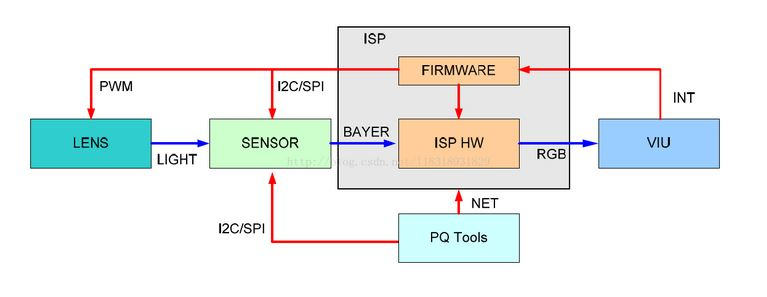
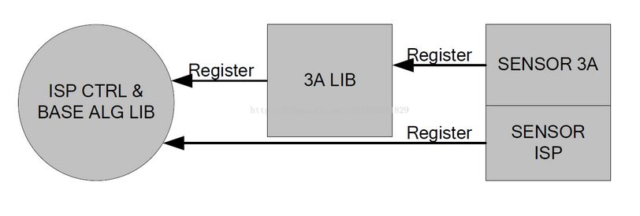
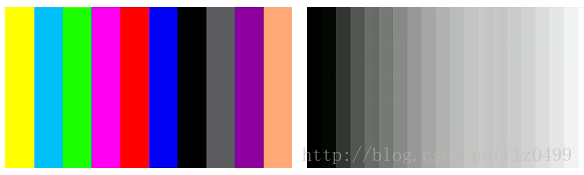
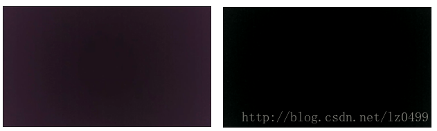
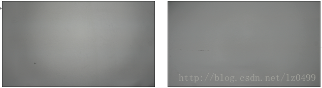
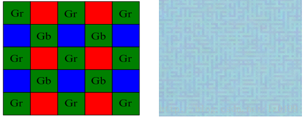

```

```

### ISP 基本框架

 ISP(Image Signal Processor)，即图像处理，主要作用是对前端图像传感器输出的信号做后期处理，主要功能有线性纠正、噪声去除、坏点去除、内插、白平衡、自动曝光控制等，依赖于ISP才能在不同的光学条件下都能较好的还原现场细节，ISP技术在很大程度上决定了摄像机的成像质量。它可以分为独立与集成两种形式。




ISP 的Firmware 包含三部分，

- 一部分是ISP 控制单元和基础算法库，

- 一部分是AE/AWB/AF 算法库，

- 一部分是sensor 库。

Firmware 设计的基本思想是单独提供3A 算法库，由ISP 控制单元调度基础算法库和3A 算法库，同时sensor 库分别向ISP 基础算法库和3A 算法库注册函数回调，以实现差异化的sensor 适配。ISP firmware 架构如下图所示。



不同的sensor 都以回调函数的形式，向ISP 算法库注册控制函数。ISP 控制单元调度基础算法库和3A 算法库时，将通过这些回调函数获取初始化参数，并控制sensor，如调节曝光时间、模拟增益、数字增益，控制lens 步进聚焦或旋转光圈等。

### 常用概念

#### 1，TestPattern------测试图像

Test Pattern主要用来做测试用。不需要先在片上ROM存储图片数据，直接使用生成的测试图像，用生成的测试图像进行后续模块的测试验证。常用的测试图像,比如：



#### 2，BLC(BlackLevel Correction)------黑电平校正

Black Level 是用来定义图像数据为 0 时对应的信号电平。由于暗电流的影响， 传感器出来的实际原始数据并不是我们需要的黑平衡（ 数据不为0） 。 所以，为减少暗电流对图像信号的影响，可以采用的有效的方法是从已获得的图像信号中减去参考暗电流信号。一般情况下， 在传感器中，实际像素要比有效像素多， 像素区头几行作为不感光区（ 实际上， 这部分区域也做了 RGB 的 color filter） ， 用于自动黑电平校正， 其平均值作为校正值， 然后在下面区域的像素都减去此矫正值， 那么就可以将黑电平矫正过来了。如下图所示，左边是做黑电平校正之前的图像，右边是做了黑电平校正之后的图像。



#### 3,LSC(Lens Shade Correction)------镜头阴影校正

 由于相机在成像距离较远时，随着视场角慢慢增大，能够通过照相机镜头的斜光束将慢慢减少，从而使得获得的图像中间比较亮，边缘比较暗，这个现象就是光学系统中的渐晕。由于渐晕现象带来的图像亮度不均会影响后续处理的准确性。因此从图像传感器输出的数字信号必须先经过镜头矫正功能块来消除渐晕给图像带来的影响。同时由于对于不同波长的光线透镜的折射率并不相同，因此在图像边缘的地方，其R、G、B的值也会出现偏差，导致CA(chroma aberration)的出现，因此在矫正渐晕的同时也要考虑各个颜色通道的差异性。

常用的镜头矫正的具体实现方法是，首先确定图像中间亮度比较均匀的区域，该区域的像素不需要做矫正；以这个区域为中心，计算出各点由于衰减带来的图像变暗的速度，这样就可以计算出相应R、G、B通道的补偿因子(即增益)。下图左边图像是未做镜头阴影校正的，右边图像是做了镜头阴影校正的。




#### 4.DPC(Bad Point Correction)------坏点校正

 所谓坏点，是指像素阵列中与周围像素点的变化表现出明显不同的像素，因为图像传感器是成千上万的元件工作在一起，因此出现坏点的概率很大。一般来讲，坏点分为三类：第一类是死点，即一直表现为最暗值的点；第二类是亮点，即一直表现为最亮值的点：第三类是漂移点，就是变化规律与周围像素明显不同的像素点。由于图像传感器中CFA的应用，每个像素只能得到一种颜色信息，缺失的两种颜色信息需要从周围像素中得到。如果图像中存在坏点的话，那么坏点会随着颜色插补的过程往外扩散，直到影响整幅图像。因此必须在颜色插补之前进行坏点的消除。 

#### 5.GB（Green Balance）------绿平衡

由于感光器件制造工艺和电路问题，Gr,Gb数值存在差异,将出现格子迷宫现象可使用均值算法处理Gr,Gb通道存在的差异,同时保留高频信息。




#### 6.Denoise-----去除噪声

使用 cmos sensor 获取图像，光照程度和传感器问题是生成图像中大量噪声的主要因素。同时， 当信号经过 ADC 时， 又会引入其他一些噪声。 这些噪声会使图像整体变得模糊， 而且丢失很多细节， 所以需要对图像进行去噪处理空间去噪传统的方法有均值滤波、 高斯滤波等。

但是， 一般的高斯滤波在进行采样时主要考虑了像素间的空间距离关系， 并没有考虑像素值之间的相似程度， 因此这样得到的模糊结果通常是整张图片一团模糊。 所以， 一般采用非线性去噪算法， 例如双边滤波器， 在采样时不仅考虑像素在空间距离上的关系， 同时加入了像素间的相似程度考虑， 因而可以保持原始图像的大体分块， 进而保持边缘。

 

#### 7.Demosaic------颜色插值


    光线中主要包含三种颜色信息，即R、G、B。但是由于像素只能感应光的亮度，不能感应光的颜色，同时为了减小硬件和资源的消耗，必须要使用一个滤光层，使得每个像素点只能感应到一种颜色的光。目前主要应用的滤光层是bayer GRBG格式。如下图所示：


### 参考链接

1. [](https://blog.csdn.net/lz0499/article/details/71156291)

2. https://www.cnblogs.com/whw19818/p/5766020.html