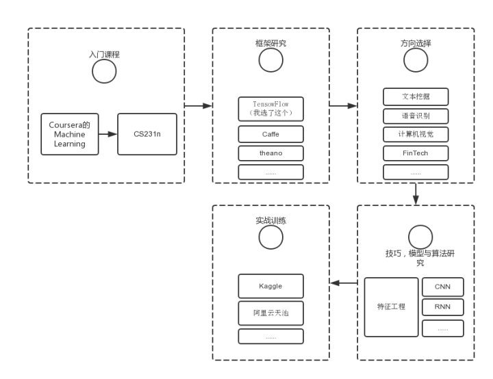

# AI 读书路线

## 什么是人工智能AI

[人工智能](https://baike.baidu.com/item/人工智能/9180)（Artificial Intelligence），英文缩写为AI。它是研究、开发 用于模拟、延伸和扩展人的智能的理论、方法、技术及应用系统的一门新的技术科学。

人工智能是计算机科学的一个分支，它企图了解智能的实质，并生产出一种新的能以人类智能相似的方式做出反应的智能机器，该领域的研究包括机器人、语言识别、图像识别、自然语言处理和专家系统等。人工智能从诞生以来，理论和技术日益成熟，应用领域也不断扩大，可以设想，未来人工智能带来的科技产品，将会是人类智慧的“容器”。人工智能可以对人的意识、思维的信息过程的模拟。人工智能不是人的智能，但能像人那样思考、也可能超过人的智能。

人工智能是一门极富挑战性的科学，从事这项工作的人必须懂得计算机知识，心理学和哲学。人工智能是包括十分广泛的科学，它由不同的领域组成，如机器学习，计算机视觉等等，总的说来，人工智能研究的一个主要目标是使机器能够胜任一些通常需要人类智能才能完成的复杂工作。但不同的时代、不同的人对这种“复杂工作”的理解是不同的。

## 前提基础

要掌握AI，你要熟悉计算机科学和编程和必要的数学基础。

### 数学基础

- **微积分学**
- **线性代数**
- **概率和统计**

### Python编程

## AI 路线

## 机器学习

### 机器学习  Andrew Ng  

入门首选，推荐只认识“机器学习”四个字但还不知道它是什么的学习。建议是直接按顺序一课课学，不要着急。在学完这个课程前，不要学后面的

1. 课程链接 [Andrew Ng机器学习课程](https://link.zhihu.com/?target=https%3A//www.coursera.org/course/ml)
2. 网易云课堂搬运了这门课，并由黄海广等人翻译了中文字幕。
3. **中文笔记及作业代码：**https://github.com/fengdu78/Coursera-ML-AndrewNg-Notes

### 吴恩达 CS229

吴恩达在斯坦福教授的机器学习课程 CS229 与 吴恩达在 Coursera 上的《Machine Learning》相似，但是有**更多的数学要求和公式的推导**，难度稍难一些。该课程对机器学习和统计模式识别进行了广泛的介绍。

**课程主页：**

http://cs229.stanford.edu/

**中文视频：**

http://open.163.com/special/opencourse/machinelearning.html

**中文笔记：**

https://kivy-cn.github.io/Stanford-CS-229-CN/#/

**速查表：**

这份给力的资源贡献者是一名斯坦福的毕业生 Shervine Amidi。作者整理了一份超级详细的关于 CS229的速查表

https://zhuanlan.zhihu.com/p/56534902

**作业代码：**

https://github.com/Sierkinhane/CS229-ML-Implements

### 林轩田《机器学习基石》

台湾大学林轩田老师的《机器学习基石》课程由浅入深、内容全面，基本涵盖了机器学习领域的很多方面。其作为机器学习的入门和进阶资料非常适合。而且林老师的教学风格也很幽默风趣，总让读者在轻松愉快的氛围中掌握知识。这门课比
Ng 的《Machine Learning》稍难一些，侧重于机器学习理论知识。

**中文视频：**

https://www.bilibili.com/video/av36731342

**中文笔记：**

https://redstonewill.com/category/ai-notes/lin-ml-foundations/

**配套教材**

配套书籍为《Learning From Data》，在线书籍主页：http://amlbook.com/

### 林轩田《机器学习技法》

《机器学习技法》课程是《机器学习基石》的进阶课程。主要介绍了机器学习领域经典的一些算法，包括支持向量机、决策树、随机森林、神经网络等等。难度要略高于《机器学习基石》，具有很强的实用性。

**中文视频：**

https://www.bilibili.com/video/av36760800

**中文笔记：**

https://redstonewill.com/category/ai-notes/lin-ml-techniques/

### 西瓜书《机器学习》

周志华的《机器学习》被大家亲切地称为“西瓜书”。这本书非常经典，讲述了机器学习核心数学理论和算法，适合有作为学校的教材或者中阶读者自学使用，入门时学习这本书籍难度稍微偏高了一些

配合《机器学习实战》一起学习，效果更好！

**读书笔记：**

https://www.cnblogs.com/limitlessun/p/8505647.html#_label0

**公式推导：**

https://datawhalechina.github.io/pumpkin-book/#/

**课后习题：**

https://zhuanlan.zhihu.com/c_1013850291887845376

### 《统计学习方法》

李航的这本《统计学习方法》堪称经典，包含更加完备和专业的机器学习理论知识，作为夯实理论非常不错。

**讲课 PPT：**

https://github.com/fengdu78/lihang-code/tree/master/ppt

**读书笔记：**

http://www.cnblogs.com/limitlessun/p/8611103.html

https://github.com/SmirkCao/Lihang

**参考笔记：**

https://zhuanlan.zhihu.com/p/36378498

**代码实现：**

https://github.com/fengdu78/lihang-code/tree/master/code

### 《Scikit-Learn 与 TensorFlow 机器学习实用指南》

在经过前面的学习之后，这本《Scikit-Learn 与 TensorFlow 机器学习实用指南》非常适合提升你的机器学习实战编程能力。

这本书分为两大部分，第一部分介绍机器学习基础算法，每章都配备 Scikit-Learn 实操项目；第二部分介绍神经网络与深度学习，每章配备 TensorFlow 实操项目。如果只是机器学习，可先看第一部分的内容。

全书代码：

https://github.com/ageron/handson-ml

### Stanford CS231n

[CS231n: Convolutional Neural Networks for Visual Recognition](https://link.zhihu.com/?target=http%3A//cs231n.stanford.edu/)
Stanford最受欢迎的课之一。做图像识别的，就算不想搞图像识别，也会学到很多有用的通用的东西。

### 比赛

#### Kaggle 比赛

比赛是提升自己机器学习实战能力的最有效的方式，**首选 Kaggle 比赛。**

**Kaggle 主页:**https://www.kaggle.com/

**Kaggle 路线:**https://github.com/apachecn/kaggle

#### 工具Scikit-Learn 官方文档

Scikit-Learn 作为机器学习一个非常全面的库，是一份不可多得的实战编程手册。

**官方文档：**https://scikit-learn.org/stable/index.html

**中文文档（0.19）：**http://sklearn.apachecn.org/#/

## 参考链接

1. [200种最佳机器学习教程汇总](https://yq.aliyun.com/articles/640631)
2. [人工智能完整自学路径](https://www.jianshu.com/p/8ff6e0d9d0a7)
3. [完备的 AI 学习路线，最详细的中英文资源整理](http://www.ijiandao.com/2b/baijia/250052.html)
4. [我的机器学习入门学习清单及路线](https://zhuanlan.zhihu.com/p/27018536)
5. [零基础初学者人工智能学习路线](https://zhuanlan.zhihu.com/p/45146188)
6. https://machinelearningmastery.com/start-here/
7. https://pic3.zhimg.com/v2-8b04444c0088fea1efa9778f0dfc2dbb_r.jpg