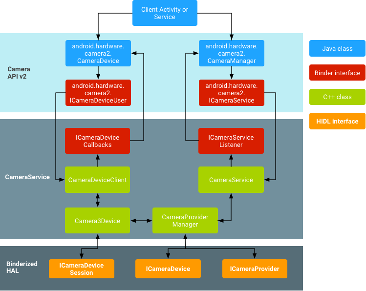
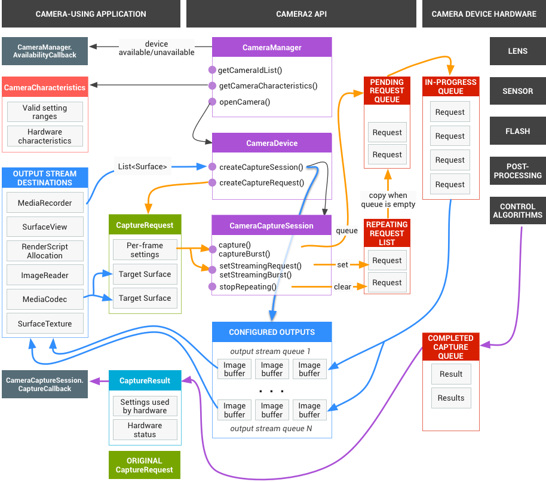
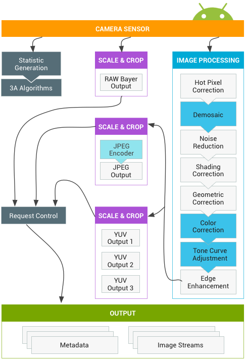
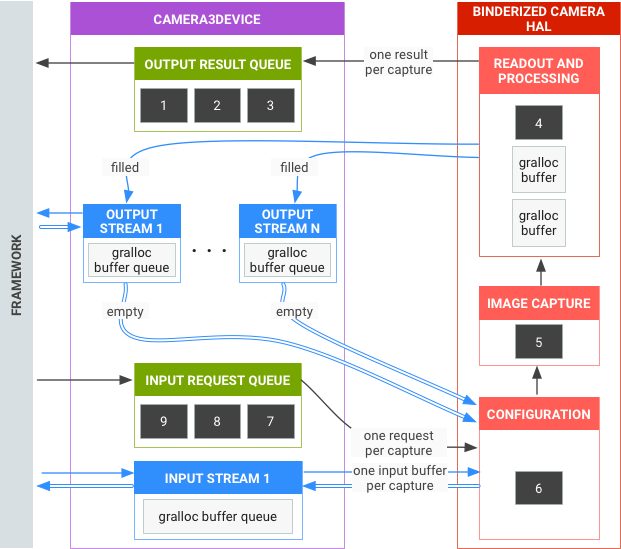
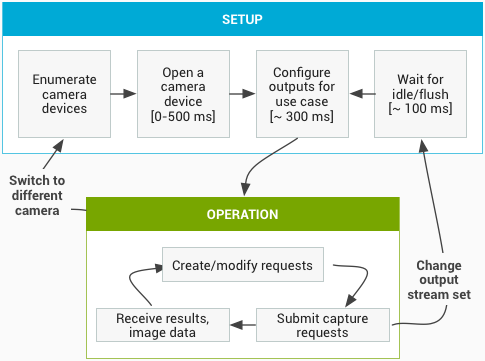
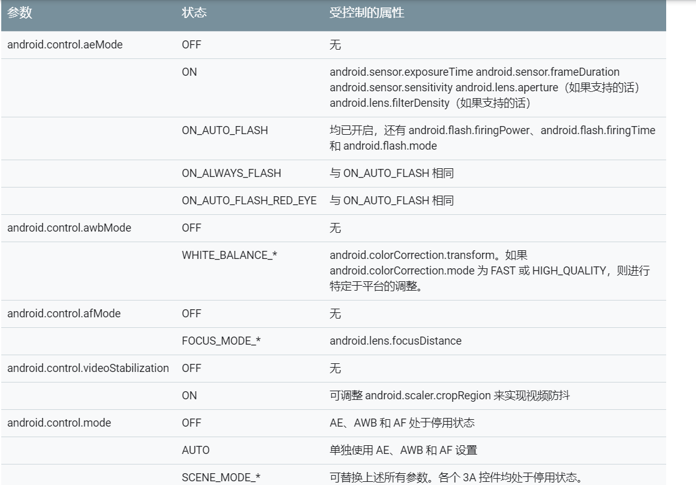

Android 的相机硬件抽象层 (HAL) 可将 [Camera 2](http://developer.android.com/reference/android/hardware/package-summary.html) 中较高级别的相机框架 API 连接到底层的相机驱动程序和硬件。相机子系统包括相机管道组件的实现，而相机 HAL 则可提供用于实现您的这些组件版本的接口。

## Camera架构

下面这张图较好的说明了Camera各组件之间的关系：

### **应用框架：**

应用代码位于应用框架级别，它使用 [Camera 2](https://developer.android.com/reference/android/hardware/camera2/package-summary) API 与相机硬件进行交互。在内部，这些代码会调用相应的 [Binder](https://developer.android.com/reference/android/os/Binder.html) 接口，以访问与相机互动的原生代码。

###  **AIDL：**

与 CameraService 关联的 Binder 接口可在 [frameworks/av/camera/aidl/android/hardware](https://android.googlesource.com/platform/frameworks/av/+/master/camera/aidl/android/hardware/ICameraService.aidl) 中找到。生成的代码会调用较低级别的原生代码以获取对实体相机的访问权限，并返回用于在框架级别创建 [CameraDevice](https://developer.android.com/reference/android/hardware/camera2/CameraDevice) 并最终创建 [CameraCaptureSession](https://developer.android.com/reference/android/hardware/camera2/CameraCaptureSession.html) 对象的数据。

###  **原生框架：**

此框架位于 `frameworks/av/` 中，并提供相当于 [CameraDevice](https://developer.android.com/reference/android/hardware/camera2/CameraDevice) 和 [CameraCaptureSession](https://developer.android.com/reference/android/hardware/camera2/CameraCaptureSession) 类的原生类。另请参阅 [NDK camera2 参考](https://developer.android.com/ndk/reference/group/camera)。

###  **Binder IPC 接口：**

IPC binder 接口用于实现跨越进程边界的通信。调用相机服务的若干个相机 Binder 类位于 `frameworks/av/camera/camera/aidl/android/hardware` 目录中。 [ICameraService](https://android.googlesource.com/platform/frameworks/av/+/master/camera/aidl/android/hardware/ICameraService.aidl) 是相机服务的接口；[ICameraDeviceUser](https://android.googlesource.com/platform/frameworks/av/+/master/camera/aidl/android/hardware/camera2/ICameraDeviceUser.aidl) 是已打开的特定相机设备的接口；[ICameraServiceListener](https://android.googlesource.com/platform/frameworks/av/+/master/camera/aidl/android/hardware/ICameraServiceListener.aidl) 和 [ICameraDeviceCallbacks](https://android.googlesource.com/platform/frameworks/av/+/master/camera/aidl/android/hardware/camera2/ICameraDeviceCallbacks.aidl) 分别是对应用框架的 CameraService 和 CameraDevice 回调。

###  **相机服务：**

位于 frameworks/av/services/camera/libcameraservice/CameraService.cpp 下的相机服务是与 HAL 进行互动的实际代码。

###  **HAL：**

硬件抽象层定义了由相机服务调用、且您必须实现以确保相机硬件正常运行的标准接口。

## 二、HAL子系统

### 2.1 capture请求

应用框架会针对捕获的结果向相机子系统发出请求。一个请求对应一组结果。请求包含有关捕获和处理这些结果的所有配置信息。其中包括分辨率和像素格式；手动传感器、镜头和闪光灯控件；3A 操作模式；RAW 到 YUV 处理控件；以及统计信息的生成等。这样一来，便可更好地控制结果的输出和处理。一次可发起多个请求，而且提交请求时不会出现阻塞。请求始终按照接收的顺序进行处理。

### 2.2 HAL 和相机子系统

相机子系统包括相机管道中组件的实现，例如 3A 算法和处理控件。相机 HAL 为您提供了用于实现这些组件版本的接口。为了保持多个设备制造商和图像信号处理器（ISP，也称为相机传感器）供应商之间的跨平台兼容性，相机管道模型是虚拟的，且不直接对应于任何真正的 ISP。不过，它与真正的处理管道足够相似，因此您可以有效地将其映射到硬件。此外，它足够抽象，可支持多种不同的算法和运算顺序，而不会影响质量、效率或跨设备兼容性。

相机管道还支持应用框架可以启动来开启自动对焦等功能的触发器。它还会将通知发送回应用框架，以通知应用自动对焦锁定或错误等事件。

请注意，上图所示的一些图像处理块在初始版本中没有明确定义。相机管道做出以下假设：

> - RAW Bayer 输出在 ISP 内部不经过任何处理。
> - 统计信息根据原始传感器数据生成。
> - 将原始传感器数据转换为 YUV 的各种处理块按任意顺序排列。
> - 当显示多个刻度和剪裁单元时，所有缩放器单元共享输出区域控件（数字缩放）。不过，每个单元都可能具有不同的输出分辨率和像素格式。

**API 用途摘要**
 下面简要介绍了使用 Android Camera API 的步骤。有关这些步骤（包括 API 调用）的详细说明，请参阅“启动和预期操作顺序”部分。

> - 1.监听和枚举相机设备。
> - 2.打开设备并连接监听器。
> - 3.配置目标使用情形的输出（如静态捕获、录制等）。
> - 4.为目标使用情形创建请求。
> - 5.捕获/重复请求和连拍。
> - 6.接收结果元数据和图片数据。
> - 7.切换使用情形时，返回到第 3 步。

**HAL 操作摘要**

> - 捕获的异步请求来自于框架。
> - HAL 设备必须按顺序处理请求。对于每个请求，均生成输出结果元数据以及一个或多个输出图像缓冲区。
> - 请求和结果以及后续请求引用的信息流遵守先进先出规则。
> - 指定请求的所有输出的时间戳必须完全相同，以便框架可以根据需要将它们匹配在一起。
> - 所有捕获配置和状态（不包括 3A 例程）都包含在请求和结果中。

下面是相机HAL概览：

### 2.3 启动和预期操作顺序

本部分详细说明了使用 Camera API 时应遵循的步骤。有关 HIDL 接口的定义，请参阅 [platform/hardware/interfaces/camera/](https://android.googlesource.com/platform/hardware/interfaces/+/master/camera/)。

------

**枚举、打开相机设备并创建有效会话**

> - 1.初始化后，框架开始监听实现 [ICameraProvider](https://android.googlesource.com/platform/hardware/interfaces/+/master/camera/provider/2.4/ICameraProvider.hal) 接口的任何现有相机提供程序。如果存在一个或多个此类提供程序，框架将尝试建立连接。
> - 2.框架通过 `ICameraProvider::getCameraIdList()` 枚举相机设备。
> - 3.框架通过调用相应的 `ICameraProvider::getCameraDeviceInterface_VX_X()` 来实例化一个新的 `ICameraDevice`。
> - 4.框架调用 `ICameraDevice::open()` 来创建一个新的有效捕获会话 ICameraDeviceSession。

------

------

**使用有效相机会话**

> - 1.框架调用 `ICameraDeviceSession::configureStreams()` 并传入到 HAL 设备的输入/输出流列表。
> - 2.框架通过调用 `ICameraDeviceSession::constructDefaultRequestSettings()` 来为某些使用情形请求默认设置。这可能会在 `ICameraDevice::open` 创建 `ICameraDeviceSession` 之后的任何时间发生。
> - 3.框架通过基于某一组默认设置的设置以及框架之前注册的至少一个输出流来构建第一个捕获请求并将其发送到 HAL。此请求通过 `ICameraDeviceSession::processCaptureRequest()` 发送到 HAL。HAL 必须阻止此调用返回，直到准备好发送下一个请求为止。
> - 4.框架继续提交请求并根据需要调用 `ICameraDeviceSession::constructDefaultRequestSettings()` 以获取其他使用情形的默认设置缓冲区。
> - 5.当请求捕获开始（传感器开始曝光以进行捕获）时，HAL 会调用 `ICameraDeviceCallback::notify()`并显示 SHUTTER 消息，包括帧号和开始曝光的时间戳。此通知回调不必在对请求第一次调用 `processCaptureResult()` 之前发生，但直到针对相应的捕获调用 notify() 之后，才会向应用提供有关该捕获的结果。
> - 6.经过一定的管道延迟后，HAL 开始使用 `ICameraDeviceCallback::processCaptureResult()` 将完成的捕获返回到框架。这些捕获按照与提交请求相同的顺序返回。一次可发起多个请求，具体取决于相机 HAL 设备的管道深度。

一段时间后，会出现以下某种情况：

> - 框架可能会停止提交新的请求，等待现有捕获完成（所有缓冲区都已填充，所有结果都已返回），然后再次调用 `ICameraDeviceSession::configureStreams()`。这会重置相机硬件和管道，以获得一组新的输入/输出流。可重复使用先前配置中的部分信息流。如果至少还有一个已注册的输出流，则框架将从发送到 HAL 的第一个捕获请求继续。（否则，需要先调用 `ICameraDeviceSession::configureStreams()`。）
> - 框架可能会调用 `ICameraDeviceSession::close()` 以结束相机会话。当框架中没有其他处于有效状态的调用时，可能随时会调用此函数；不过，在所有发起的捕获完成（所有结果都已返回，所有缓冲区都已填充）之前，调用可能会阻塞。close() 调用返回后，不允许再从 HAL 对 `ICameraDeviceCallback` 进行调用。一旦进行 close() 调用，框架便不能再调用其他任何 HAL 设备函数。
> - 在发生错误或其他异步事件时，HAL 必须调用 `ICameraDeviceCallback::notify()` 并返回相应的错误/事件消息。从严重的设备范围错误通知返回后，HAL 的行为方式应像对其调用了 close() 一样。但是，HAL 必须在调用 notify() 之前取消或完成所有待处理的捕获，以便在调用 notify() 并返回严重错误时，框架不会收到来自设备的更多回调。在 notify() 方法从严重错误消息返回后，close() 之外的方法应返回 -ENODEV 或 NULL。

下面是相机操作流程：

### 2.4 硬件级别

相机设备可以根据其功能实现多个硬件级别。有关详情，请参阅[支持的硬件级别](https://developer.android.com/reference/android/hardware/camera2/CameraCharacteristics#INFO_SUPPORTED_HARDWARE_LEVEL)。

### 2.5 应用捕获请求、3A 控件和处理管道之间的交互

根据 3A 控件块中的设置，相机管道会忽略应用捕获请求中的某些参数，而改用 3A 控件例程提供的值。例如，启用自动曝光后，传感器的曝光时间、帧时长和感光度参数由平台 3A 算法控制，所有应用指定的值都会被忽略。必须在输出元数据中报告由 3A 例程为帧选择的值。下表描述了 3A 控件块的不同模式以及由这些模式控制的属性。有关这些属性的定义，请参阅 [platform/system/media/camera/docs/docs.html](https://android.googlesource.com/platform/system/media/+/master/camera/docs/docs.html) 文件。

在**图三**中，图像处理块中的控件都以类似的原理操作，并且每个块一般都具有 3 种模式：

> - OFF：该处理块处于停用状态。无法停用去马赛克、色彩校正和色调曲线调整块。
> - FAST：与 OFF 模式相比，在这种模式下，处理块可能不会降低输出帧速率，但是考虑到限制条件，它应该会产生能够产生的最优质输出。通常，该模式会用于预览或视频录制模式，或用于连拍静态图像。在一些设备上，该模式可能等同于 OFF 模式（进行任何处理都会降低帧速率）；而在另外一些设备上，该模式可能等同于 HIGH_QUALITY 模式（最佳质量仍不会降低帧速率）。
> - HIGH_QUALITY：在这种模式下，处理块应尽可能产生最优质结果，根据需要降低输出帧速率。通常，该模式会用于拍摄优质静态图像。一些块包括可以被选中的手动控件（而非 FAST 或 HIGH_QUALITY）。例如，色彩校正块支持颜色变换矩阵，而色调曲线调整支持任意的全局色调映射曲线。

相机子系统可以支持的最大帧速率受到多种因素的影响：

> - 所请求的输出图像流的分辨率
> - 成像器上像素组合/跳过模式的可用性
> - 成像器接口的带宽
> - 各种 ISP 处理块的带宽

由于这些因素在不同的 ISP 和传感器之间可能有很大差异，因此相机 HAL 接口会设法将带宽限制抽象为尽可能简单的模型。显示的模型具有以下特性：

> - 考虑到应用的请求输出流大小，图像传感器始终配置为输出尽可能最小的分辨率。最小分辨率定义为至少与请求的最大输出流一样大。
> - 因为任何请求都可能使用当前配置的任意或所有输出流，所以传感器和 ISP 必须配置为支持将单个捕获同时扩展到所有信息流。
> - 对于不包含 JPEG 流的请求，JPEG 流表现得像经过处理的 YUV 流一样；在直接引用它们的请求中，它们用作 JPEG 流。
> - JPEG 处理器可以并行运行到相机管道的剩余部分，但不能一次处理多个捕获。

参考：
 [Android camera相机架构](https://source.android.com/devices/camera)
 [Android camera HAL子系统](https://source.android.com/devices/camera/camera3_requests_hal)

## 参考链接

https://www.jianshu.com/p/bac0e72351e4