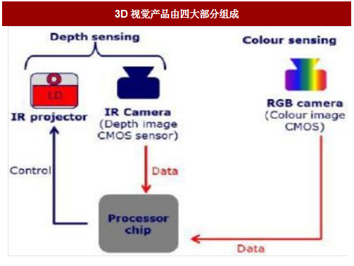

深度相机中3D结构光原理

#### 一，概述

我们知道到3D深度相机有多种的实现方案，每一种方案都有其优缺点，今天学习下结构光方案。

已知空间方向的投影光线的集合称为结构光，而3D结构光的根本就是通过光学手段获取被拍摄物体的三维结构

主要分为点结构光、线结构光、多线结构光、面结构光、相位法结构光，散斑结构光，编码结构光。

手机中目前使用比较多的是散斑结构光和编码结构光，比如iphone X  （使用的是收购的PrimeSense的技术） FindX据分析应使用的是散斑结构光，小米8透明探索版 使用的是编码散斑结构光（此次的3D结构光技术方案供应商为以色列的Mantis Vision）。

#### 二，3D结构光的整体框图

通过拆解结构光先驱Primesense的产品结构，可以看到整个结构光产品方案主要由四部分组成：

- TX发射部分（IRProjector，主要为红外光发射器IRLD）、
- RX接收部分（IRCamera，主要为红外光图像[传感器](http://www.chinabaogao.com/search?c=1&q=%B4%AB%B8%D0%C6%F7)IRCIS）、
- RGB可见光图像传感器（VisCIS）、
- 专用数据处理[芯片](http://www.chinabaogao.com/search?c=1&q=%D0%BE%C6%AC)（ProcessorChip）。

3D视觉结构光方案的产品结构，我们也可以在英特尔Realsense近距离结构光方案中得到证实。英特尔Realsense近距离3D视觉方案主要基于结构光原理，由一个红外发射器、一个红外传感器、一个可见光色彩传感器和一颗实感图像处理芯片组成。

 红外发射器发射近红外光到物体表面，红外传感器与色彩传感器分别采集物体的深度图像和平面图像，最终经过实感芯片的处理得到三维位置信息。

**图：英特尔RealSense近距离结构光3D相机结构图**

#### 三，基本原理

 因此，我们可以总结出，典型结构光3D视觉系统的工作原理为：

1. 首先红外激光发射器（IRLD）发射出近红外光（IRLight）特定图案（如激光散斑等），
2. 经过物体（如人手或人脸等）的反射之后，形变之后的图案被红外图像传感器（IRCIS）所接收，
3. 经过算法计算出人手/人脸所处的位置（Z轴）；
4. 同时，可见光图像传感器采集二维平面（X与Y轴）的人手/人脸信息（VisLight）；
5. 两颗图像传感器的信息汇总至专用的图像处理芯片，从而得到三维数据，实现空间定位。

#### 四，深度计算原理

##### 激光散斑原理

激光散斑：激光在散射体表面的漫反射或通过一个透明散射体（如毛玻璃）时，在散射表面或附近的光场中可以观察到一种无规分布的亮暗斑点，这种斑点称为激光散斑（Laser Speckles）。
     激光散斑是由无规散射体被相干光照射产生的，因此是一种随机过程。要研究它必须使用概率统计的方法。通过统计方法的研究，可以认识到散斑的强度分布、对比度和散斑运动规律等特点。最重要的特点就是，这种散斑具有高度的随机性，而且随着距离的不同会出现不同的图案，也就是说，在同一空间中任何两个地方的散斑图案都不相同。只要在空间中打上这样的结构光然后加以记忆就让整个空间都像是被做了标记，然后把一个物体放入这个空间后只需要从物体的散斑图案变化就可以知道这个物体的具体位置。
应用：用散斑的对比度测量反射表面的粗糙度；利用散斑的动态情况测量物体运动的速度；利用散斑进行光学信息处理，甚至利用散斑验光等。
   激光在成像领域极具潜力。但“光斑”问题却一直困扰着人们：当传统激光器被用于成像时，由于高空间相干性，会产生大量随机的斑点或颗粒状的图案，严重影响成像效果。一种能够避免这种失真的方法是使用LED光源。但问题是，对高速成像而言，LED光源的亮度并不够。

结构光：首先将结构光投射至物体表面，再使用摄像机接收该物体表面反射的结构光图案，由于接收图案必会因物体的立体型状而发生变形，故可以试图通过该图案在摄像机上的位置和形变程度来计算物体表面的空间信息。普通的结构光方法仍然是部分采用了三角测距原理的深度计算。
      与结构光法不同的是，Light Coding的光源称为“激光散斑”，是激光照射到粗糙物体或穿透毛玻璃后随机形成的衍射斑点。这些散斑具有高度的随机性，而且会随着距离的不同而变换图案。也就是说空间中任意两处的散斑图案都是不同的。只要在空间中打上这样的结构光，整个空间就都被做了标记，把一个物体放进这个空间，只要看看物体上面的散斑图案，就可以知道这个物体在什么位置了。当然，在这之前要把整个空间的散斑图案都记录下来，所以要先做一次光源标定。
概括一下，Light Coding与传统的ToF、结构光技术的不同之处在于：

1）和传统的ToF、结构光的光源不同，激光散斑是当激光照射到粗糙物体或穿透毛玻璃后形成的随机衍射斑点；

2）不需要特制的感光芯片，只需要普通的CMOS感光芯片；

3）Light Coding技术不是通过空间几何关系求解的，它的测量精度只和标定时取的参考面的密度有关，参考面越密测量越精确。传统结构光方法采用三角视差测距，基线长度（光源与镜头光心的距离）越长越好。换句话说，不用为了提高精度而将基线拉宽。这其中的奥秘就是“激光散斑原理”。

##### 测量流程

1. IRprojector  发射带有散斑的红外光
2. IRCamera 采集由物体反射过来的红外光，得到一帧图像；
3. 一帧图像，根据出厂前标定的参考图进行对比得到 深度图，从而得到depth流
4. 可见光Camera 可以采集输出rgb流。
5. 利用算法将深度图与可见光Camera 采集得到的rgb图对齐，得到完整的三维数据

##### Q&A

1. IRprojector   和IRCamera 的运行过程，是一行一行的扫描得到？  激光发射器是一束激光  还是n多束激光
2. 利用IR图计算深度图时，采集到的散斑与标记的散斑怎么匹配  得到深度值
3. 这其中的去畸变是指什么
4. rgb图和深度图如何对齐
5. 散斑结构光的标记
6. 散斑结构光的标定

#### 六，参考链接

1. [深度相机原理揭秘--结构光（iPhone X 齐刘海原理）](https://blog.csdn.net/electech6/article/details/78707839)
2. [深度相机（二）--结构光深度测距](https://blog.csdn.net/lg1259156776/article/details/53103350)
3. http://market.chinabaogao.com/dianzi/10252b3292017.html
4. [2017年我国3D视觉行业结构光方案产业链细分领域情况分析](http://market.chinabaogao.com/dianzi/10252b3392017.html)
5. https://github.com/jakobwilm/slstudio
6. [2017年我国3D视觉结构光方案技术及工作流程分析](http://free.chinabaogao.com/dianzi/201710/10252b2H2017.html)

