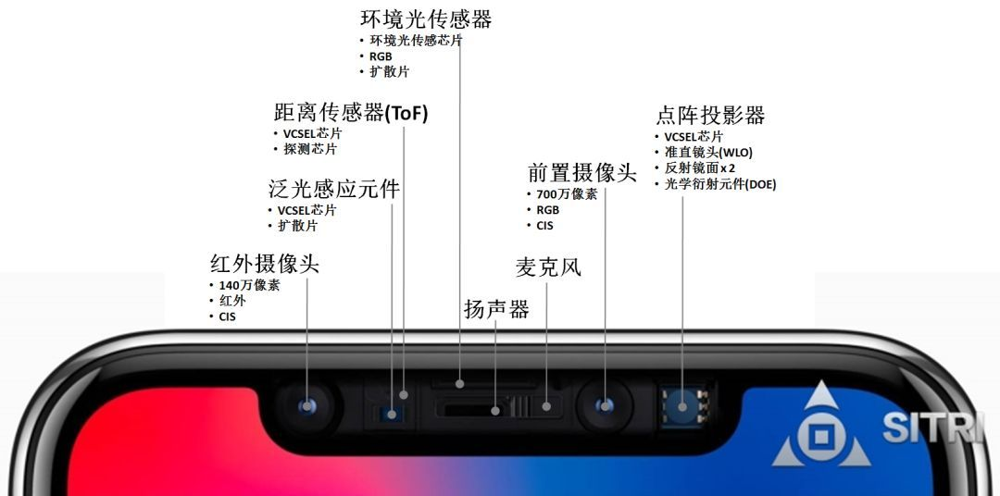

3D摄像头产业链情况

我们看一下移动端3D视觉相关都由那些元素

3D摄像头产业链大致可以分为：

1. 上游：红外传感器、红外光源、光学组件、光学镜头以及CMOS图像传感器；
2. 中游：传感器模组、摄像头模组、光源代工、光源检测以及图像算法；
3. 下游：终端厂商以及应用。

全球 3D结构光供应链趋于完善，整体技术方案有Primesense、奥比中光、英特尔、以色列Mantis Vision、图漾科技、奥比中光、华捷艾米等。在3D图像处理芯片方面，有Primesense、意法半导体、德州仪器、英飞凌等少数几家芯片巨头等。

2018年  **移动端3D视觉结构光方案产业链汇总**

3D摄像头模组拆解后，其主要硬件包括：

1. 红外光发射器（IR LED或VCSEL）、
2. 红外光图像传感器（IR CIS或者其他光电二极管）
3. 可见光图像传感器（Vis CIS）、
4. 图像处理芯片、
5. 滤光片或镜头。

此外，室外工作的飞行时间（ToF）方案需要窄带滤光片；结构光方案需要发射端光学棱镜与DOE光栅；双目立体成像方案采用两颗红外光摄像头或两颗可见光摄像头。

### 一，整体技术方案

在整体技术方案方面，苹果自收购结构光先驱Primesense之后，便不再对外输出技术，基于Primesense在3D视觉方面的积累，近年来致力于实现小型化、低功耗、精度更高的3D视觉产品。

​     目前全球范围内掌握结构光核心技术（特别是核心算法方案）的公司不多，除了Primesense之外，还有英特尔、以色列MantisVision（欧菲光2015年投资500万美元，2016年形成战略合作）等少数几家公司。

​     国内方面，目前致力于3D视觉结构光方案的初创型公司包括图漾科技、奥比中光、华捷艾米等，具体产品的技术水平还有待市场检验。

### **二，3D视觉图像处理芯片**

​     Primesense拥有自行设计3D图像处理芯片的能力，并且已经成功应用到Kinect1代结构光方案中，因此，我们判断苹果3D视觉结构光方案将继续采用Primesense的芯片方案。

​     该芯片具有较高的技术壁垒，尤其是算法层面的要求较高，需要根据3D视觉方案处理深度信息，目前全球范围内可以提供该类产品的公司为少数几家芯片]巨头，包括意法半导体、德州仪器、英飞凌等。国内方面还未见相关产品和供应商。

### 三，TX红外发射部分

#### **1）VCSEL红外光源**

根据Lumentum在17年二季度的财报会议，其消费级VCSEL产品订单从上季度的500万美元大幅跃升至2亿美元，根据美国和台湾产业链（如BI、科技时报等）的信息，订单主要来自于苹果公司。我们判断Lumentum将为苹果新一代iPhone8提供3D相机中的VCSEL器件，而是将是主力供应商。除了Lumentum之外，II-VI公司也在苹果供应链之列，同时菲尼萨也有望加入。

 

​         

由于VCSEL具有非常高的技术壁垒，其器件的功耗、响应速度、稳定性都存在很高的设计难度，因此，目前全球范围内具有VCSEL设计能力的公司主要为欧美光通信器件巨头。国内方面光迅科技、华芯半导体具备中低端VCSEL的设计能力，长春光机所在VCSEL技术研发方面有一定竞争力。但是整体而言，国内公司与海外巨头相比差距较大。

 

​         

在VCSEL制造与代工方面，由于VCSEL主要材料为GaAs（掺杂In、Al等），在工艺方面与化合物半导体类似，国外目前主要的供应商为台湾宏捷科、稳懋，其中Lumentum的代工合作方为稳懋。国内方面三安光电正积极布局化合物晶圆制造，我们认为其未来有望切入VCSEL代工领域。

 

​         

**2）DOE衍射光栅**

 

​         

在苹果公司方面，我们判断苹果3D视觉结构光用DOE将由Primesense自行设计、台积电提供pattern加工、精材提供器件封装、采钰提供ITO材料。

 

​         

目前具有先进DOE设计与制造的公司不多，全球范围内主要供应商有德国CDA、法国Silios、德国Holoeye等，特别是在移动端微小型器件方面还未见相关产品。根据台湾科技媒体中时电子报的分析，高通目前正积极研发3D视觉结构光方案，在DOE和WLO方面，将采用Himax奇景光电的方案。国内方面，目前未见具有移动端DOE设计与加工能力的公司。

 

​         

**3）WLO晶圆级光学透镜**

 

​         

为了将3D视觉产品应用到移动端消费电子产品上，采用WLO工艺制造的晶圆级光学元件（如扩束元件、准直元件、投射透镜等）对于压缩发射端体积非常重要。

 

​         

在苹果3D视觉结构光方案中，我们判断Heptagon（已被AMS奥地利微电子收购）将提供TX发射端WLO晶圆级光学透镜，并且Heptagon已经在WLO设计领域积累了众多专利，技术实力强。此外来自台湾的Himax奇景光电也是未来潜在供应商。

 

​         

国内方面，半导体封测厂华天科技和晶方科技在WLO方面布局较早，主要提供WLO后段加工技术，特别是华天科技具备成熟的加工能力。

​         参考中国报告网发布《[2018-2023年中国**3D**产业市场竞争现状调查与未来发展方向研究报告](http://baogao.chinabaogao.com/dianzidiangong/298242298242.html)》

​         

（四）RX红外接收部分

          1）红外CMOS芯片

 

​         

由于目前3D视觉刚刚起步，不同厂商采用的图像识别方案不同，对红外CMOS的要求（如分辨率、响应速度等）不同，因此在3D视觉方案中所需的红外CMOS需要特制。目前，红外CMOS传感器供应商主要包括意法半导体、奇景光电、三星电子、富士通、东芝等公司。

 

​         

根据Yole的分析，意法半导体已经开发出了可能用于iPhone8的3D成像红外传感器，我们判断将于17年下半年开始大规模为苹果提供红外CMOS图像传感器。该芯片将由意法半导体设计、台积电代工、同欣电提供晶圆重组（RW）。

 

​         

国内方面，目前涉足红外CMOS传感器的公司不多，思比科公司布局较早，可提供200万、500万高红外灵敏度专用CMOS图像传感器，技术比较成熟。

 

​         

**2）近红外窄带干涉滤色片**

 

​         

在3D视觉产品中，为了减少环境可见光线的干扰，普遍采用窄带干涉滤色片。目前近红外窄带滤色片主要采用干涉原理，需要几十层光学镀膜构成，具有更高的技术难度，因而比传统截止型滤色片的价值高。

 

​         

根据美国《巴伦周刊》的报道，VIAVI公司将为苹果新一代iPhone8提供近红外窄带干涉滤色片，双方已签署订单意向协议，苹果将向VIAVI采购1.5亿颗光学滤光片用于Iphone系列的3D视觉。目前国际上除了VIAVI之外，近红外窄带干涉滤色片的供应商还有布勒莱宝光学（Buhler）、美题隆精密光学（Materion）、波长科技（Wavelength）等公司。

 

​         

国内方面，水晶光电在滤色片领域技术实力强，具有国际竞争力，是全球范围内滤色片的重要供应商之一。

 

​         

**3）红外摄像头用光学镜头**

 

​         

2017年6月，苹果相机镜头核心供应商大立光称，将在17下半年大量出货3D相机用镜头，我们判断将主要用于苹果新一代iPhone8用3D视觉产品中。

 

​         

红外摄像头对光学镜头的要求不如可见光摄像头的要求高，对光线的通光量、畸变矫正等指标容忍度高，目前3D视觉产品多采用成熟的普通镜头，国外供应商包括大立光、玉晶光电、关东辰美等，国内方面舜宇光学、联创电子、旭业、川禾田等公司均可提供。

 

​         

**（五）可见光摄像头**

 

​         

目前智能手机普遍至少配有两颗可见光摄像头（一颗前置、一颗后置），所以智能手机搭载3D视觉之后，并不需要额外增加可见光摄像头，直接利用手机上已有的摄像头即可，因此，3D视觉并未给可见光摄像头带来新的增量。

 

​         

**（六）3D系统模组制造与组装**

 

​         

由于3D视觉方案涉及较多的硬件部分，需要红外发射端、红外接收摄像头、可见光摄像头、图像处理芯片四大部分的协同合作，红外光的发射与接收之间的匹配对整个3D视觉方案的准确度和响应速度至关重要，因此整个系统模组的封装和集成是非常关键的。

 

​         

我们判断，苹果3D视觉模组的组装（包括TX发射端组装、RX接收端组装、系统组装）将由富士康（系统组装与RX模组组装）、LGInnotek（TX发射端模组组装）、Sharp（RX接收端模组组装）等几家公司负责。

 

​         

在联想Phab2Pro手机中，3D深度相机的模组封装与集成由舜宇光学完成。国内方面，除了舜宇光学之外，欧菲光、丘钛科技等摄像头模组公司也具有较强的组装能力。

3D摄像头模组  是什么

3D Sensing模组是什么

3D系统组装是指什么

ov7251  

1. [ov7251 camera sensor](https://www.ovt.com/sensors/OV7251)
2. [ov9282]()

#### 参考链接

1. [2018-0807,3D结构光产业现状：手机厂商导入放缓，供应商后劲待发](http://www.eeworld.com.cn/xfdz/2018/ic-news080788630.html)
2. [3D摄像头产业链解析](http://www.sohu.com/a/271770701_132567)
3. [结构光定位标定](https://blog.csdn.net/seven_year_promise/article/details/78984105)
4. [2017年我国3D视觉行业结构光方案产业链细分领域情况分析（图）](http://market.chinabaogao.com/dianzi/10252b3392017.html)
5. [3D视觉传感器产业现状-2018年](https://blog.csdn.net/wishchin/article/details/80756918)
6. https://wenku.baidu.com/view/14e42d56e97101f69e3143323968011ca300f7a2.html

----

1. 