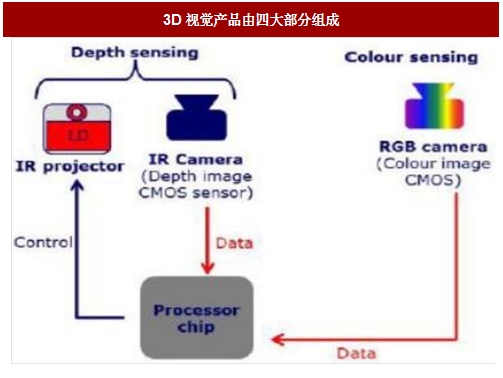

1. IRprojector   和IRCamera 的运行过程，是一行一行的扫描得到？  激光发射器是一束激光  还是n多束激光
2. 利用IR图计算深度图时，采集到的散斑与标记的散斑怎么匹配  得到深度值
3. 这其中的去畸变是指什么
4. rgb图和深度图如何对齐
5. 散斑结构光的标记
6. 散斑结构光的标定

我们知道IR Projector和IR Camera 无论在那种深度相机方案中都是不可或缺的，今天我们大致看下 IR Projector和IR Camera的情况和基本使用。

全球 3D结构光供应链趋于完善，整体技术方案有Primesense、奥比中光、英特尔、以色列Mantis Vision、图漾科技、奥比中光、华捷艾米等。在3D图像处理芯片方面，有Primesense、意法半导体、德州仪器、英飞凌等少数几家芯片巨头等。

2018年

3D摄像头模组拆解后，其主要硬件包括：红外光发射器（IR LED或VCSEL）、红外光图像传感器（IR 
CIS或者其他光电二极管）和可见光图像传感器（Vis 
CIS）、图像处理芯片、滤光片或镜头。此外，室外工作的飞行时间（ToF）方案需要窄带滤光片；结构光方案需要发射端光学棱镜与DOE光栅；双目立体成像方案采用两颗红外光摄像头或两颗可见光摄像头。

3D摄像头模组  是什么

3D Sensing模组是什么

3D系统组装是指什么

ov7251  

1. [ov7251 camera sensor](https://www.ovt.com/sensors/OV7251)
2. [ov9282]()

#### 参考链接

1. [2018-0807,3D结构光产业现状：手机厂商导入放缓，供应商后劲待发](http://www.eeworld.com.cn/xfdz/2018/ic-news080788630.html)
2. [3D摄像头产业链解析](http://www.sohu.com/a/271770701_132567)
3. [结构光定位标定](https://blog.csdn.net/seven_year_promise/article/details/78984105)

----

1. 