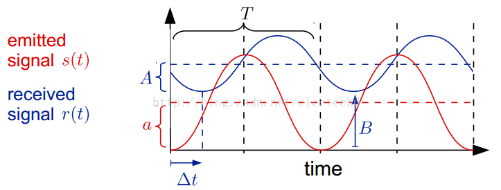
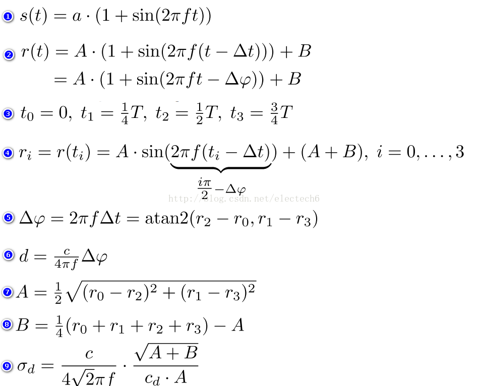

```

```


#### TOF(Time of Flight)基本原理

ToF是Time of Flight的缩写，直译为飞行时间，通过给目标发送光，然后用传感器**接收从物体返回的光**，通过探测这些发射和接收光脉冲的**飞行（往返）时间**来得到**目标物距离**。

##### TOF相机的一般组成

ToF相机与普通相机成像过程类似，主要由**光源、感光芯片、镜头、传感器、驱动控制电路以及处理电路**等几部分关键单元组成。

ToF相机包括两部分核心模块，`发射照明模块`和`感光接收模块`，根据这两大核心模块之间的相互关联来生成深度信息。ToF相机的感光芯片根据像素单元的数量也分为`单点`和`面阵式`感光芯片，为了测量整个三维物体表面位置深度信息，可以利用单点ToF相机通过逐点扫描方式获取被探测物体三维几何结构，也可以通过面阵式ToF相机，拍摄一张场景图片即可实时获取整个场景的表面几何结构信息，面阵式ToF相机更易受到消费类电子系统搭建的青睐

TOF的照射单元都是对光进行高频调制之后再进行发射，一般采用LED或激光（包含激光二极管和VCSEL）来发射高性能脉冲光

飞行时间的两种常见方案

##### 脉冲式激光测距

```
L = c Δt/2
```

*L*为测量距离，

*c*为光在空气中传播的速度， 

Δ*t*为光波信号在测距仪与目标往返的时间

可见此方式对时钟要求很高。

脉冲激光的发射角小，能量在空间相对集中，瞬时功率大，利用这些特性可制成各种中远距离激光测距仪、激光雷达等。目前，脉冲式激光测距广泛应用在地形地貌测量、地质勘探、工程施工测量、飞行器高度测量、人造地球卫星相关测距、天体之间距离测量等遥测技术方面

##### 相位式激光测距（连续式）

```
2L=ϕ⋅c⋅T/2π
```

式中*L*为测量距离，*c*为光在空气中传播的速度，*T*为调制信号的周期时间， *ϕ*为发射与接收波形的相位差。

特点是只能测试出一个周期内的距离，为解决这个问题可以使用多个频率

发射一束照明光，利用发射光波信号与反射光波信号的**相位变化**来进行距离测量。其中，照明模组的波长一般是红外波段，且需要进行高频率调制。ToF感光模组与普通手机摄像模组类似，由芯片，镜头，线路板等部件构成，ToF感光芯片每一个像元对发射光波的往返相机与物体之间的`具体相位`分别进行录，通过数据处理单元提取出`相位差`，由公式计算出深度信息。该芯片传感器结构与普通手机摄像模组所采用的CMOS图像传感器类似，但更复杂一些，它包含`调制控制单元`，`A/D转换单元`，`数据处理单元`等，因此ToF芯片像素比一般图像传感器像素尺寸要大得多，一般20um左右。也需要一个搜集光线的镜头，不过与普通光学镜头不同的是这里需要加一个`红外带通滤光片`来保证`只有与照明光源波长相同`的光才能进入。由于光学成像系统不同距离的场景为各个`不同直径的同心球面`，而非平行平面，所以在实际使用时，需要后续数据处理单元对这个误差进行校正。ToF相机的`校正`是生产制程中必不可少的最重要的工序，没有校正工序，ToF相机就无法正常工作。


#### 连续式正弦波调制测距原理推导


波形示意图




- 发射波s(t),接收波r(t)

  ```
  s(t) = a * (1+sin(2πft))
  ```

  ```
  r(t) = A *(1+sin(2πf(t-Δt))) + B
  ```

  




优点：

1. 相位偏移（公式5）中的(r2-r0)和(r1-r3)相对于脉冲调试法消除了由于测量器件或者环境光引起的固定偏差。
2. 可以根据接收信号的振幅A和强度偏移B来间接的估算深度测量结果的精确程度（方差）。
3. 不要求光源必须是短时高强度脉冲，可以采用不同类型的光源，运用不同的调制方法

缺点：

1. 需要多次采样积分，测量时间较长，限制了相机的帧率
2. 需要多次采样积分，测量运动物体时可能会产生运动模糊。 


#### TOF优点

体积小，误差小 
 TOF相机要求接收端与发射端尽可能的接近，越接近，由于发射、接收路径不同而带来的误差就越小，从体积紧凑角度来讲有着天然的优势；

直接输出深度信息 
 TOF可以直接输出深度信息，不需要类似双目立体视觉或者结构光等需要通过算法计算来获得深度信息。

抗干扰强 
 TOF不受表面灰度和特征影响，太阳光由于没有经过调制，所以TOF抗强光能力也较好


#### 总结


 目前的消费级TOF深度相机主要有：微软的Kinect  2、 MESA 的 SR4000 、Google Project Tango 中使用的PMD Tech  的TOF深度相机等。这些产品已经在体感识别、手势识别、环境建模等方面取得了较多的应用，最典型的就是微软的Kinect 2。

​    TOF深度相机对时间测量的精度要求较高，即使采用最高精度的电子元器件，也很难达到毫米级的精度。因此，在近距离测量领域，尤其是1m范围内，TOF深度相机的精度与其他深度相机相比还具有较大的差距，这限制它在近距离高精度领域的应用。

​    但是，从前面的原理不难看出，TOF深度相机可以通过调节发射脉冲的频率改变相机测量距离；TOF深度相机与基于特征匹配原理的深度相机不同，其测量精度不会随着测量距离的增大而降低，其测量误差在整个测量范围内基本上是固定的；TOF深度相机抗干扰能力也较强。因此，在测量距离要求比较远的场合（如无人驾驶），TOF深度相机具有非常明显的优势。