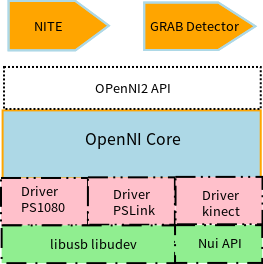

# openni SDK 源码框架


## OpenNI简介


- OpenNI中文译为开放自然语言交互，用官方的表述来讲就是a standard framework for 3D sensing，用于3D感知的开发接口；
- OpenNI2是第二代版本，相对于第一代更加专注于对3D设备的支持和数据的获取，移除了手势识别等中间件的方式，代码更加的精简，简而言之OpenNI2就是一个RGBD相机的用户态驱动，对上提供统一的接口，方便用户获取RGBD的图像数据，对下提供统一的标准类，方便RGBD厂商进行适配；
- 目前OpenNI2支持的设备包括PS1080、PSLink、orbbec、Kinect等设备，由于其清晰的代码结构，很容易对第三方设备进行适配；
- OpenNI2的源码地址为https://github.com/OpenNI/OpenNI2
  


## 整体框图





- 最上层为关于OpenNI2的应用如NITE手势识别，身体运动检测等
- 接下来是OpenNI2的对外提供的统一接口，这些接口对应的头文件为OpenNI.h
- OpenNI Core为OpenNI2的核心部分，OpenNI.h中的结构实现都在这部分；对Driver层提供统一的API，用于Driver的开发扩展，这部分API对应的头文件为OniDriverAPI.h
- 最底层为硬件驱动、或者第三方库，如PS1080通信用的libusb，以及kinect的Nui API
  

## OpenNI2 API 

```c++
namespace openni
{
    class VideoMode；
    class SensorInfo;
    class VideoFrameRef;
    class VideoStream;
    class Device;
    class OpenNI;
    class CameraSettings;
    class PlaybackControl;
}
```


OpenNI2 的类都放在命名空间openni中，主要有OpenNI、Device、VideoStream、VideoFrameRef这些类

- openni::Device 	顾名思义是rgbd设备的封装
- openni::VideoStream     是各个视频流的封装，类型有depth，IR、color等
- openni::VideoFrameRef 是图片信息的封装
- openni::OpenNI              用于管理上述各个封装


### readdemo


```c++
#include <stdio.h>
#include <OpenNI.h>

#include "OniSampleUtilities.h"

#define SAMPLE_READ_WAIT_TIMEOUT 2000 //2000ms

using namespace openni;

int main()
{
    // OpenNI 的初始化， 该方法必须调用，在此之后才能使用Videostream、 Device等
    Status rc = OpenNI::initialize();
    if (rc != STATUS_OK)
    {
        printf("Initialize failed\n%s\n", OpenNI::getExtendedError());
        return 1;
    }

    // 打开一个设备，这里的ANY_DEVICE为打开系统中连接的第一个设备
    Device device;
    rc = device.open(ANY_DEVICE);
    if (rc != STATUS_OK)
    {
        printf("Couldn't open device\n%s\n", OpenNI::getExtendedError());
        return 2;
    }

    VideoStream depth;

    // 打开设备后，获取传感器信息，然后根据传感器信息创建视频流
    if (device.getSensorInfo(SENSOR_DEPTH) != NULL)
    {
        // 创建一个深度视频流
        rc = depth.create(device, SENSOR_DEPTH);
        if (rc != STATUS_OK)
        {
            printf("Couldn't create depth stream\n%s\n", OpenNI::getExtendedError());
            return 3;
        }
    }

    // 调用start方法开始采集深度信息
    rc = depth.start();
    if (rc != STATUS_OK)
    {
        printf("Couldn't start the depth stream\n%s\n", OpenNI::getExtendedError());
        return 4;
    }

    VideoFrameRef frame;

    while (!wasKeyboardHit())
    {
        int changedStreamDummy;
        VideoStream* pStream = &depth;

        // 采用轮询方式获取码流信息
        rc = OpenNI::waitForAnyStream(&pStream, 1, &changedStreamDummy, SAMPLE_READ_WAIT_TIMEOUT);
        if (rc != STATUS_OK)
        {
            printf("Wait failed! (timeout is %d ms)\n%s\n", SAMPLE_READ_WAIT_TIMEOUT, OpenNI::getExtendedError());
            continue;
        }

        // 读取一帧数据
        rc = depth.readFrame(&frame);
        if (rc != STATUS_OK)
        {
            printf("Read failed!\n%s\n", OpenNI::getExtendedError());
            continue;
        }

        if (frame.getVideoMode().getPixelFormat() != PIXEL_FORMAT_DEPTH_1_MM && frame.getVideoMode().getPixelFormat() != PIXEL_FORMAT_DEPTH_100_UM)
        {
            printf("Unexpected frame format\n");
            continue;
        }

        // 获取深度图像中心点的深度值
        DepthPixel* pDepth = (DepthPixel*)frame.getData();
                float x,y,z;
                CoordinateConverter coorvert; 

        int middleIndex = (frame.getHeight()+1)*frame.getWidth()/2;

                coorvert.convertDepthToWorld(depth, frame.getWidth()/4, frame.getHeight()/4, pDepth[middleIndex], &x, &y, &z);

        printf("[%08llu] %8d %f %f %f\n", (long long)frame.getTimestamp(), pDepth[middleIndex], x, y, z);
    }

    // 停止视频采集后关闭相关设备
    depth.stop();
    depth.destroy();
    device.close();
    OpenNI::shutdown();

    return 0;
}
```


OpenNI2相当于rgbd设备的用户态驱动，主要提供了一套获取rgbd设备的深度数据和color图片的API函数；手势识别等算法应用是建立在OpenNI2 API之上的；
OpenNI2的两大特点：

1. 对外提供统一的接口用以获取rgbd设备的数据，屏蔽应用层对不同设备的操作的差异；
2. OpenNI2 提供了两种方式来获取数据：轮询和事件方式；

