0

## **基本概念**

一个【传输】(控制、批量、中断、等时)：由多个【事务】组成;

一个【事务】(IN、OUT、SETUP)：由一多个【Packet】组成。

USB数据在【主机软件】与【USB设备特定的端点】间被传输。【主机软件】与【USB设备特定的端点】间的关联叫做【pipes】。一个USB设备可以有多个管道(pipes)。

## 1 包(Packet)

包(Packet)是USB系统中信息传输的基本单元，所有数据都是经过打包后在总线上传输的。数据在  USB总线上的传输以包为单位，包只能在帧内传输。高速USB 总线的帧周期为125us，全速以及低速 USB 总线的帧周期为  1ms。帧的起始由一个特定的包(SOF 包)表示，帧尾为 EOF。EOF不是一个包，而是一种电平状态，EOF期间不允许有数据传输。

注意：虽然高速USB总线和全速/低速USB总线的帧周期不一样，但是SOF包中帧编号的增加速度是一样的，因为在高速USB系统中，SOF包中帧编号实际上取得是计数器的高11位，最低三位作为微帧编号没有使用，因此其帧编号的增加周期也为 1mS。

**• USB总线上的情形是怎样的?**

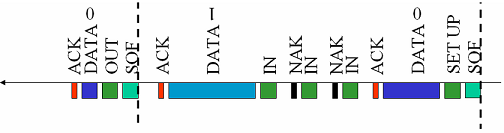

• 包是USB总线上数据传输的最小单位，不能被打断或干扰，否则会引发错误。若干个数据包组成一次事务传输，一次事务传输也不能打断，属于一次事务传输的几个包必须连续，不能跨帧完成。一次传输由一次到多次事务传输构成，可以跨帧完成。

USB包由五部分组成，即同步字段(SYNC)、包标识符字段(PID)、数据字段、循环冗余校验字段(CRC)和包结尾字段(EOP)，包的基本格式如下图：

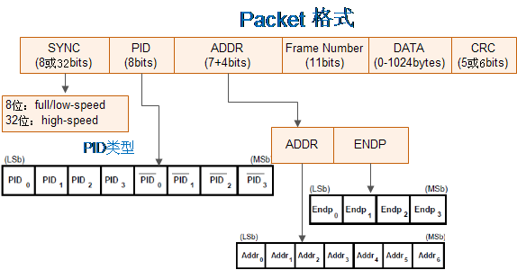

### **1.1 PID类型(即包类型)**

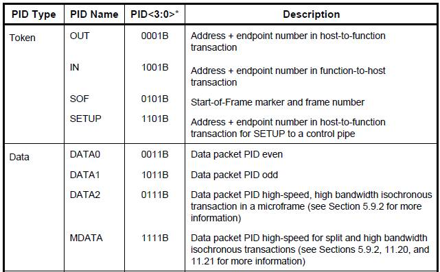

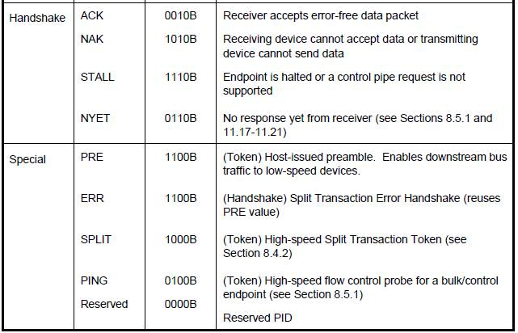

### **1.2 Token Packets**

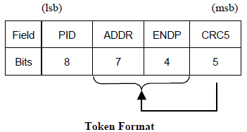

此格式适用于IN、OUT、SETUP、PING。

PID 数据传输方向

IN Device->Host

OUT Host->Device

SETUP Host->Device

PING Device->Host

### **1.3 Start-of-Frame(SOF) Packets**

SOF包由Host发送给Device。

1) 对于full-speed总线，每隔1.00 ms ±0.0005 ms发送一次;

2) 对于high-speed总线，每隔125 μs ±0.0625 μs发送一次;

SOF包构成如下图所示：

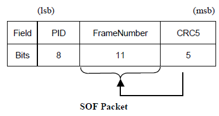

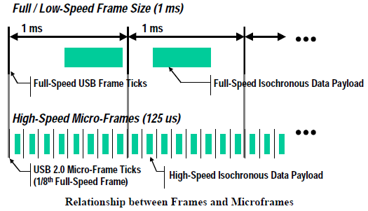

### **1.4 Data Packets**

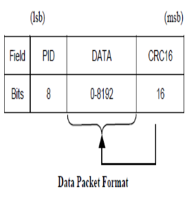

有四种类类型的数据包：DATA0, DATA1, DATA2,and MDATA，且由PID来区分。DATA0和DATA1被定义为支持数据切换同步(data toggle synchronization)。

### **1.5 Handshake Packets**

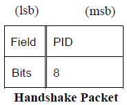

• ACK: 对于IN事务，它将由host发出;对于OUT、SETUP和PING事务，它将由device发出。

• NAK: 在数据阶段，对于IN事务，它将由device发出;在握手阶段，对于OUT和PING事务，它也将由device发出;host从不发送NAK包。

## 2 **事务(Transaction)**

在USB上数据信息的一次接收或发送的处理过程称为事务处理(Transaction)即：The delivery of service to an
endpoint。一个事务由一系统packet组成，具体由哪些packet组成，它取决于具体的事务。可能由如下包组成：

• 一个token packet

• 可选的data pcket

• 可选的handshake packet

• 可选的special packet

### **2.1 输入(IN)事务处理**

输入事务处理：表示USB主机从总线上的某个USB设备接收一个数据包的过程。

•【正常】的输入事务处理

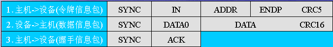

•【设备忙】时的输入事务处理

【设备出错】时的输入事务处理

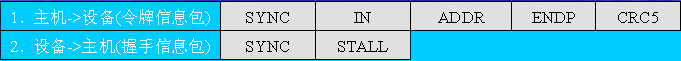

### **2.2. 输出(OUT)事务处理**

输出事务处理：表示USB主机把一个数据包输出到总线上的某个USB设备接收的过程。

•【正常】的输出事务处理

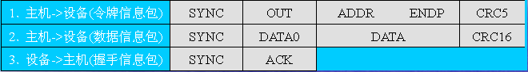

•【设备忙时】的输出事务处理

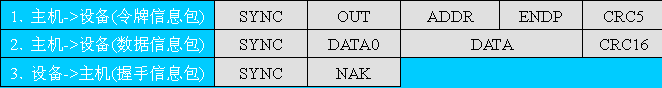

•【设备出错】的输出事务处理

### **2.3 设置(SETUP)事务处理**

•【正常】的设置事务处理

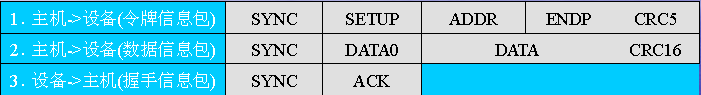

•【设备忙时】的设置事务处理

•【设备出错】的设置事务处理

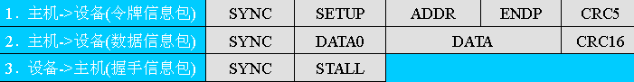

## **3 USB传输类型**

在USB的传输中，定义了4种传输类型：

• 控制传输 (Control Transfer)

• 中断传输 (Interrupt Transfer)

• 批量传输 (Bulk Transfer)

• 同步传输 (Isochronous)

### **3.1 控制传输 (Control Transfer)**

控制传输由2～3个阶段组成：

1) 建立阶段(Setup)

2) 数据阶段(无数据控制没有此阶段)(DATA)

3) 状态阶段(Status)

•每个阶段都由一次或多次(数据阶段)事务传输组成(Transaction)。

控制数据由USB系统软件用于配置设备(在枚举时)，其它的驱动软件可以选择使用control transfer实现具体的功能，数据传输是不可丢失的。

#### **3.1.1 建立阶段**

主机从USB设备获取配置信息，并设置设备的配置值。建立阶段的数据交换包含了SETUP令牌封包、紧随其后的DATA0数据封包以及ACK握手封包。它的作用是执行一个设置(概念含糊)的数据交换，并定义此控制传输的内容(即：在Data  Stage中IN或OUT的data包个数，及发送方向，在Setup Stage已经被设定)。

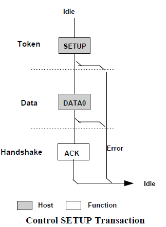

#### **3.1.2 数据阶段**

根据数据阶段的数据传输的方向，控制传输又可分为3种类型：

1) 控制读取(读取USB描述符)

2) 控制写入(配置USB设备)

3) 无数据控制

数据传输阶段：用来传输主机与设备之间的数据。

• 控制读取

是将数据从设备读到主机上，读取的数据USB设备描述符。该过程如下图的【Control  Read】所示。对每一个数据信息包而言，首先，主机会发送一个IN令牌信息包，表示要读数据进来。然后，设备将数据通过DATA1/DATA0数据信息包回传给主机。最后，主机将以下列的方式加以响应：当数据已经正确接收时，主机送出ACK令牌信息包;当主机正在忙碌时，发出NAK握手信息包;当发生了错误时，主机发出STALL握手信息包。

• 控制写入

是将数据从主机传到设备上，所传的数据即为对USB设备的配置信息，该过程如下的图【Control  Wirte】所示。对每一个数据信息包而言，主机将会送出一个OUT令牌信息包，表示数据要送出去。紧接着，主机将数据通过DATA1/DATA0数据信息包传递至设备。最后，设备将以下列方式加以响应：当数据已经正确接收时，设备送出ACK令牌信息包;当设备正在忙碌时，设备发出NAK握手信息包;当发生了错误时，设备发出STALL握手信息包。

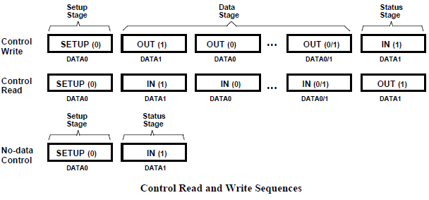

#### **3.1.3 状态阶段**

状态阶段：用来表示整个传输的过程已完全结束。

状态阶段传输的方向必须与数据阶段的方向相反，即原来是IN令牌封包，这个阶段应为OUT令牌封包;反之，原来是OUT令牌封包，这个阶段应为IN令牌封包。

对于【控制读取】而言，主机会送出OUT令牌封包，其后再跟着0长度的DATA1封包。而此时，设备也会做出相对应的动作，送ACK握手封包、NAK握手封包或STALL握手封包。

相对地对于【控制写入】传输，主机会送出IN令牌封包，然后设备送出表示完成状态阶段的0长度的DATA1封包，主机再做出相对应的动作：送ACK握手封包、NAK握手封包或STALL握手封包。

### **3.2 批量传输 (Bulk Transfer)**

•用于传输大量数据，要求传输不能出错，但对时间没有要求，适用于打印机、存储设备等。

•批量传输是可靠的传输，需要握手包来表明传输的结果。若数据量比较大，将采用多次批量事务传输来完成全部数据的传输，传输过程中数据包的PID 按照 DATA0-DATA1-DATA0-…的方式翻转，以保证发送端和接收端的同步。

• USB 允许连续 3次以下的传输错误，会重试该传输，若成功则将错误次数计数器清零，否则累加该计数器。超过三次后，HOST 认为该端点功能错误(STALL)，放弃该端点的传输任务。

• 一次批量传输(Transfer)由 1 次到多次批量事务传输(Transaction)组成。

• 翻转同步：发送端按照 DATA0-DATA1-DATA0-…的顺序发送数据包，只有成功的事务传输才会导致 PID  翻转，也就是说发送端只有在接收到 ACK 后才会翻转  PID，发送下一个数据包，否则会重试本次事务传输。同样，若在接收端发现接收到到的数据包不是按照此顺序翻转的，比如连续收到两个  DATA0，那么接收端认为第二个 DATA0 是前一个 DATA0 的重传。

它通过在硬件级执行“错误检测”和“重传”来确保host与device之间“准确无误”地传输数据，即可靠传输。它由三种包组成(即IN事务或OUT事务)：

1) token

2) data

3) handshake

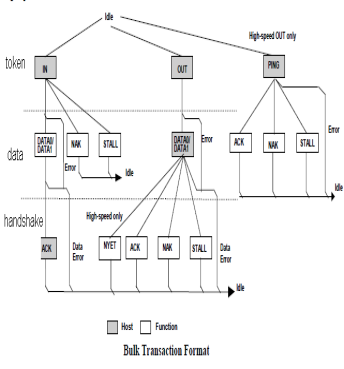

1) For IN Token (即：IN Transaction)

• ACK: 表示host正确无误地接收到数据

• NAK: 指示设备暂时不能返回或接收数据 (如：设备忙)

• STALL:指示设备永远停止，需要host软件的干预 (如：设备出错)

2) For OUT Token (即：OUT Transaction)

如果接收到的数据包有误，如：CRC错误，Device不发送任何handshake包

• ACK: Device已经正确无误地接收到数据包，且通知Host可以按顺序发送下一个数据包

• NAK: Device 已经正确无误地接收到数据包，且通知Host重传数据，由于Device临时状况(如buffer满)

• STALL: 指示Device endpoint已经停止，且通知Host不再重传

3) Bulk读写序列

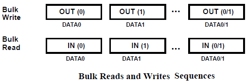

即由一系统IN事务或OUT事务组成。

### **3.3 中断传输(Interrupt Transfer)**

中断传输由IN或OUT事务组成。

中断传输在流程上除不支持PING 之外，其他的跟批量传输是一样的。他们之间的区别也仅在于事务传输发生的端点不一样、支持的最大包长度不一样、优先级不一样等这样一些对用户来说透明的东西。

主机在排定中断传输任务时，会根据对应中断端点描述符中指定的查询间隔发起中断传输。中断传输有较高的优先级，仅次于同步传输。

同样中断传输也采用PID翻转的机制来保证收发端数据同步。下图为中断传输的流程图。

中断传输方式总是用于对设备的查询，以确定是否有数据需要传输。因此中断传输的方向总是从USB设备到主机。

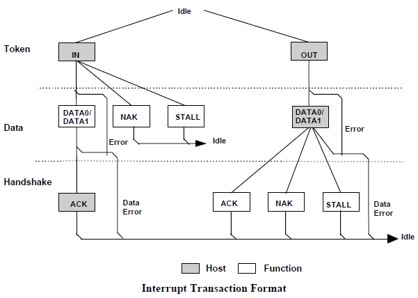

DATA0或DATA1中的包含的是中断信息，而不是中断数据。

### **3.4 同步传输(Isochronous Transfer)**

1) 它由两种包组成：

1) token

2) data

同步传输不支持“handshake”和“重传能力”，所以它是不可靠传输。

同步传输是不可靠的传输，所以它没有握手包，也不支持PID翻转。主机在排定事务传输时，同步传输有最高的优先级。

同步传输适用于必须以固定速率抵达或在指定时刻抵达，可以容忍偶尔错误的数据上。实时传输一般用于麦

克风、喇叭、UVC Camera等设备。实时传输只需令牌与数据两个信息包阶段，没有握手包，故数据传错时不会重传。

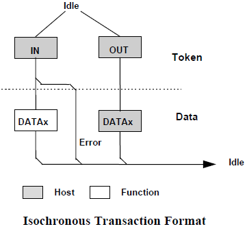

## 参考链接

1. 