### 0,目标

本文主要描述USB通讯协议的主要概念，协议格式，枚举流程。

### 1，USB 是什么

- USB`（Universal Serial Bus） 是一种支持热插拔的高速串行传输总线，它使用 差分信号 来传输数据。
- 在 USB 1.0和 USB 1.1 版本中，只支持 1.5Mb/s 的低速（low-speed）模式和 12Mb/s 的全速（full-speed）模式，在 USB 2.0 中，又加入了480Mb/s 的高速模式，USB 3.0(super speed)，传输速率最大5Gbps。
- USB 2.0 被设计成为向下兼容的模式，当有全速（USB 1.1）或者低速（USB 1.0）设备连接到高速（USB 2.0）主机时，主机可以通过分离传输来支持它们。
- 一条USB 总线上，可达到的最高传输速度等级由该总线上最慢的“设备”决定。

### 2，USB架构组成

USB 体系包括 ***USB host（主机）*** 、***USB device(设备)*** 以及 ***物理连接(USB interconnect)*** 三个部分。其中，***设备(USB device)*** 又分为 ***USB function*** 和 ***USB Hub***。

#### USB Host

- ***USB host：*** 任何USB系统中只有一个主机。 主机系统的USB接口被称为主机控制器。 主机控制器可以以硬件，固件或软件的组合来实现。 根集线器集成在主机系统内以提供一个或多个连接点。


#### USB device

- USB Hub： USB HUB提供了一种低成本、低复杂度的USB接口扩展方法。HUB的上行PORT面向HOST，下行PORT面向设备(HUB或功能设备)。在下行PORT上，HUB提供了设备连接检测和设备移除检测的能力，并给各下行PORT供电。HUB可以单独使能各下行PORT。不同PORT可以工作在不同的速度等级(高速/全速/低速)。

> （1）一个 USB HOST 最多可以同时支持128 个地址，地址0 作为默认地址，只在设备枚举期间临时使用，而不能被分配给任何一个设备，因此一个USB HOST 最多可以同时支持127 个地址，如果一个设备只占用一个地址，那么可最多支持127 个USB 设备。在实际的USB 体系中，如果要连接127 个USB设备，必须要使用USB HUB，而USB HUB 也是需要占用地址的，所以实际可支持的USB 功能设备的数量将小于127。
> （2）ROOT HUB 是一个特殊的USB HUB，它集成在主机控制器里，不占用地址。ROOT HUB 不但实现了普通USB HUB 的功能，还包括其他一些功能。
> （3）“复合设备（Compound Device）”可以占用多个地址。所谓复合设备其实就是把多个功能设备通过内置的USB HUB 组合而成的设备，比如带录音话筒的USB 摄像头等。

- ***USB function：*** 能够通过总线传输或接收数据或控制信息的设备，在USB2.0标准中，别成为Class，规范中有详细的章节进行定义。主要有以下三类：
  - A human interface device such as a mouse, keyboard, tablet, or game controller
  - An imaging device such as a scanner, printer, or camera
  - A mass storage device such as a CD-ROM drive, floppy drive, or DVD drive
    

#### ***USB interconnect：***

 USB设备连接到主机并与之通信的方式。主要由以下三部分：

- Bus Topology： 

1. USB上的设备通过分层的星形拓扑物理连接到主机，如下图所示。 

2. USB连接点由称为集线器的特殊类别的USB设备提供。

3.  集线器提供的附加连接点称为端口。 主机包括称为根集线器的嵌入式集线器。 

4. 主机通过根集线器提供一个或多个连接点。 

5. 为主机提供附加功能的USB设备称为功能(funcation)。 

6. 为了防止循环附件，USB层的星形拓扑结构上采用了分层排序。

   

   

USB设备和主机之间的连接模型

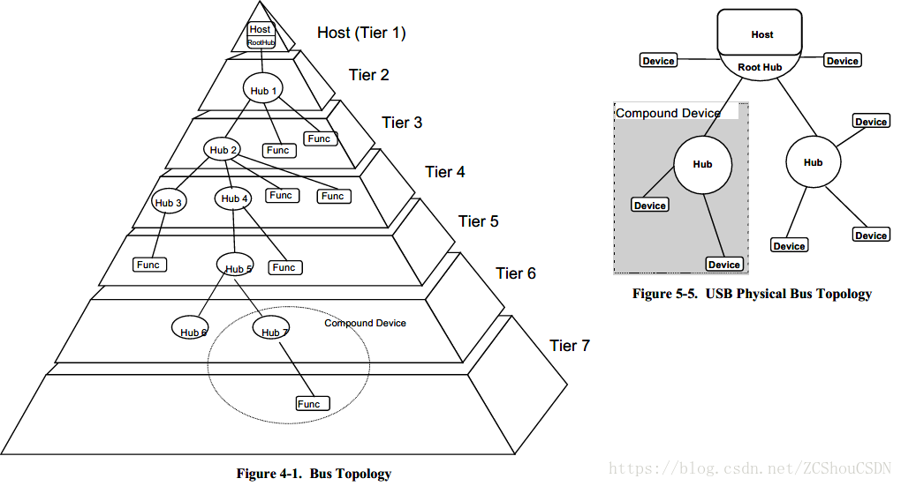

> 以HOST-ROOT HUB为起点，最多支持7 层（Tier），也就是说任何一个
> USB 系统中最多可以允许5个USB HUB 级联。一个复合设备（Compound Device）将同时占据两层或更多的层。


- ***Inter-layer Relationships：*** 就功能堆栈而言，是系统中每层执行的USB任务。
- ***Data Flow Models：*** 数据在生产者和消费者之间通过USB在系统中移动的方式。


> 管道（Pipe）是主机和设备端点之间数据传输的模型，共有两种类型的管道：***无格式的流管道（Stream Pipe）***和***有格式的信息管道（Message Pipe）***。任何USB 设备一旦上电就存在一个信息管道，即默认的控制管道，USB 主机通过该管道来获取设备的描述、配置、状态，并对设备进行配置。


***USB Schedule：*** USB 提供共享互连。 为了支持同步数据传输并消除仲裁开销，计划访问互连。


### 3,***NRZI(非归零编码)*** 

NRZ-I编码中，编码后电平只有正负电平之分，没有零电平，是不归零编码。

根据这一编码原则，假设发送端传送8位数据流0000   0001B，前面的7个0位经过NRZ-I编码后，将得到7次翻转信号，如图二的同步域部分。在接收端根据脉宽很容易得到同步接收时钟。此后根据这个频率的倍频来采样后面的数据。在传输过程中，每一次编码的跳变都可以用来同步。这种同步机制在USB低速和中速传输中得到应用。即发送数据前，首先发送同步头**SYNC**，内容为01H。这样就可以[同步传输](https://baike.baidu.com/item/同步传输/2007281)数据了，且字节开头和结尾不需要起始位和停止位。

#### 示例

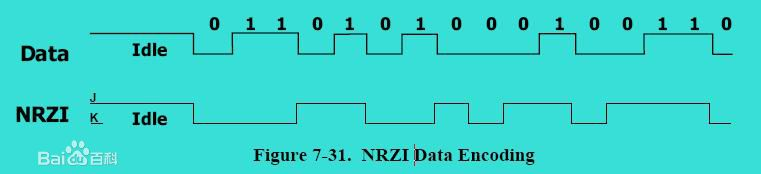

[NRZ-I](https://baike.baidu.com/item/NRZ-I)电平的一次翻转来表示Data电平的逻辑0，与前一个NRZ-I电平相同的电平表示Data电平的逻辑1（）。仔细观察，我们发现，NRZ-I编码信号经过反向后，还原的内容不变。典型应用如USB传输。

#### 原理

**NRZ-INo Return Zero-Inverse 非归零反相编码**

在传输中，同步头SYNC为00 01H，15个翻转信号。

但是当传输连续的逻辑1位时，NRZ-I编码后，将保持上一次翻转后的状态。这使得接收端无法从中得到同步信号。为此，USB协议规定：如果要发送的数据中出现有连续的6个1，则在进行NRZI编码前，在这6个连续的1后面会插入1个0，然后再进行NRZI编码。接收端收到连续6个1，将自动去掉后面的1个0。从而恢复原数据。如图二的包[数据传送](https://baike.baidu.com/item/数据传送)多个1的处理。这样就使得USB通信的接收同步更加可靠。

解释翻转含义：

这个翻转是在原来的电平上翻转的，当碰到0电平来临的时候，原来的1电平变为现在的0电平。是在上一个电平的基础上翻转的，这样有助于理解。

#### usb中使用NRZI


USB采用不归零取反来传输数据，当传输线上的差分数据输入0时就取反，输入1时就保持原值，为了确保信号发送的准确性，当在USB总线上发送一个包时，传输设备就要进行位插入操作(即在数据流中每连续 6 个 1 后就插入一个0) ，从而强迫 NRZI 码发生变化。接收方解码 NRZI 码流，然后识别出填充位，并丢弃它们。这些是**由专门硬件处理**的。


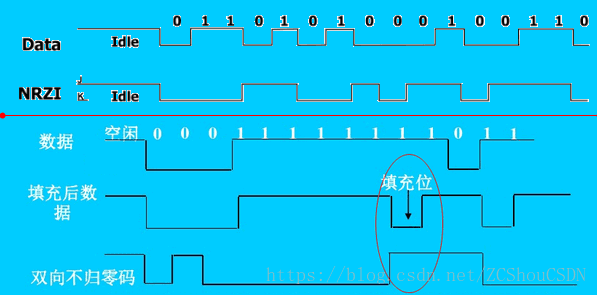


### 4, USB协议数据格式

本文描述，USB协议中基本的数据类型。

- 集合关系：传输类型 -> 事务 -> 包 -> 域
  - 传输类型： 控制、中断、同步、批量
  - 事务： IN、OUT、SETUP
  - 包： 令牌包、数据包、握手包
  - 域： 同步序列域、包标识域、地址域、端点域、帧号域、数据域、CRC校验域

- 注:

1. USB基本 数据结构是包，而包由不同的域构成，而不同的包又组成不同的传输类型。
2. USB总线发送是LSB在前，MSB最后。
3. 批量传输、同步传输和中断传输每传输一次数据都是一个事务。
4. 控制传输包括三个过程，建立过程和状态过程分别是一个事务，数据过程则可能包含多个事务。


### 5, USB 协议 常用概念

#### 帧周期

高速USB 总线的帧周期为125us，全速以及低速 USB 总线的帧周期为 1ms。

也就是说 对于高速USB总线 每125us 传输一帧数据。

#### 帧（Frame）

时间概念，在USB中，一帧就是1ms（对于全速及低速设备），它是一个独立的单元，包含了一系列总线动作，USB将1帧分为好几份，每一份中是一个USB的传输动作。	

帧的起始由一个特定的包（SOF包）表示，帧尾为 EOF。EOF不是一个包，而是一种电平状态，EOF期间不允许有数据传输。 

帧编号在SOF包中。

 **注意：**虽然高速USB总线和全速/低速USB总线的帧周期不一样，但是SOF包中帧编号的增加速度是一样的，因为在高速USB系统中，SOF包中帧编号实际上取得是计数器的高11位，最低三位作为微帧编号没有使用，因此其帧编号的增加周期也为 1mS。	

帧的概念 粗浅的理解可以认为是数据链路层的概念。 USB  电气部分属于物理层，在物理层之上 利用 NRZI(非归零编码)和帧的概念，实现数据链路层，这一层负责实现，包的传输和传递。

#### Start-of-Frame(SOF) Packets

在一帧的开始时发送。

SOF包由Host发送给Device。
    1) 对于full-speed总线，每隔1.00 ms ±0.0005 ms发送一次；
    2) 对于high-speed总线，每隔125 μs ±0.0625 μs发送一次；
    SOF包构成如下图所示：


### 6， 包(Package)

包是USB总线上数据传输的最小单位，不能被打断或干扰，否则会引发错误。若干个数据包组成一次事务传输，一次事务传输也不能打断，属于一次事务传输的几个包必须连续，不能跨帧完成。一次传输由一次到多次事务传输构成，可以跨帧完成。

USB包由五部分组成，即同步字段（SYNC）、包标识符字段（PID）、数据字段、循环冗余校验字段（CRC）和包结尾字段（EOP），包的基本格式如下图：


#### 同步序列域SYNC

位于一个包的最开始处，8bit，固定0000 0001 

#### 标识域PID

8bit，LSB四位为标识码，MSB四位为标识码的反码。类型见下图。

USB 协议1 .1 中, 定义了10 种不同类型的包。USB 协议2 .0 中则定义了全部16 种标识域。如下图所示，标橙色为2.0所有。 

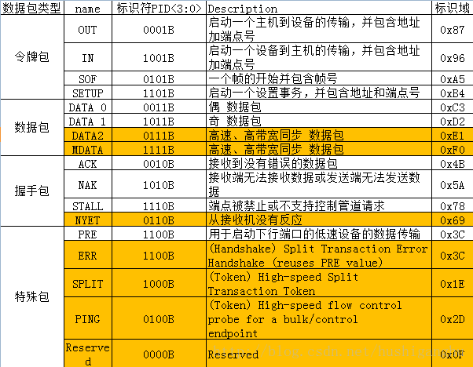


#### 地址域（ADDR）

由主机分配唯一地址，7bit，由于地址0保留用作初始化，因此地址最多有127个，也是usb结构中最大127个设备的原因

#### 端点域（ENDP）

4bit，端点0必须作为控制端点，端点可被定义为IN、SETUP、OUT、PING端点，所有设备必须支持端点0作为默认的控制管道。低速设备最大支持3个管道，1个0端点和2个其他端点（可以是都是控制，一个控制一个中断也可以是两个中断）。高速全速支持最大16个输入输出管道。

#### 帧号域（FRAM）

11bit，每个帧都有一个特定帧号，帧号域最大容量为0x7FF 

#### 数据域（DATA）

在不同的传输类型中，数据域的长度不同（0到1024Byte），但是必须为整数个字节的长度。 

#### 校验域（CRC）

对令牌包和数据包中非PID域进行校验，令牌包使用CRC5（5bit），数据包使用CRC16（16bit）

### 7， 包分类

#### 令牌包( Token Packet )

##### IN、OUT、SETUP包

结构是一样的，如下图 

| SYNC | PID  | ADDR | ENDP | CRC5 |
| ---- | ---- | ---- | ---- | ---- |
| 8bit | 8bit | 7bit | 4bit | 5bit |

##### SOF

Start-of-Frame(SOF) Packets

帧的起始由一个特定的包（SOF 包）表示，所有高速和全速还有hub都会收到SOF包，但是不会引起任何作用

##### Split Token

split传输特殊令牌包（Split Token）

　　在主机控制器和 HUB之间执行，通过分离传输，可以允许全速/低速设备连接到高速主机。分为start-split transaction (SSPLIT)和complete-split transaction (CSPLIT)。具体可看USB2.0协议8.4.2。


#### 数据包（Data Packets）

USB 发送数据包的时候, 如果一次发送数据长度大于端点容量时候, 就要把数据分成几个包, 分批发送。如果第一个数据包被确定为DATA0 , 那么第二个发送的数据包就应该是DATA1⋯⋯如此交替下去。而数据的接收方在接收数据时检查其类型是否是DA TA0、DATA1 交替的, 这是保证数据交换正确的机制之一。
但是当处于同步传输中，所有的数据包都是DATA0。 

| SYNC | PID  | DATA        | CRC16 |
| ---- | ---- | ----------- | ----- |
| 8bit | 8bit | 0-1023 byte | 16bit |


所有的四个数据包用于高带宽高速同步端点，三个数据包(MDATA DATA0,DATA1)用于split事务传输。 
所有数据包都是整数发送，CRC校验不包括PID域。允许数据包最大大小为低速8Byte，全速1023Byte，高速1024Byte。

#### 握手包（Handshake Packets）


| SYNC | PID  |
| ---- | ---- |
| 8bit | 8bit |

##### ACK

标识域PID 被正确接收;
并且没有发生数据位错误;
没有发生数据域的CRC 校验错误等。
一般由接收到数据的一方发出，主机和设备都可以发送
ACK。

##### NACK

在接到主机发来的OU T 命令后, 设备无法接收数据;
接到主机的IN 命令, 但是设备没有数据发送给主机。
NAK 只能由设备发送, 而不能由主机发送。

##### STALL

设备无法发送数据;
设备无法接收数据;
不支持某一种控制管道的命令
STALL 也只能是由设备来发送，NAK 是USB 的一种暂时状态, 当设备处于“ 忙”的工作状态时, 就会发送NAK。等到设备处于空闲状态。这时, 如果主机再要求设备发送或接收数据时, 设备不再返回NAK, 而是进行正常的数据传输。而STALL 与NAK 不同, STALL所表示的传送失败的意义更加严重。当在控制传输中出现STALL 后, 主机就会丢弃所有发给设备的控制命令, 而且要重新进行控制传输后, 才能停止STALL 状态。

##### NYET

##### ERR


### 8，事务

　事务分为IN，OUT，SETUP3个事务。每个事务由令牌包，数据包，握手包3个阶段构成。事务3个阶段如下：
　　1）令牌包阶段：启动一个输入，输出或设置的事务。
　　2）数据包阶段：按输入，输出发送相应的数据。
　　3）握手包阶段：返回数据接收情况，在同步传输的IN事务和OUT事务中没有这个阶段。

#### IN事务

- 令牌包阶段–主机发送一个PID为IN的输入包给设备，通知设备要往主机发送数据。
- 数据包阶段–设备根据情况会做出3种反应：
  　　a. 设备端点正常，设备往主机内发出数据，DATA0和DATA1交替发送。
    　　b. 设备正在繁忙，无法往主机发出数据包，此时发送NAK无效包，IN事务提前结束，到了下一个IN事务才继续。
    　　c. 相应设备端点被禁止，此时发送STALL错误包，事务提前结束，总线进入空闲状态。
- 握手包阶段–主机在正确接收到数据后，就会向设备发送ACK包。

#### OUT事务：

- 令牌包阶段–主机发送一个PID为OUT的输出包给设备，通知设备要接收主机数据。
- 数据包阶段–主机交替发送数据DATA0和DATA1。
- 握手包阶段–设备根据情况做出3种反应：
  　　a. 设备端点接收正确，设备向主机返回ACK包，通知主机可以发送新的数据，如果数据包发送了CRC校验数据，将不返回任何握手信息。
    　　b. 设备正在忙碌，无法从主机接收数据包就发送NAK无效包，通知主机再次发送数据。
    　　c. 相应设备端点被禁止，发送错误STALL包，事务提前结束，总线直接进入空闲状态。

#### SETUP事务

- 令牌包阶段–主机发送一个PID为SETUP的输出包给设备，通知设备要接收数据。

- 数据包阶段–主机设备发送数据，注意这里只有一个固定为8个字节的DATA0包，其中就是标准的USB设备请求指令。
- 握手包阶段–设备接收到主机的命令信息后，返回ACK包，此后总线进入空闲状态，并准备下一个传输。一般来说，在SETUP事务后面通常是一个IN或OUT事务构成的传输。
  


### 9，传输类型

USB 定义了4 种数据传输的类型：控制传输、中断传输、批量传输和同步传输。任何一种传输都是由上面的3 种事务所组成的，传输类型由一笔或者多笔事务完成。
USB 把事务分为IN、OU T 和SET UP 3 种类型, 但在每一种传输类型中, 这些相同事务结果并不是完全一样。比如，同步传输IN 事务和中断传输IN事务就有差别。

#### 批量传输(Bulk Transactions)

- 由IN 事务或OU T 事务构成
- 翻转同步：发送端按DATA0-DATA1-DATA0-…顺序发送数据包，只有成功的事务传输才会导致 PID 翻转，发送端只有在接收到 ACK 后才会翻转 PID，发送下一个数据包，否则会重试本次事务传输。同样，若在接收端发现接收到到的数据包不是按照此顺序翻转的，比如连续收到两个 DATA0，那么接收端认为第二个 DATA0 是前一个 DATA0 的重传。
- 没有固定传输速率，不占固定带宽
- PING事务是USB2.0高速模式特有的，全速模式和低速模式没有
- 全速和高速设备支持批量传输, 而低速设备不支持 

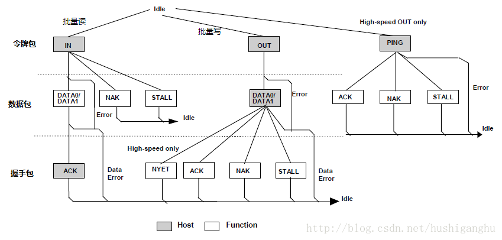

数据包大小

- 数据包大小可设定为8、16、32、64字节，高速设备必须设定为512字节除了最后一个包


#### 中断传输(Interrupt Transfer)

- IN 事务或OU T 事务组成。

- 除了不支持PING之外与批量传输一致

- 主机根据中断端点描述符指定查询间隔发起中断传输。中断传输有较高的优先级，仅次于同步传输。

- 没有固定传输速率，不占固定带宽

- 全速设备可选轮询周期是1～255 ms , 低速设备轮询周期10～255 ms 

数据包大小

低速设备数据包大学1-8字节，全速1-64字节，高速1-1024字节


#### 同步传输(Isochronous Transfer)


- 只有IN和OUT事务

- 没有握手包，总线优先保证占用带宽

- 只使用DATA0

- 数据包大小全速1-1023字节，高速1024字节

- 低速设备不支持 
  

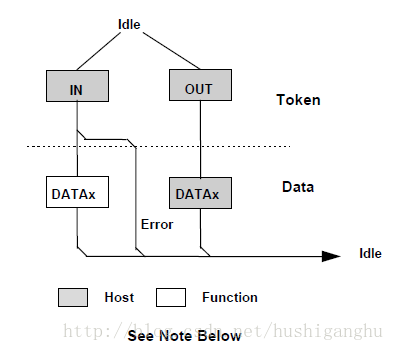


- 全速设备的同步传输, 在1 个帧内, 可以包含1 笔IN 事务或OUT 事务, 而高速设备可以包含3 笔事务。总线将会优先保证同步传输的带宽, 甚至会因此而暂时中止批量传输的进行。

数据包大小

全速设备数据包的大小为0～1 023 字节, 而高速设备为1 024 字节

#### 控制传输(Control Transfer)

枚举阶段最主要的数据交换方式

##### 结构

- 初始设置阶段;
- 可选数据阶段;
- 状态信息阶段。

##### （1）初始设置阶段


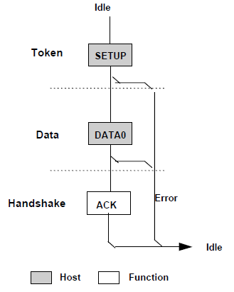

上图可知，初始设置阶段也分为
令牌包阶段: 主机发送SETUP令牌包。
数据包阶段: 主机发送固定为8 个字节的DATA0 包, 并且有确定的结构, 将这8 个字节分配给5 种命令信息, 即bmRequestType、bRequest、wValue、wIndex 和wLength。具体看标准命令


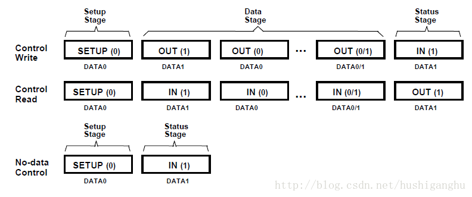

##### （2）可选数据阶段

如果在上一步骤中的命令要求读/ 写数据的话, 就由这一步骤来具体交换数据。如果没有数据交换要求的, 这个步骤就可以省去。（由SETUP事务的数据包阶段发送的标准请求命令决定），当一个数据包阶段发送不了时候，就分多个数据包发送。
根据数据阶段的数据传输的方向，控制传输又可分为3种类型：
1) 控制读取（读取USB描述符）
2) 控制写入（配置USB设备）
3) 无数据控制

##### （3）状态信息阶段

获取状态信息，由IN或OUT事务构成的传输
传输方向相反，这里IN表示向设备里面传送数据，OUT表示数据向主机里送数据，这是为了和可选数据阶段向结合。
数据包都是0长度


数据包大小

初始设置中, 1 个固定为8 字节大小的DATA0 包。可选数据步骤中, 低速设备,则数据包为8 字节; 全速设备数据包大小可以是8、16、32 和64 字节; 高速设备的数据包大小必须为64 字节。


### 10，数据流模型

#### 端点( Endpoint )

- 设备硬件上具有一定大小的数据缓冲区
- 有惟一的地址和端点号
- 端点0是设备的默认控制端点
- 端点描述符中规定了端点所能支持的最大包长。
  - 控制传输：高速模式的最大包长固定为64个字节；全速模式可在8、16、32、64字节中选择；低速模式的最大包长固定为8个字节。
  - 批量传输：高速模式固定为512个字节；全速模式最大包长可在8、16、32、64字节中选择；低速模式不支持批量传输。
  - 同步传输：高速模式的最大包长上限为1024个字节；全速模式的最大包长上限为1023个字节；低速模式不支持同步传输。
  - 中断传输：告诉模式的最大包长上限为1024个字节；全速模式最大包长上限为64个字节；低速模式最大最大包长上限为8个字节。
    

#### 管道( Pipe)

- 管道就是主机与设备端点之间逻辑上的的连接
- 管道的概念主要用于PC 上驱动程序和用户程序的编写

#### USB 数据传输过程

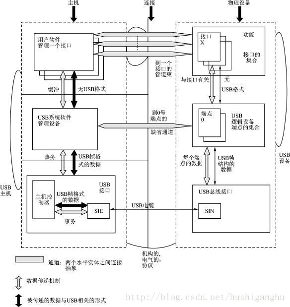


完整的数据传输过程:

-  PC 上, 设备驱动程序通过调用USB 驱动程序接口USBD( USB DriverInterface) , 发出输入输出请求包IRP; 
- 在USB 驱动程序接到请求之后, 调用主控制器驱动程序接口HCD( Host Cont roller DriverInterface ) , 将IRP 转化为USB的传输。
- 一个IRP 可以包含一个或多个USB 传输; 接着, 主控制器驱动程序将USB 传输分解为总线事务, 主控制器以包的形式发送给设备。
- 这里各种驱动程序和IRP的概念, 都是基于PC 和其操作系统的, 当在设计嵌入式USB 主机的时候, 完全可以摆脱这种框架, 而仅以最简单的能够实现USB 各种类传输为目标即可。
  

USB 采用“令牌包”-“数据包”-“握手包”的传输机制，在令牌包中指定数据包去向或者来源的设备地址和端点(Endpoint)，从而保证了只有一个设备对被广播的数据包/令牌包作出响应。握手包表示了传输的成功与否。
  USB 采用轮询的广播机制传输数据，所有的传输都由主机发起，任何时刻整个 USB 体系内仅允许一个数据包的传输，即不同物理传输线上看到的数据包都是同一被广播的数据包。
  各种传输类型下，对于包长、速率限制如下：
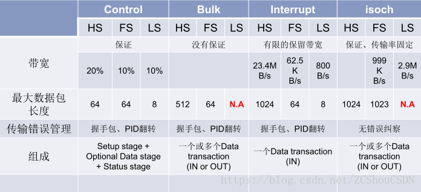

传输由OUT、IN和SETUP事务构成，传输有四种类型，中断传输、批量传输、同步传输、控制传输，其中中断传输和批量传输的结构一样，同步传输有最简单的结构，而控制传输是最重要的也是最复杂的传输。

### 11，USB设备的状态

在USB 2.0协议中第 9.1 USB Device States 章节规定了USB设备的6种状态

即 上电状态(Powered)，默认状态(Default)，地址状态(Address)和配置状态(Configured)， 连接状态和挂起状态（Suspend）。


1. 连接状态（Attached）：设备连接，但未提供电源。
2. 上电状态（Powered）：设备被复位(Reset)，或者说处于地址、配置状态.
3. 挂起状态（Suspended）：3 ms未见总线活动而处于省电状态，设备不可用，但仍然保持原有的USB地址和配置。


#### **1) 连接(Attached)**      

 设备可以连接到USB或者从USB上拔出.USB设备从总线上拨出后的状态在规范没定义,只说明一旦USB连到总线要求的操作以及属性.

####   **2) 上电(Powered)**       

USB设备的电源可来自外部电源，也可从USB接口的集线器而来。电源来自外部电源的USB设备被称作自给电源式的(self-powered)。尽管自给电源式的USB设备可能在连接上USB接口以前可能已经带电，但它们直到连线上USB接口后才能被看作是加电状态(Powered
state)。而这时候VBUS已经对设备产生作用了.
一个设备可能有既支持自给电源的，同时也支持总线电源式的配置。有一些支持其中的一种，而另一些设备配置可能只有在自给电源下才能被使用。设备对电源支持的能力是通过配置描述表(configuration
descriptor)来反映的。当前的电源供给形式被作为设备状态的一部分被反映出来。设备可在任何时候改变它们的供电来源，比如说：从自给式向总线式改变，如果一个配置同时支持两种模式，那此状态的最大电源需求就是指设备在两种模式下从VBUS上获取电能的最大值。设备必须以此最大电源作为参照，而究竟处于何状态是不考虑的。如果有一配置仅支持一种电源模式，那么电源模式的改变会使得设备失去当前配置与地址，返回加电状态。如果一个设备是自给电源式，并且当前配置需要大于100mA电流，那么如果此设备转到了总线电源式，它必须返回地址状态(Address
state)。自给电源式集线器使用VBUS来为集线控制器(Hub 
controller)提供电源，因而可以仍然保持配置状态(Configured state)，尽管自给电源停止提供电源。

####  **3)默认状态(Default)**

​      设备上电后,它不响应任何总线处理,直到总线接收到复位信号为止.接收到复位信号后,用默认的地址可以对设备寻址.
​        当用复位过程完成后,USB设备在正确的速度下操作(即低速/全速/高速).低速和全速的数据选择由设备的终端电阻决定.能进行高速操作的设备决定它是否在复位的过程的一部分执行高速操作.
​         能进行高速操作的设备在全速的电气环境中操作时,必须能以全速成功复位.设备成功复位后,设备必须成功响应设备和配置描述符请求,并且返回适当的信息.当在全速下工作时,设备可能或者不能支持预定义的功能.


#### **4) 地址(Address)**        

所有的USB设备在加电复位以后都使用缺省地址。每一设备在连接或复位后由主机分配一个唯一的地址。当USB设备处于挂起状态时，它保持这个地址不变。
        USB设备只对缺省通道(Pipe)请求发生响应，而不管设备是否已经被分配地址或在使用缺省地址。


#### **5) 配置状态( Configured )**       

在USB设备正常工作以前，设备必须被正确配置。从设备的角度来看，配置包括一个将非零值写入设备配置寄存器的操作。配置一个设备或改变一个可变的设备设置会使得与这个相关接口的终端结点的所有的状态与配置值被设成缺省值。这包括将正在使用(date
toggle)的结点(end point)的 (Date toggle)被设置成DATA0。

#### **6) 挂起状态**    

​    为节省电源，USB设备在探测不到总线传输时自动进入中止状态。当中止时，USB设备保持本身的内部状态，包括它的地址及配置。
所有的设备在一段特定的时间内探测不到总线活动时必须进入中止态。不管设备是被分配了非缺省的地址或者是被配置了，已经连接的设备必须在任何加电的时刻随时准备中止。总线活动的中止可能是因为主机本身进入了中止状态。另外，USB设备必须在所连接的集线器端口失效时进入中止态。这就是所指的选择性中止(Selective
suspend)。
​       USB设备在总线活动来到时结束中止态。USB设备也可以远程唤醒的电流信号来请求主机退出中止态或选择性中止态。具体设备具有的远程唤醒的能力是可选的，也就是说，如果一个设备有远程唤醒的能力，此设备必须能让主机控制此能力的有效与否。当设备复位时，远程唤醒能力必须被禁止。


### 12，USB枚举过程

#### 枚举是指什么

枚举就是从设备读取一些信息，知道设备是什么样的设备，如何进行通信，这样主机就可以根据这些信息来加载合适的驱动程序。

USB架构中， hub负责检测设备的连接和断开，利用其中断IN端点(Interrupt IN Endpoint)来向主机（Host）报告。在系统启动时，主机轮询它的根hub（Root Hub）的状态看是否有设备（包括子hub和子hub上的设备）连接。

一旦获悉有新设备连接上来，主机就会发送一系列的请求(Resqusts)给设备所挂载到的hub，再由hub建立起一条连接主机（Host）和设备（Device）之间的通信通道。然后主机以控制传输(Control
Transfer)的方式，通过端点0(Endpoint 0)对设备发送各种请求，设备收到主机发来的请求后回复相应的信息，进行枚举（Enumerate）操作。所有的USB设备必须支持标准请求（StandardRequests），控制传输方式（Control Transfer）和端点0（Endpoint 0）。


#### 枚举步骤

##### 1，USB设备插入Hub

usb设备插入hub，导致总线上D+ D- 电平变化，hub可以依据此得知有设备插入或者拔出，以及什么样的设备（高速，还是低速）。

#### 2，hub 获知接入设备的情况

每个hub利用它自己的中断端点向主机报告它的各个端口的状态（对于这个过程，设备是看不到的，也不必关心），报告的内容只是hub端口的设备连接／断开的事件。如果有连接／断开事件发生，那么host会发送一个
Get_Port_Status请求(request)给hub以了解此次状态改变的确切含义。Get_Port_Status等请求属于所有hub都要求支持的hub类标准请求（standard hub-class requests）。

#### 3，hub 报告Host 接入设备是高速还是低速设备

hub通过检测USB总线空闲(Idle)时差分线的高低电压来判断所连接设备的速度类型，当host发来Get_Port_Status请求时，hub就可以将此设备的速度类型信息回复给host。USB 2.0规范要求速度检测要先于复位（Reset）操作。

#### 4，hub 复位新接入的设备

主机一旦得知新设备已连上以后，它至少等待100ms以使得插入操作的完成以及设备电源稳定工作。然后主机控制器就向hub发出一个 Set_Port_Feature请求让hub复位其管理的端口(刚才设备插上的端口)。hub通过驱动数据线到复位状态(D+和D-全为低电平 )，并持续至少10ms。当然，hub不会把这样的复位信号发送给其他已有设备连接的端口，所以其他连在该hub上的设备自然看不到复位信号，不受影响。

##### 5，Host检测所连接的全速设备是否是支持高速模式

​       因为根据USB 2.0协议，高速（High  Speed）设备在初始时是默认全速（Full Speed ）状态运行，所以对于一个支持USB  2.0的高速hub，当它发现它的端口连接的是一个全速设备时，会进行高速检测，看看目前这个设备是否还支持高速传输，如果是，那就切到高速信号模式，否则就一直在全速状态下工作。
​        同样的，从设备的角度来看，如果是一个高速设备，在刚连接bub或上电时只能用全速信号模式运行（根据USB  2.0协议，高速设备必须向下兼容USB  1.1的全速模式）。随后hub会进行高速检测，之后这个设备才会切换到高速模式下工作。假如所连接的hub不支持USB  2.0，即不是高速hub，不能进行高速检测，设备将一直以全速工作。

####  6，Hub建立设备和主机之间的信息通道

​       主机不停地向hub发送Get_Port_Status请求，以查询设备是否复位成功。Hub返回的报告信息中有专门的一位用来标志设备的复位状态。
​        当hub撤销了复位信号，设备就处于默认／空闲状态（Default state），准备接收主机发来的请求。设备和主机之间的通信通过控制传输，默认地址0，端点号0进行。此时，设备能从总线上得到的最大电流是100mA。(**所有的USB设备在总线复位后其地址都为0，这样主机就可以跟那些刚刚插入的设备通过地址0通信**。)


#### 7，主机发送Get_Descriptor请求获取默认管道的最大包长度

​       默认管道（Default Pipe）在设备一端来看就是端点0。主机此时发送的请求是默认地址0，端点0，虽然所有未分配地址的设备都是通过地址0来获取主机发来的请求，但由于枚举过程不是多个设备并行处理，而是一次枚举一个设备的方式进行，所以不会发生多个设备同时响应主机发来的请求。
​       设备描述符的第8字节代表设备端点0的最大包大小。虽然说设备所返回的设备描述符（Device  Descriptor）长度只有18字节，但系统也不在乎，此时，描述符的长度信息对它来说是最重要的，其他的瞄一眼就过了。当完成第一次的控制传输后，也就是完成控制传输的状态阶段，系统会要求hub对设备进行再一次的复位操作（USB规范里面可没这要求）。再次复位的目的是使设备进入一个确定的状态。

#### 8，主机给设备分配一个地址

​        主机控制器通过Set_Address请求向设备分配一个唯一的地址。在完成这次传输之后，设备进入地址状态（Address  state），之后就启用新地址继续与主机通信。这个地址对于设备来说是终生制的，设备在，地址在；设备消失（被拔出，复位，系统重启），地址被收回。同一个设备当再次被枚举后得到的地址不一定是上次那个了。

#### 9，主机获取设备的信息

​       主机发送 Get_Descriptor请求到新地址读取设备描述符，这次主机发送Get_Descriptor请求可算是诚心，它会认真解析设备描述符的内容。设备描述符内信息包括端点0的最大包长度，设备所支持的配置（Configuration）个数，设备类型，VID（Vendor  ID，由USB-IF分配）， PID（Product ID，由厂商自己定制）等信息。Get_Descriptor请求(Device  type)和设备描述符（已抹去VID，PID等信息）


 **标准Get_Descriptor请求**


之后主机发送Get_Descriptor请求，读取配置描述符（Configuration Descriptor），字符串等，逐一了解设备更详细的信息。事实上，对于配置描述符的标准请求中，有时wLength一项会大于实际配置描述符的长度（9字节），比如255。这样的效果便是：主机发送了一个Get_Descriptor_Configuration
的请求，设备会把接口描述符，端点描述符等后续描述符一并回给主机，主机则根据描述符头部的标志判断送上来的具体是何种描述符。
      接下来，主机就会获取配置描述符。配置描述符总共为9字节。主机在获取到配置描述符后，根据里面的配置集合总长度，再获取配置集合。配置集合包括配置描述符，接口描述符，端点描符等等。
     如果有字符串描述符的话，还要获取字符串描述符。另外HID设备还有HID描述符等。

#### 10,主机给设备挂载驱动（复合设备除外）

​       主机通过解析描述符后对设备有了足够的了解，会选择一个最合适的驱动给设备。  然后tell the  world（announce_device）说明设备已经找到了，最后调用设备模型提供的接口device_add将设备添加到 usb  总线的设备列表里，然后 usb总线会遍历驱动列表里的每个驱动，调用自己的 match（usb_device_match）  函数看它们和你的设备或接口是否匹配，匹配的话调用device_bind_driver函数，现在就将控制权交到设备驱动了。   

​     对于复合设备，通常应该是不同的接口（Interface）配置给不同的驱动，因此，需要等到当设备被配置并把接口使能后才可以把驱动挂载上去。

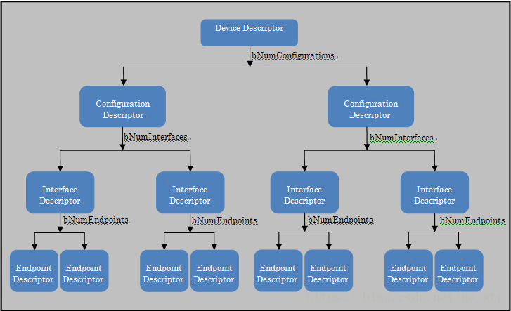

实际情况没有上述关系复杂。一般来说，一个设备就一个配置，一个接口，如果设备是多功能符合设备，则有多个接口。端点一般都有好几个，比如Mass Storage设备一般就有两个端点（控制端点0除外）。

#### 11,设备驱动选择一个配置

​      驱动（注意，这里是驱动，之后的事情都是有驱动来接管负责与设备的通信）根据前面设备回复的信息，发送Set_Configuration请求来正式确定选择设备的哪个配置（Configuration）作为工作配置（对于大多数设备来说，一般只有一个配置被定义）。至此，设备处于配置状态(Configured)，当然，设备也应该使能它的各个接口（Interface）。
​     对于复合设备，主机会在这个时候根据设备接口信息，给它们挂载驱动。


### 13，枚举过程抓包


```ini
#使用的工具
Bus Hound 6.01 capture on Windows Vista (x64). Complements of www.perisoft.net
uvc枚举
  Device - Device ID (followed by the endpoint for USB devices)
            (11) USB Composite Device
            (15) Logitech HD Webcam C270  #使用的摄像头设备
            (16) HD Webcam C270
            (22) Generic SuperSpeed USB Hub
            (23) Generic USB Hub
            (24) Azure Kinect Depth Camera
            (25) USB Composite Device
            (26) Azure Kinect Microphone Array
            (27) USB Input Device
            (28) HID-compliant device
            (29) USB Composite Device
            (30) Azure Kinect 4K Camera
            (31) Azure Kinect 4K Camera
  Phase  - Phase Type
            CTL   USB control transfer       
            IN    Data in transfer           
            OUT   Data out transfer          
            USTS  USB status                 
  Data   - Hex dump of the data transferred
  Descr  - Description of the phase
  Cmd... - Position in the captured data
```


数据区各字段的含义

```ini
Device  Phase  Data                 Description                       Cmd.Phase.Ofs(rep)
11.0    CTL    80 06 00 01  00 00 12 00    GET DESCRIPTOR             1.1.0    
```

- Device   表示当前与主机通讯的设备 及其端点号， 11.0   表示deviceId为11的设备的端点0
- Phase    表示控制传输
- Data       数据
- Description   描述
- Cmd.Phase.Ofs(rep)    当前指令的执行阶段    比如1.1.0   第1条指令的第1阶段，0 字节偏移


```
CTL    80 06 00 01  00 00 12 00			GET DESCRIPTOR
IN     12 01 00 02  ef 02 01 40  6d 04 25 08  12 00 00 00  02 01
```


### 14，USB 设备请求

标准的USB设备请求命令是用在**控制传输**中的“初始设置步骤”里的数据包阶段(即DATA0，由8个字节构成)。

命令共有11个，大小都是8个字节，具有相同的结构，由5个字段构成(字段是标准请求命令的数据部分)，结构如下(括号中的数字表示字节数，首字母bm,b,w分别表示位、字节，双字节)：


Table 9-2. Format of Setup Data

| Offset | Field         | Size | Value           | Description                                                  |
| ------ | ------------- | ---- | --------------- | ------------------------------------------------------------ |
| 0      | bmRequestType | 1    | Bitmap          | Characteristics of request:  <br>D7:Data transfer direction  <br>0 = Host-to-device <br>1 = Device-to-host <br>D6...5: Type  <br>0 = Standard <br>1 = Class <br>2 = Vendor <br>3 = Reserved <br>D4...0: Recipient <br>0 = Device <br>1 = Interface <br>2 = Endpoint <br>3 = Other <br>4...31 = Reserved |
| 1      | bRequest      | 1    | Value           | Specific request (refer to Table 9-3)                        |
| 2      | wValue        | 2    | Value           | 根据不同的命令，含义也不同                                   |
| 4      | wIndex        | 2    | Index or Offset | 根据不同的命令，含义也不同，主要用于传送索引或偏移           |
| 6      | wLength       | 2    | Count           | 如有数据传送阶段，此为数据字节数.                            |


详情 查看 usb2.0  9.4节


## 参考链接

1. [USB 之一 USB2.0 规范详解 第一部分](https://blog.csdn.net/ZCShouCSDN/article/details/79957404)
2. [USB协议传输结构](https://blog.csdn.net/hushiganghu/article/details/54906960)
3. https://www.usb.org/documents
4. [USB枚举过程](https://blog.csdn.net/MyArrow/article/details/8270029)
5. https://wenku.baidu.com/view/ffa4f33a227916888486d7a4.html?sxts=1571795091833
6. [usb分析](https://www.cnblogs.com/sky-heaven/p/5663484.html）

