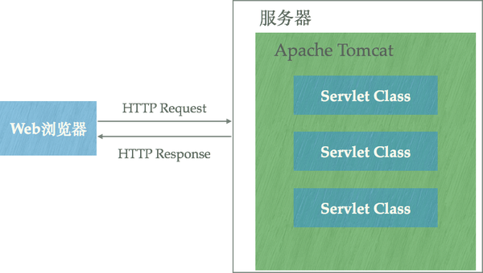

### tomcat 与 nginx，apache的区别是什么？

这三者都是web server，那他们各自有什么特点呢？他们之间的区别是什么呢？
nginx 和 tomcat在性能上面有何异同。
tomcat用在java后台程序上，java后台程序难道不能用apache和nginx吗？

###1.  tomcat 与 nginx，apache三者分别是什么

- Apache，指的应该是Apache软件基金会下的一个项目——[Apache HTTP Server Project](https://link.zhihu.com/?target=https%3A//httpd.apache.org/)；

- Nginx同样也是一款开源的HTTP服务器软件（当然它也可以作为邮件代理服务器、通用的TCP代理服务器）。

*HTTP服务器本质上也是一种应用程序——它通常运行在服务器之上，绑定服务器的IP地址并监听某一个tcp端口来接收并处理HTTP请求，这样客户端（一般来说是IE, Firefox，Chrome这样的浏览器）就能够通过HTTP协议来获取服务器上的网页（HTML格式）、文档（PDF格式）、音频（MP4格式）、视频（MOV格式）等等资源*

- Apache Tomact 则是Apache基金会下的另外一个项目，与Apache HTTP Server相比，Tomcat能够**动态**的生成资源并返回到客户端。Apache HTTP Server和Nginx都能够将某一个文本文件的内容通过HTTP协议返回到客户端，但是这个文本文件的内容是固定的——也就是说无论何时、任何人访问它得到的内容都是完全相同的，这样的资源我们称之为**静态**资源。动态资源则与之相反，在不同的时间、不同的客户端访问得到的内容是不同的。

### 三者之间的区别

Apache HTTP Server和Nginx本身不支持生成动态页面，但它们可以通过其他模块来支持（例如通过Shell、PHP、Python脚本程序来动态生成内容）。
如果想要使用Java程序来动态生成资源内容，使用这一类HTTP服务器很难做到。[Java Servlet**](https://link.zhihu.com/?target=http%3A//www.tianmaying.com/tutorial/servlet-intro)技术以及衍生的[Java Server Pages**](https://link.zhihu.com/?target=http%3A//www.tianmaying.com/tutorial/jsp-intro)技术可以让Java程序也具有处理HTTP请求并且返回内容（由程序动态控制）的能力，Tomcat正是支持运行Servlet/JSP应用程序的容器（Container）:

Tomcat运行在JVM之上，它和HTTP服务器一样，绑定IP地址并监听TCP端口，同时还包含以下指责：

- 管理Servlet程序的生命周期
- 将URL映射到指定的Servlet进行处理
- 与Servlet程序合作处理HTTP请求——根据HTTP请求生成HttpServletResponse对象并传递给Servlet进行处理，将Servlet中的HttpServletResponse对象生成的内容返回给浏览器

### Tomcat通常它仍然会和Nginx配合在一起使用

虽然Tomcat也可以认为是HTTP服务器，但通常它仍然会和Nginx配合在一起使用：

- 动静态资源分离——运用Nginx的反向代理功能分发请求：所有动态资源的请求交给Tomcat，而静态资源的请求（例如图片、视频、CSS、JavaScript文件等）则直接由Nginx返回到浏览器，这样能大大减轻Tomcat的压力。
- 负载均衡，当业务压力增大时，可能一个Tomcat的实例不足以处理，那么这时可以启动多个Tomcat实例进行水平扩展，而Nginx的负载均衡功能可以把请求通过算法分发到各个不同的实例进行处理

### 其他非java程序为什么不使用Tomcat

关于Tomcat 我们看下，百度百科的解释：

Tomcat是Apache 软件基金会（Apache Software Foundation）的Jakarta 项目中的一个核心项目，由[Apache](https://baike.baidu.com/item/Apache/6265)、Sun 和其他一些公司及个人共同开发而成。由于有了Sun 的参与和支持，最新的Servlet 和JSP 规范总是能在Tomcat 中得到体现，Tomcat 5支持最新的Servlet 2.4 和JSP 2.0 规范。因为Tomcat 技术先进、性能稳定，而且免费，因而深受Java 爱好者的喜爱并得到了部分软件开发商的认可，成为目前比较流行的Web 应用服务器。

Tomcat 服务器是一个免费的开放源代码的Web 应用服务器，属于轻量级应用[服务器](https://baike.baidu.com/item/%E6%9C%8D%E5%8A%A1%E5%99%A8)，在中小型系统和并发访问用户不是很多的场合下被普遍使用，是开发和调试JSP 程序的首选。对于一个初学者来说，可以这样认为，当在一台机器上配置好Apache 服务器，可利用它响应[HTML](https://baike.baidu.com/item/HTML)（[标准通用标记语言](https://baike.baidu.com/item/%E6%A0%87%E5%87%86%E9%80%9A%E7%94%A8%E6%A0%87%E8%AE%B0%E8%AF%AD%E8%A8%80)下的一个应用）页面的访问请求。实际上Tomcat是Apache 服务器的扩展，但运行时它是独立运行的，所以当你运行tomcat 时，它实际上作为一个与Apache 独立的进程单独运行的。

诀窍是，当配置正确时，Apache 为HTML页面服务，而Tomcat 实际上运行JSP 页面和Servlet。另外，Tomcat和[IIS](https://baike.baidu.com/item/IIS)等Web服务器一样，具有处理HTML页面的功能，另外它还是一个Servlet和JSP容器，独立的Servlet容器是Tomcat的默认模式。不过，Tomcat处理静态[HTML](https://baike.baidu.com/item/HTML)的能力不如Apache服务器。目前Tomcat最新版本为**9.0。**

Tomcat 主要是 一个Servlet和JSP容器。与Apache 相比他的优点是对动态资源的处理。 同时他是针对java 的Servlet和JSP容器。

总结：  nginx 和 apache 之间的竞争关系，他们之间可以相互替代，又各有优缺点。

而 Tomcat  是针对java程序的。在java 项目中使用，又和 nginx 和 apache之间是互补关系。