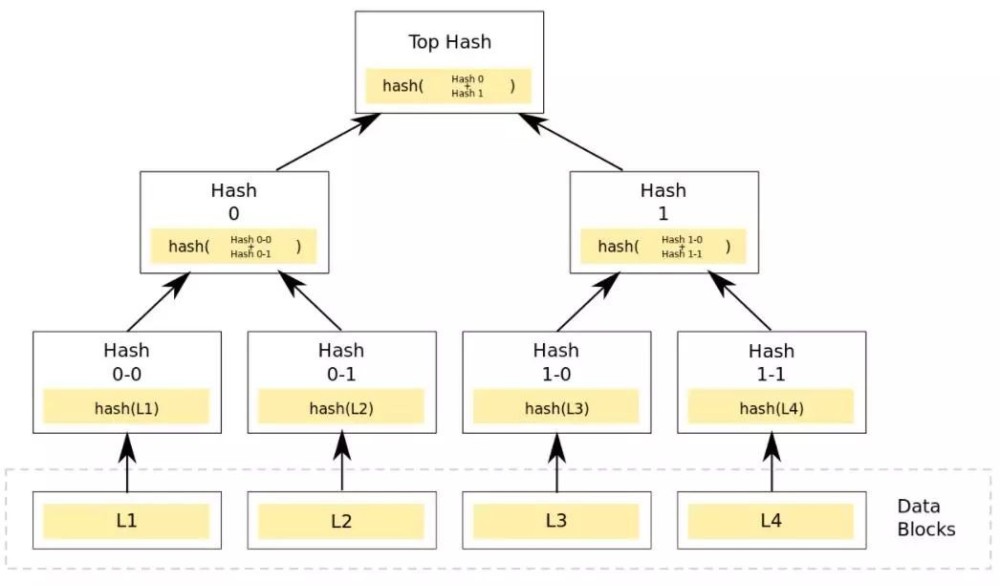

```

```


Merkle Tree（默克尔树），通常也被称作Hash Tree。顾名思义，就是存储hash值的一棵树。

ps

1. Hash是一个把任意长度的数据映射成固定长度数据的函数。
2. 一个典型的应用就是校验下载的文件是否被篡改过，比较公布的hash值和下载得到文件的hash值即可。
3. 一个常用的hash算法是 md5.   linux下可使用md5sum命令


Merkle树的叶子是数据块(例如，文件或者文件的集合)的hash值。非叶节点是其对应子节点串联字符串的hash。





1. http://www.sohu.com/a/230312547_100123121