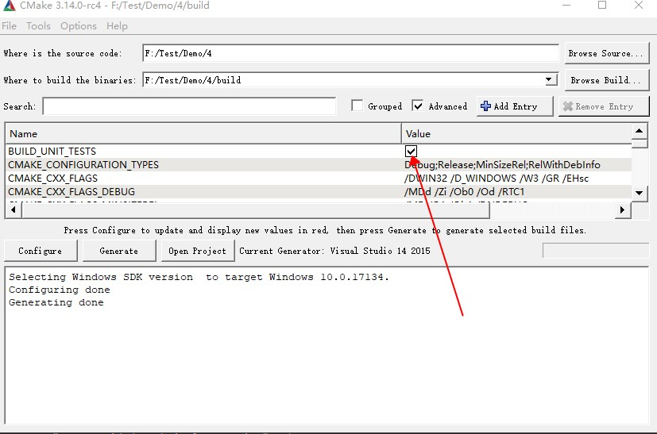

# Cmake 入门及简单使用


## 

## 0，引言


夫妻之间吵架，吵得不可开交，这时可以通过第三方调解，这第三方可以是一个心理咨询机构，可以是熟悉的朋友，甚至可以是上帝！

关于间接层，软件工程领域有个著名的结论：

> All problems in computer science can be solved by another level of 
> indirection, except for the problem of too many layers of indirection.
>
> （在计算机科学中所有问题都可以通过引入另外一个间接层来解决，除了因为间接层太多带来的新问题。）
>
> **David Wheeler**（计算机科学家）


## 1，什么是 CMake

​       你或许听过好几种 Make 工具，例如 GNU Make ，QT 的 [qmake](http://qt-project.org/doc/qt-4.8/qmake-manual.html) ，微软的 [MS nmake](http://msdn.microsoft.com/en-us/library/ms930369.aspx)，BSD Make（[pmake](http://www.freebsd.org/doc/en/books/pmake/)），[Makepp](http://makepp.sourceforge.net/)，等等。这些Make 工具遵循着不同的规范和标准，所执行的 Makefile 
格式也千差万别。这样就带来了一个严峻的问题：如果软件想跨平台，必须要保证能够在不同平台编译。而如果使用上面的 Make 工具，就得为每一种标准写一次 Makefile ，这将是一件让人抓狂的工作。

CMake就是针对上面问题所设计的工具：它首先允许开发者编写一种平台无关的CMakeList.txt 文件来定制整个编译流程，然后再根据目标用户的平台进一步生成所需的本地化 Makefile 和工程文件，

如 Unix的 Makefile 或 Windows 的 Visual Studio 工程。从而做到

**“Write once, run everywhere”**。

显然，CMake 是一个比上述几种 make 更高级的编译配置工具。

使用 CMake 作为项目架构系统的知名开源项目有 [VTK](http://www.vtk.org/)、[ITK](http://www.itk.org/)、[KDE](http://kde.org/)、[OpenCV](http://www.opencv.org.cn/opencvdoc/2.3.2/html/modules/core/doc/intro.html)、[OSG](http://www.openscenegraph.org/) 等 。


在 linux 平台下使用 CMake 生成 Makefile 并编译的流程如下：

1.  编写 CMake 配置文件 CMakeLists.txt 。
2. 执行命令 `cmake PATH` 或者 `ccmake PATH` 生成 Makefile  。其中， `PATH` 是 CMakeLists.txt 所在的目录。
3. 使用 `make` 命令进行编译。


`ccmake` 和 `cmake` 的区别在于前者提供了一个交互式的界面。

本文将从实例入手，一步步讲解 CMake 的常见用法，文中所有的实例代码可以在[这里](https://github.com/wzpan/cmake-demo)找到


## 2，入门案例：单个源文件

对于简单的项目，只需要写几行代码就可以了。例如，假设现在我们的项目中只有一个源文件 main.c，该程序的用途是计算一个斐波那契数。

### 源文件

```c++
#include <stdio.h>
#include <stdlib.h>
/**
 * 返回 斐波那契数列 指定位置的元素
 * @param index 指定位置.
 * @return base raised to the power exponent.
 */
int FibonacciSequence(int index) {
    if (index < 3) {
        return  1;
    }
    return FibonacciSequence(index - 1) + FibonacciSequence(index - 2);
}


int main(int argc, char *argv[])
{
    if (argc < 2){
        printf("Usage: %s FibonacciSequence index \n", argv[0]);
        return -1;
    }
    int  index  = atof(argv[1]);
    int value = FibonacciSequence(index);

    printf("FibonacciSequence index %d is %d\n", index, value);
    return 0;
}
```

### 编写 CMakeLists.txt

首先编写 CMakeLists.txt 文件，并保存在与 main.c 源文件同个目录下：

```cmake
# CMake 最低版本号要求
cmake_minimum_required (VERSION 2.8)
# 项目信息
project (Demo1)
# 显示指定使用的C++编译器 
#set(CMAKE_CXX_COMPILER "g++")
# 指定生成目标
add_executable(Demo main.c)
```

CMakeLists.txt 的语法比较简单，由命令、注释和空格组成，其中命令是不区分大小写的。符号 `#` 后面的内容被认为是注释。命令由命令名称、小括号和参数组成，参数之间使用空格进行间隔。

对于上面的 CMakeLists.txt 文件，依次出现了几个命令：

1. `cmake_minimum_required`：指定运行此配置文件所需的 CMake 的最低版本；
2. `project`：参数值是 `Demo1`，该命令表示项目的名称是 `Demo1` 。
3. `add_executable`： 将名为 main.c 的源文件编译成一个名称为 Demo 的可执行文件。


### 编译项目

如图，使用CMake (cmake-gui) 如下操作即可生成vs项目工程


## 3，多个源文件

上面的例子只有单个源文件。现在假如把 `FibonacciSequence`函数单独写进一个名为 `Math.c` 的源文件里，使得这个工程变成如下的形式：

```
CMakeLists.txt  build  main.c  mymath.c  mymath.h
```

### CMakeLists.txt 

```cmake
# CMake 最低版本号要求
cmake_minimum_required (VERSION 2.8)
# 项目信息
project (Demo1)
# 显示指定使用的C++编译器 
#set(CMAKE_CXX_COMPILER "g++")
# 指定生成目标
add_executable(Demo main.c mymath.c)
```

唯一的改动只是在 `add_executable` 命令中增加了一个 `mymath.c` 源文件。这样写当然没什么问题，但是如果源文件很多，把所有源文件的名字都加进去将是一件烦人的工作。更省事的方法是使用 `aux_source_directory` 命令，该命令会查找指定目录下的所有源文件，然后将结果存进指定变量名。其语法如下：

```cmake
aux_source_directory(<dir> <variable>)
```

可以修改 CMakeLists.txt 如下：

```cmake
# CMake 最低版本号要求
cmake_minimum_required (VERSION 2.8)
# 项目信息
project (Demo)
# 查找当前目录下的所有源文件
# 并将名称保存到 DIR_SRCS 变量
aux_source_directory(. DIR_SRCS)
# 指定生成目标
add_executable(Demo ${DIR_SRCS})
```

这样，CMake 会将当前目录所有源文件的文件名赋值给变量 `DIR_SRCS` ，再在add_executable 中引用这个变量 指示变量 `DIR_SRCS` 中的源文件需要编译成一个名称为 Demo 的可执行文件。

## 4，多个目录，多个源文件


现在进一步将 mymath.h 和 mymath.c 文件移动到 math 目录下作为一个模块。

```bash
│  CMakeLists.txt
│  main.c
│
├─build
└─math
        mymath.c
        mymath.h
```

对于这种情况，需要分别在项目根目录  和 math 目录里各编写一个 CMakeLists.txt 文件。为了方便，我们可以先将 math 目录里的文件编译成静态库再由 main 函数调用。


### 根目录中的 CMakeLists.txt 

```cmake
# CMake 最低版本号要求
cmake_minimum_required (VERSION 2.8)
# 项目信息
project (Demo)
# 查找当前目录下的所有源文件
# 并将名称保存到 DIR_SRCS 变量
aux_source_directory(. DIR_SRCS)
# 添加 math 子目录
add_subdirectory(math)
# 指定生成目标 
add_executable(Demo main.c)
# 添加链接库
target_link_libraries(Demo MathFunctions)
```

该文件添加了下面的内容: 第3行，使用命令 `add_subdirectory` 指明本项目包含一个子目录 math，这样 math 目录下的 CMakeLists.txt 文件和源代码也会被处理 。第6行，使用命令 `target_link_libraries` 指明可执行文件 main 需要连接一个名为 MathFunctions 的链接库 。

### 子目录的 CMakeLists.txt

```cmake
# 查找当前目录下的所有源文件
# 并将名称保存到 DIR_LIB_SRCS 变量
aux_source_directory(. DIR_LIB_SRCS)
# 生成链接库
add_library (MathFunctions ${DIR_LIB_SRCS})
```

在该文件中使用命令 `add_library` 将 src 目录中的源文件编译为静态链接库。


## 5，自定义编译选项

CMake 允许为项目增加编译选项，从而可以根据用户的环境和需求选择最合适的编译方案。

例如，可以将 MathFunctions 库设为一个可选的库，如果该选项为 `ON` ，就使用该库定义的数学函数来进行运算。否则就调用标准库中的数学函数库。

### 5.1 根据选项是否编译某模块

我们可以将某一部分设置为可选，在编译的时候根据界面选择，来决定是否将其放进项目。

假设有以下需求

1. 新增一个测试模块
2. 模块是可选的，默认为不编译

我们基于上一版本的基础上做修改

#### 根目录的 CMakeLists.txt

```cmake
# CMake 最低版本号要求
cmake_minimum_required (VERSION 2.8)
# 项目信息
project (Demo)
# 查找当前目录下的所有源文件
# 并将名称保存到 DIR_SRCS 变量
aux_source_directory(. DIR_SRCS)
# 添加 math 子目录
add_subdirectory(math)

#编译选项
OPTION(BUILD_UNIT_TESTS        "tests"      OFF)

#条件判断
if(BUILD_UNIT_TESTS)
	add_subdirectory(tests)
endif()

# 指定生成目标 
add_executable(Demo main.c)
# 添加链接库
target_link_libraries(Demo MathFunctions)
```


这里使用了option命令字

```cmake
#       选项名					注释			初始状态
OPTION(BUILD_UNIT_TESTS        "tests"      OFF)
```

入下图，value值可以勾选配置。




新增模块test 的 CMakeLists.txt 与MathFunctions 类似


### 5.2 一个定义版本号的常用做法

假设我们有一个这样的需求

> 1. 在CMakeLists.txt文件中定义test模块的版本
> 2. 每次如果修改CMakeLists.txt即可修改其版本


CMake中有一个configure_file的命令

**configure_file**

将一份文件拷贝到另一个位置并修改它的内容

```ini
configure_file(<input> <output>
               [COPYONLY] [ESCAPE_QUOTES] [@ONLY]
               [NEWLINE_STYLE [UNIX|DOS|WIN32|LF|CRLF] ])
```

复制一个`<input>`文件到一个`<output>`文件和替代变量值作为引用`@VAR@`或`${VAR}`在输入文件内容。每个变量引用将替换为变量的当前值，如果未定义变量，则替换为空字符串。

参数定义

- <input>

输入文件的路径。相对路径根据值来处理CMAKE_CURRENT_SOURCE_DIR。输入路径必须是文件，而不是目录。

- <output>

输出文件或目录的路径。相对路径根据值来处理CMAKE_CURRENT_BINARY_DIR。如果路径命名现有目录，则输出文件将放在该目录中，文件名与输入文件相同。

- COPYONLY


复制文件而不替换任何变量引用或其他内容。此选项可能不会用于NEWLINE_STYLE。

- ESCAPE_QUOTES


使用反斜杠（C风格）转义任何替换引号。

- @ONLY


将变量替换限制为表单的引用@VAR@。这对于配置使用${VAR}语法的脚本很有用。

- NEWLINE_STYLE <style>


为输出文件指定换行样式。指定 UNIX或LF用于\n换行，或指定 DOS，WIN32或CRLF用于\r\n换行。此选项可能不会用于COPYONLY。


这里我们的基本思路是

利用configure_file ，根据CMakelist.txt 中定义的变量生成一个头文件，头文件中定义版本宏。

**实现**

修改子目录tests中的 CMakeLists.txt

```cmake
# 查找当前目录下的所有源文件
# 并将名称保存到 DIR_LIB_SRCS 变量

#TEST 模块版本定义
set (TEST_VERSION_MAJOR 1)
set (TEST_VERSION_MINOR 0)
set (TEST_VERSION_PATCHLEVEL 1)
set (TEST_VERSION_RELEASER 1)


configure_file (
  "test_version.h.ini"
  "${PROJECT_BINARY_DIR}/test_version.h"
  )
#添加头文件的索引目录  
include_directories(${PROJECT_BINARY_DIR})

aux_source_directory(. DIR_LIB_SRCS)
# 生成链接库
add_library (Tests ${DIR_LIB_SRCS})
```

其中

变量 PROJECT_BINARY_DIR  代表项目的编译目录

变量 PROJECT_SOURCE_DIR  代表源码目录

一般建议在项目目录下新建一个目录 比如build 作为编译目录，编译期间生成的文件的根目录在这里。


test_version.h.ini

```ini
#define TEST_VERSION_MAJOR @TEST_VERSION_MAJOR@
#define TEST_VERSION_MINOR @TEST_VERSION_MINOR@
#define TEST_VERSION_PATCHLEVEL @TEST_VERSION_PATCHLEVEL@
#define TEST_VERSION_RELEASER @TEST_VERSION_RELEASER@

```

重新编译即可在build目录下生成 test_version.h

```c
#define TEST_VERSION_MAJOR 1
#define TEST_VERSION_MINOR 0
#define TEST_VERSION_PATCHLEVEL 1
#define TEST_VERSION_RELEASER 1
```


### 5.3 支持 gdb

让 CMake 支持 gdb 的设置也很容易，只需要指定 `Debug` 模式下开启 `-g` 选项：

```cmake
set(CMAKE_BUILD_TYPE "Debug")
set(CMAKE_CXX_FLAGS_DEBUG "$ENV{CXXFLAGS} -O0 -Wall -g -ggdb")
set(CMAKE_CXX_FLAGS_RELEASE "$ENV{CXXFLAGS} -O3 -Wall")
```

之后可以直接对生成的程序使用 gdb 来调试


## 6， 安装和测试


CMake 也可以指定安装规则，以及添加测试。这两个功能分别可以通过在产生 Makefile 后使用 `make install` 和 `make test` 来执行。在以前的 GNU Makefile 里，你可能需要为此编写 `install` 和 `test` 两个伪目标和相应的规则，但在 CMake 里，这样的工作同样只需要简单的调用几条命令。


### 6.1 定制安装规则

首先先在 tests/CMakeLists.txt 文件里添加下面两行：

```cmake
# 指定 tests 库的安装路径
install (TARGETS Tests DESTINATION  ${PROJECT_BINARY_DIR}/bin)
install (FILES test.h DESTINATION  ${PROJECT_BINARY_DIR}/include)
```

指明 MathFunctions 库的安装路径。之后同样修改根目录的 CMakeLists 文件，在末尾添加下面几行

```cmake
# 指定安装路径
install (TARGETS Demo DESTINATION ${PROJECT_BINARY_DIR}/bin)
```

重新编译，会在工程中生成  INSTALL 模块，

通过上面的定制，生成的 Demo 文件和 tests函数库 Tests.lib 文件将会被复制到 `${PROJECT_BINARY_DIR}/bin` 中，而 test.h 文件则会被复制到 `${PROJECT_BINARY_DIR}/include` 中。我们可以验证一下。

其中bin  及include 不需要预先创建，会自动生成。


### 6.2 为工程添加测试

CTest是CMake的一部分，是一个测试框架，可以将构建，配置，测试，覆盖率等指标更新到[CDash]()或[Dart]()看板工具上。 
 有两种模式：

- 一种是，CMake用来配置和编译一个项目，在CMakeLists.txt中使用特殊的指令来创建和执行测试。CTest用来执行这些测试，并作为可选项更新测试结果到看板服务。
- 一种是，运行脚本(使用跟CMakeLists.txt的语法)来控制测试流程，包括下载 更新代码，配置和构建项目  运行测试。


添加测试同样很简单。CMake 提供了一个称为 CTest 的测试工具。我们要做的只是在项目根目录的 CMakeLists 文件中调用一系列的 `add_test` 命令。

```cmake
# 启用测试
enable_testing()
# 测试程序是否成功运行
add_test (test_run Demo 5 2)
# 测试帮助信息是否可以正常提示
add_test (test_usage Demo)
set_tests_properties (test_usage
  PROPERTIES PASS_REGULAR_EXPRESSION "Usage: .* base exponent")
# 测试 5 的平方
add_test (test_5_2 Demo 5 2)
set_tests_properties (test_5_2
 PROPERTIES PASS_REGULAR_EXPRESSION "is 25")
# 测试 10 的 5 次方
add_test (test_10_5 Demo 10 5)
set_tests_properties (test_10_5
 PROPERTIES PASS_REGULAR_EXPRESSION "is 100000")
# 测试 2 的 10 次方
add_test (test_2_10 Demo 2 10)
set_tests_properties (test_2_10
 PROPERTIES PASS_REGULAR_EXPRESSION "is 1024")
```


可以使用如下命令查看帮助

```bash
cmake --help-command enable_testing
cmake --help-command add_test
cmake --help-property "<CONFIG>_POSTFIX"
cmake --help-command set_property
```


上面的代码包含了四个测试。第一个测试 `test_run` 用来测试程序是否成功运行并返回 0 值。剩下的三个测试分别用来测试 5 的 平方、10 的 5 次方、2 的 10 次方是否都能得到正确的结果。其中 `PASS_REGULAR_EXPRESSION` 用来测试输出是否包含后面跟着的字符串。

让我们看看测试的结果：

```
[ehome@xman Demo5]$ make test
Running tests...
Test project /home/ehome/Documents/programming/C/power/Demo5
    Start 1: test_run
1/4 Test #1: test_run .........................   Passed    0.00 sec
    Start 2: test_5_2
2/4 Test #2: test_5_2 .........................   Passed    0.00 sec
    Start 3: test_10_5
3/4 Test #3: test_10_5 ........................   Passed    0.00 sec
    Start 4: test_2_10
4/4 Test #4: test_2_10 ........................   Passed    0.00 sec
100% tests passed, 0 tests failed out of 4
Total Test time (real) =   0.01 sec
```

相当于在命令行下执行

```bash
#再build目录下执行
ctest.exe --force-new-ctest-process -C Debug
```

如果要测试更多的输入数据，像上面那样一个个写测试用例未免太繁琐。这时可以通过编写宏来实现：

```
# 定义一个宏，用来简化测试工作
macro (do_test arg1 arg2 result)
  add_test (test_${arg1}_${arg2} Demo ${arg1} ${arg2})
  set_tests_properties (test_${arg1}_${arg2}
    PROPERTIES PASS_REGULAR_EXPRESSION ${result})
endmacro (do_test)
 
# 使用该宏进行一系列的数据测试
do_test (5 2 "is 25")
do_test (10 5 "is 100000")
do_test (2 10 "is 1024")
```

关于 CTest 的更详细的用法可以通过 `man 1 ctest` 参考 CTest 的文档。

1. [ctest官方文档](https://cmake.org/cmake/help/v3.15/manual/ctest.1.html)


## 7，TODO环境检查

有时候可能要对系统环境做点检查，例如要使用一个平台相关的特性的时候。或者或者当前的编译器信息。

### 7.1 CheckSymbolExists检测符号是否存在

```ini
check_symbol_exists(<symbol> <files> <variable>)

Check that the <symbol> is available after including given header <files> and store the result in a <variable>. Specify the list of files in one argument as a semicolon-separated list. <variable> will be created as an internal cache variable.
```


```cmake
cmake_minimum_required(VERSION 3.0)
include(CheckSymbolExists)

# Define executable
add_executable(myexe main.c)

# atan2 requires the math library to be linked
list(APPEND CMAKE_REQUIRED_LIBRARIES m)

check_symbol_exists(atan2 math.h HAVE_ATAN2)

if(NOT HAVE_ATAN2)
	message("do not HAVE_ATAN2")
endif()

# Add compile definitions if we have the library
if(HAVE_ATAN2)
	target_compile_definitions(myexe PRIVATE -DHAVE_ATAN2)
endif()
```

检测include math.h 后是否存在符号atan2（包括函数  宏 变量名），如果存在 则在代码中定义宏HAVE_ATAN2

参考[CheckSymbolExists](https://cmake.org/cmake/help/latest/module/CheckSymbolExists.html)


### 7.2 常用的系统信息宏


- WIN32 	Set to `True` when the target system is Windows, including Win64.
- Win64      windows 64bit
- APPLE      Set to `True` when the target system is an Apple platform(macOS, iOS, tvOS or watchOS).
- ANDROID   Set to `1` when the target system ([`CMAKE_SYSTEM_NAME`](https://cmake.org/cmake/help/latest/variable/CMAKE_SYSTEM_NAME.html#variable:CMAKE_SYSTEM_NAME)) is`Android`.


### 7.3 参考链接

- 常用的cmake方法库 [cmake-modules](https://cmake.org/cmake/help/latest/manual/cmake-modules.7.html)

- CMake中常用的变量 [cmake-variables](https://cmake.org/cmake/help/latest/manual/cmake-variables.7.html#id1)
  - 这里可以看到CMake中常用的变量 包括 系统信息描述类的  控制编译  语言相关变量   CTest 相关变量 CPack相关变量等等


## 8，生成安装包

本节将学习如何配置生成各种平台上的安装包，包括二进制安装包和源码安装包。为了完成这个任务，我们需要用到 CPack ，它同样也是由 CMake 提供的一个工具，专门用于打包。

首先在顶层的 CMakeLists.txt 文件尾部添加下面几行：

```cmake
# 构建一个 CPack 安装包
include (InstallRequiredSystemLibraries)
set (CPACK_RESOURCE_FILE_LICENSE
  "${CMAKE_CURRENT_SOURCE_DIR}/License.txt")
set (CPACK_PACKAGE_VERSION_MAJOR "${Demo_VERSION_MAJOR}")
set (CPACK_PACKAGE_VERSION_MINOR "${Demo_VERSION_MINOR}")
include (CPack)
```

上面的代码做了以下几个工作：

1. 导入 InstallRequiredSystemLibraries 模块，以便之后导入 CPack 模块；
2. 设置一些 CPack 相关变量，包括版权信息和版本信息，其中版本信息用了上一节定义的版本号；
3. 导入 CPack 模块。

接下来的工作是像往常一样构建工程，并执行 `cpack` 命令。

- 生成二进制安装包：


关于 CPack 的更详细的用法可以通过 `man 1 cpack` 参考 CPack 的文档。

## 9，CMake关于交叉编译


#### 参考链接

https://segmentfault.com/a/1190000019276315


10，

引用第三方模块

1. [7.11 Git 工具 - 子模块](https://git-scm.com/book/zh/v2/Git-%E5%B7%A5%E5%85%B7-%E5%AD%90%E6%A8%A1%E5%9D%97)
2. http://blog.changyy.org/2016/04/git-submodule-cmake-googletest.html?m=1


## 将其他平台的项目迁移到 CMake


CMake 可以很轻松地构建出在适合各个平台执行的工程环境。而如果当前的工程环境不是 CMake ，而是基于某个特定的平台，是否可以迁移到 CMake 呢？答案是可能的。下面针对几个常用的平台，列出了它们对应的迁移方案。

#### autotools

- [am2cmake](https://projects.kde.org/projects/kde/kdesdk/kde-dev-scripts/repository/revisions/master/changes/cmake-utils/scripts/am2cmake) 可以将 autotools 系的项目转换到 CMake，这个工具的一个成功案例是 KDE 。
- [Alternative Automake2CMake](http://emanuelgreisen.dk/stuff/kdevelop_am2cmake.php.tgz) 可以转换使用 automake 的 KDevelop 工程项目。
- [Converting autoconf tests](http://www.cmake.org/Wiki/GccXmlAutoConfHints)

#### qmake

- [qmake converter](http://www.cmake.org/Wiki/CMake:ConvertFromQmake) 可以转换使用 QT 的 qmake 的工程。

#### Visual Studio

- [vcproj2cmake.rb](http://vcproj2cmake.sf.net/) 可以根据 Visual Studio 的工程文件（后缀名是 `.vcproj` 或 `.vcxproj`）生成 CMakeLists.txt 文件。
- [vcproj2cmake.ps1](http://nberserk.blogspot.com/2010/11/converting-vc-projectsvcproj-to.html) vcproj2cmake 的 PowerShell 版本。
- [folders4cmake](http://sourceforge.net/projects/folders4cmake/) 根据 Visual Studio 项目文件生成相应的 “source_group” 信息，这些信息可以很方便的在 CMake 脚本中使用。支持 Visual Studio 9/10 工程文件。

#### CMakeLists.txt 自动推导

- [gencmake](http://websvn.kde.org/trunk/KDE/kdesdk/cmake/scripts/) 根据现有文件推导 CMakeLists.txt 文件。
- [CMakeListGenerator](http://www.vanvelzensoftware.com/postnuke/index.php?name=Downloads&req=viewdownload&cid=7) 应用一套文件和目录分析创建出完整的 CMakeLists.txt 文件。仅支持 Win32 平台。

## 相关链接

1. [官方主页](http://www.cmake.org)
2. [官方文档](http://www.cmake.org/cmake/help/cmake2.4docs.html)
3. [官方教程](http://www.cmake.org/cmake/help/cmake_tutorial.html)
4. [Wiki](http://www.cmake.org/Wiki/CMake#Basic_CMakeLists.txt_from-scratch-generator)
5. [FAQ](http://www.cmake.org/Wiki/CMake_FAQ)
6. [bug tracker](http://www.cmake.org/Bug)
7. 邮件列表： 
   - [cmake on Gmane](http://dir.gmane.org/gmane.comp.programming.tools.cmake.user)
   - http://www.mail-archive.com/cmake@cmake.org/
   - [http://marc.info/?l=cmake](http://www.mail-archive.com/cmake@cmake.org/)
8. 其他推荐文章 
   - [在 linux 下使用 CMake 构建应用程序](http://www.ibm.com/developerworks/cn/linux/l-cn-cmake/)
   - [cmake的一些小经验](http://www.cppblog.com/skyscribe/archive/2009/12/14/103208.aspx)
   - [Packaging Software with CPack](http://www.kitware.com/media/archive/kitware_quarterly0107.pdf)
   - [视频教程: 《Getting Started with CMake》](http://www.youtube.com/watch?v=CLvZTyji_Uw)
   - [CMake 入门实战](https://www.hahack.com/codes/cmake/)
   - [这个页面](http://www.cmake.org/Wiki/CMake_Projects)详细罗列了使用 CMake 的知名项目


9. [cmake库](https://github.com/bilke/cmake-modules)

## 类似工具

- [SCons](http://scons.org/)：Eric S. Raymond、Timothee Besset、Zed A. Shaw 等大神力荐的项目架构工具。和 CMake 的最大区别是使用 Python 作为执行脚本。

------


