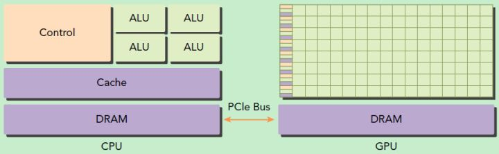
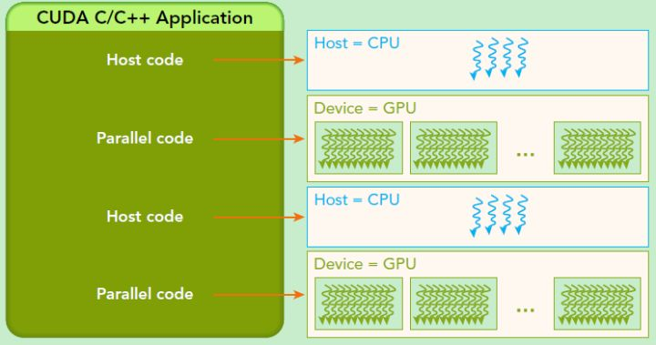

CUDA（Compute Unified Device Architecture）， CUDA™是一种由NVIDIA推出的通用[并行计算](https://baike.baidu.com/item/并行计算/113443)架构(2006年)，该架构使[GPU](https://baike.baidu.com/item/GPU)能够解决复杂的计算问题。 它包含了CUDA[指令集架构](https://baike.baidu.com/item/指令集架构)（[ISA](https://baike.baidu.com/item/ISA)）以及GPU内部的并行计算引擎。基于CUDA编程可以利用GPUs的并行计算引擎来更加高效地解决比较复杂的计算难题。近年来，GPU最成功的一个应用就是深度学习领域，基于GPU的并行计算已经成为训练深度学习模型的标配。目前，最新的CUDA版本为CUDA 10.1。

GPU并不是一个独立运行的计算平台，而需要与CPU协同工作，可以看成是CPU的协处理器，因此当我们在说GPU并行计算时，其实是指的基于CPU+GPU的异构计算架构。在异构计算架构中，GPU与CPU通过PCIe总线连接在一起来协同工作，CPU所在位置称为为主机端（host），而GPU所在位置称为设备端（device），如下图所示。

*基于CPU+GPU的异构计算. 来源：Preofessional CUDA® C Programming*

可以看到GPU包括更多的运算核心，其特别适合数据并行的计算密集型任务，如大型矩阵运算，而CPU的运算核心较少，但是其可以实现复杂的逻辑运算，因此其适合控制密集型任务。另外，CPU上的线程是重量级的，上下文切换开销大，但是GPU由于存在很多核心，其线程是轻量级的。因此，基于CPU+GPU的异构计算平台可以优势互补，CPU负责处理逻辑复杂的串行程序，而GPU重点处理数据密集型的并行计算程序，从而发挥最大功效。

CUDA是NVIDIA公司所开发的GPU编程模型，它提供了GPU编程的简易接口，基于CUDA编程可以构建基于GPU计算的应用程序。CUDA提供了对其它编程语言的支持，如C/C++，Python，Fortran等语言。

## 参考链接

1. [CUDA编程入门极简教程](https://zhuanlan.zhihu.com/p/34587739)
2. https://blog.csdn.net/sunmc1204953974/article/details/51000970