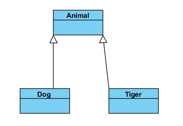

# UML类图中四大关系

## 类与类之间存在以下关系:

　　**(1) 泛化(Generalization)**

　　**(2) 关联(Association)**

　　**(3) 依赖(Dependency)**

　　**(4) 聚合(Aggregation)**

## 耦合度大小关系

​          **泛化 = 实现 > 组合 > 聚合 > 关联 > 依赖**

# 常见关系

## 泛化(Generalization)

是指一般与特殊的关系。

### 代码体现

- 类与类之间的继承关系，

- 接口与接口之间的继承关系，

- 类对接口的实现关系。

### 表达方式

带三角箭头的实线，箭头指向父类。

## 实现（Realization）

是一种类与接口的关系，它表示不继承结构而只继承行为，是类与接口之间最常见的关系。准确的说，类不是继承(inherit)接口，而是实现(implement)接口。

### 代码体现

类实现接口

### UML中表达方式

用带三角箭头的虚线，箭头指向接口

##  **依赖(Dependency)**

是一种使用的关系，即一个类的实现需要另一个类的协助，所以要尽量不使用双向的互相依赖.

### 代码表现

局部变量、方法的参数或者对静态方法的调用

###  箭头及指向

带箭头的虚线，指向被使用者

## 关联(Association）

是一种拥有的关系，它使一个类知道另一个类的属性和方法；如：老师与学生，丈夫与妻子关联可以是双向的，也可以是单向的。双向的关联可以有两个箭头或者没有箭头，单向的关联有一个箭头。

###    代码体现

成员变量

###   箭头及指向

单向关联为带普通箭头的实心线，箭头指向被拥有者

##  **聚合（Aggregation）**

是整体与部分的关系，且部分可以离开整体而单独存在。如车和轮胎是整体和部分的关系，轮胎离开车仍然可以存在。

​        聚合关系是关联关系的一种，是强的关联关系；关联和聚合在语法上无法区分，必须考察具体的逻辑关系。

###  代码体现

成员变量

###      箭头及指向

带空心菱形的实心线，菱形指向整体

## **组合（composition）：**

是整体与部分的关系，但部分不能离开整体而单独存在。如线段和点是整体和部分的关系，没有点就不存在线段。

组合关系是关联关系的一种，是比聚合关系还要强的关系，它要求普通的聚合关系中代表整体的对象负责代表部分的对象的生命周期。

### 代码体现

成员变量

### 箭头及指向

带实心菱形的实线，菱形指向整体