# FFmpeg关键组件与硬件加速

作者：FFmpeg Maintainer赵军：

>本文是FFmpeg Maintainer赵军，的一篇演讲分享。在这里作为个人的学习材料，并做备注笔记。

## 1，ffmpeg是什么

FFmpeg诞生于十几年前，最初是作为一个MPlayer播放器的一个子项目出现。因为当时的播放器有需要支持各种各样解码的需求， 其中有一位Mplayer的开发者看到了这样的需求，于是编写了FFmpeg。

它作为迄今为止最流行的一个开源多媒体框架之一，FFmpeg有两种基本使用方式——作为库或者作为工具，其中后者的使用场景更多，同时它也被称为多媒体开发的“瑞士军刀”。

FFmpeg库中90%的代码以上使用C，同时也有一些汇编语言上的优化，还有一些基于[GPU](http://www.elecfans.com/tags/gpu/)的优化。对于汇编优化而言，由于YASM对最新的[CPU](http://m.elecfans.com/article/645277.html)指令支持效果不好，FFmpeg的汇编现在正在向[NASM](http://www.elecfans.com/tags/nas/)转变。

FFmpeg本身有一些基本的开发策略，希望所有的Codec集成在内部库中随时调用；当然它也在必要时可以依赖一些外部第三方库，例如像众所周知的X.264。（X.264作为一个Encoder来说已经足够优秀，我们可以看到大部分的商业产品都以X.264为对标，常会看到某某Codec宣称比X.264好多少，似乎X.264已经成为业内一个基本对标点）。

FFmpeg同样也是一个跨平台的产品，主要的License是GNU GPLv2，或GNU LGPLv2.1+的

使用场景

FFmpeg有很多使用场景，其中较为典型的有播放器、媒体编辑器、云转码，编解码等等

>多媒体信息处理，特指视频、音频媒体数据的处理。媒体数据包括原始信号数据（未压缩）和编码后媒体流数据（已压缩），处理域可能在空间域、时间域或变换域上。其中视频处理具体包括视频编码、解码、采集、显示、分组（打包）、解分组（拆包）、合成、分割、上采样、下采样、OSD叠加等等；音频处理具体包括音频编码、解码、采集、回放、分组、解分组、混音、噪声抑制、回声消除、增益控制等等；此外还有音视频流化、音视频的复用与解复用、音视频同步等处理技术。多媒体信息处理应用的硬件平台涵盖x86平台、ARM平台、DSP平台、GPU平台，操作系统包含服务器PC机上主流的OS，如Windows（x86）、Linux（x86）以及嵌入式OS，如Embedded Linux、Android、iOS等。技术领域覆盖通信基础、计算机硬件原理、计算机网络、计算机软件架构、音视频编码协议与算法等等
>
>常见开源多媒体框架：
>
>1. Directshow/Media Foundation 是微软在Windows平台上推出的两个多媒体应用库，为Windows平台提供一个统一的多媒体影音解决方案，两个应用库都是基于COM(Component Object Model)的流媒体处理的开发包
>
>2. GStreamer是Linux平台下用来构建流媒体应用的开源多媒体框架，为Linux平台提供一个统一的音/视频应用程序的开发方法，该多媒体框架库基于Glib核心库函数，是一个处理插件、数据流和媒体操作的框架。开发者利用API可以构建一系列的媒体处理组件模块，并能够很方便的接入到任意的管道当中。这个优点使得利用GStreamer编写一个万能的可编辑音视频应用程序成为可能。目前该库目前广泛地支持各种媒体格式，其管道能够被GUI编辑器编辑, 能够以XML文件来保存。
>
>3. OpenMAX（全称Open Media Acceleration），是一个C语言实现的、处理多媒体的跨平台的软件抽象层，其目标在于创造一个统一的接口，加速大量多媒体资源的处理，目前支持嵌入式Linux、Android等操作系统。随着从事移动开发的程序员越来越多，移动处理芯片的多媒体处理硬核加速的需求将该开源库的关注度日益增高。
>
>4. ### FFmpeg

>汇编编译器：nasm？fasm？yasm？还是masm、gas或其他？
>
>前面三个是免费开源的汇编编译器，总体上来讲都使用Intel的语法。yasm是在nasm的基础上开发的，与nasm同宗。由于使用了相同的语法，因此nasm的代码可以直接用yasm来编译。
>
>yasm虽然更新较慢，但对nasm一些不合理的地方进行了改良。从这个角度来看，yasm比nasm更优秀些，而nasm更新快，能支持更新的指令集。在Windows平台上，fasm是另一个不错的选择，平台支持比较好，可以直接用来开发Windows上的程序，语法也比较独特。在对Windows程序结构的支持上，fasm是3个免费的编译器里做得最好的。
>
>masm是微软发布的汇编编译器，现在已经停止单独发布，被融合在Visual Studio产品中。gas是Linux平台上的免费开源汇编编译器，使用AT&T的汇编语法，使用起来比较麻烦。
>
>

## 2，FFmpeg组件

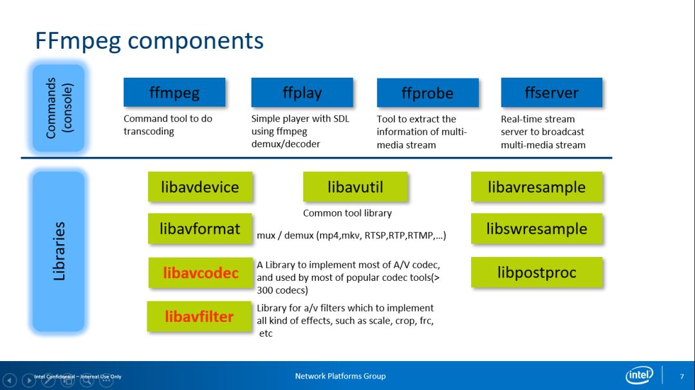

- FFmpeg组件中应用最多的是FFmpeg，它被用于进行转码，
- FFprobe则被用于进行码流分析（这些都是基于命令行的工具）；
- 而FFserver的代码库已经被删除，其最主要的原因是FFmpeg Server的维护状态并不好，出现很多问题。最近社区又有人在重写FFmpeg  Server，估计不久之后代码库会得以恢复。但这时的FFserver的实现方式跟之前已经基本没什么关系了。
- Libavdevice主要使用硬件Capture或者进行[SDI（流化）1](#jump)，
- Libavformat是一些常见容器格式例如[Mux或Demux](#)等。我个人的大部分工作是在Libavcodec与Libavfilter，在Libavcodec上进行一些基于英特尔平台的优化，
- Libavfilter主要是针对图像的后处理。我认为在AI盛行的时代Libavfilter会出现非常大的改动，加入更多新功能而非仅仅基于传统信号处理方式的图像处理。最近实际上已经有人尝试在其中集成Super Resolution，但在性能优化上仍有待改进，预计还需要持续一段时间才能真正做到实时与离线。除去作为基础组件的Libavutil，其他像Libavresample、Libswresample、Libpostproc这几个库现在都有逐渐被废弃的趋势。

>1. SDI（流化）:流化的本质就是按顺序提取音视频帧的过程,即计算每个数据帧在文件中的偏移量的问题。
>
>2. Mux或Demux:  Mux 是 Multiplex 的缩写，意为“多路传输”，其实就是“混流”、“封装”的意思，与“合成”的意思相似就是指把视频素材和音频素材封装到一个单独的文件中。
>
>   通过 muxing（混流），可以将视频流、音频流甚至是字幕流捆绑到一个单独的文件中，作为一个信号进行传输，等传输完毕，就可以通过 demuxing（分离） 将里面的视频、音频或字幕分解出来各自进行解码和播放。
>
>   在 muxing 与 demuxing 的整个过程，都不对原来的视频、音频或字幕重新编码。混流（封装、打包）后的文件，可以通过分离（分解、解包）操作，获得与原始素材一模一样的独立的视频、音频和字幕文件。
>
>3. Super Resolution:超分辨率重建技术（Super-Resolution）是指从观测到的低质量、低分辨率图像重建出相应的高质量、高分辨率图像。高分辨率图像意味着图像具有更多的细节信息、更细腻的画质，这些细节在高清电视、医学成像、遥感卫星成像等领域有着重要的应用价值。
>
>   Super-Resolution 可分为两类:从多张低分辨率图像重建出高分辨率图像、从单张低分辨率图像重建出高分辨率图像。
>
>   a. [深度学习之超分辨率重建技术（Super-Resolution）总结：从 SRCNN 到 WDSR](https://blog.csdn.net/TeFuirnever/article/details/90719309)
>
>   b.[超分辨率（Super-Resolution）论文整理](https://www.jianshu.com/p/6d761f8a8149)

### 2.1 Libavformat

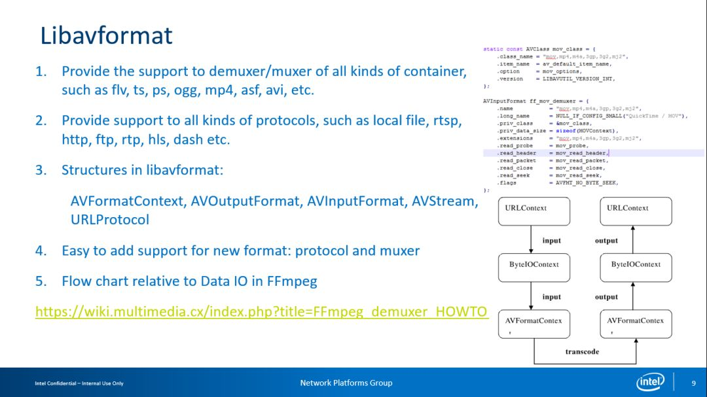

Libavformat的主要任务是Demuxer/Muxer功能。我们可以看到FFmpeg的框架设计得十分精炼，基本上如果需要实现一个AVFormat或AVCodec以对应新的Format/Codec；所以即使一位开发者不了解FFmpeg框架也可以编写一个简单的Format或Codec，需要做的最主要是实现对应的AVFormat/AVCodec。

### 2.2 Libavcodec

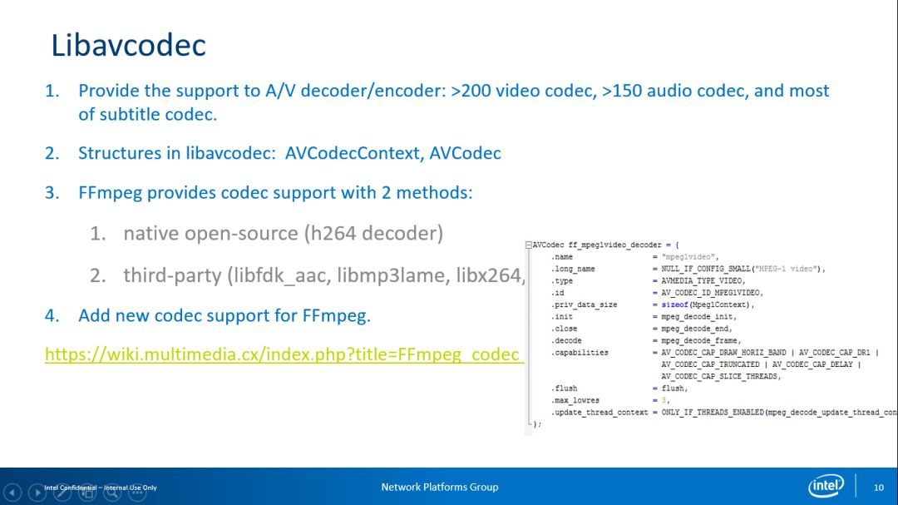

需要提及一下的，有两种方案实现对应的Libavcodec，一种是以Native方式实现在FFmpeg内部，另一种是利用集成的第三方库，我们现在看到的一些Encoder相关的是以集成的第三方库为基础。而对于Decoder ，FFmpeg社区的开发者做得非常快。耐人寻味的是，据说FFmpeg内部VP9 的Decoder速度比Google Libvpx Decoder还要快，我们知道Google是VP9 Codec的创立者，但是Google的表现还不如FFmpeg自身的VP9 的Decoder 。

### 2.3 Libavfilter

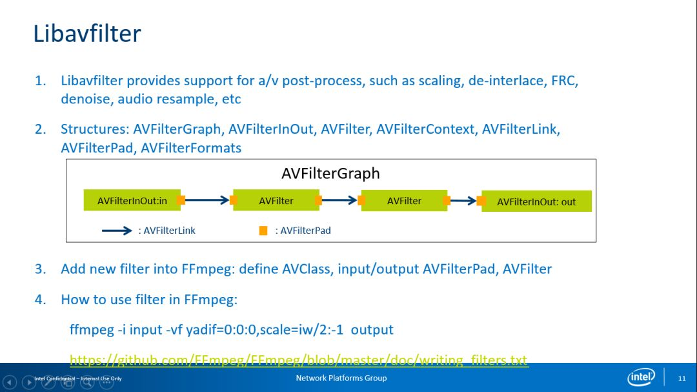

Libavfilter是FFmpeg内部最复杂的部分之一，其代码一直在反复重构。Libavfilter的思想可能借鉴了Windows 的DirectX上一些思想，但代码却有些复杂。其构成并非像图片展示的那样是一个简单的串行关系，实际上它可以构成一个有向无环图，这意味着只要能够构成一个DAG这个LibavFilter就能工作。但是Libavfilter的综合表现并不是特别好，我一直在想尝试对其进行改进，但因为这一部分的复杂度比较高，总是令我感觉不入其门。

>有向无环图DAG:  [科普 ｜ 一文读懂 DAG（有向无环图）技术](https://baijiahao.baidu.com/s?id=1613728387077554506&wfr=spider&for=pc)

### 2.4 FFmpeg Transcoding

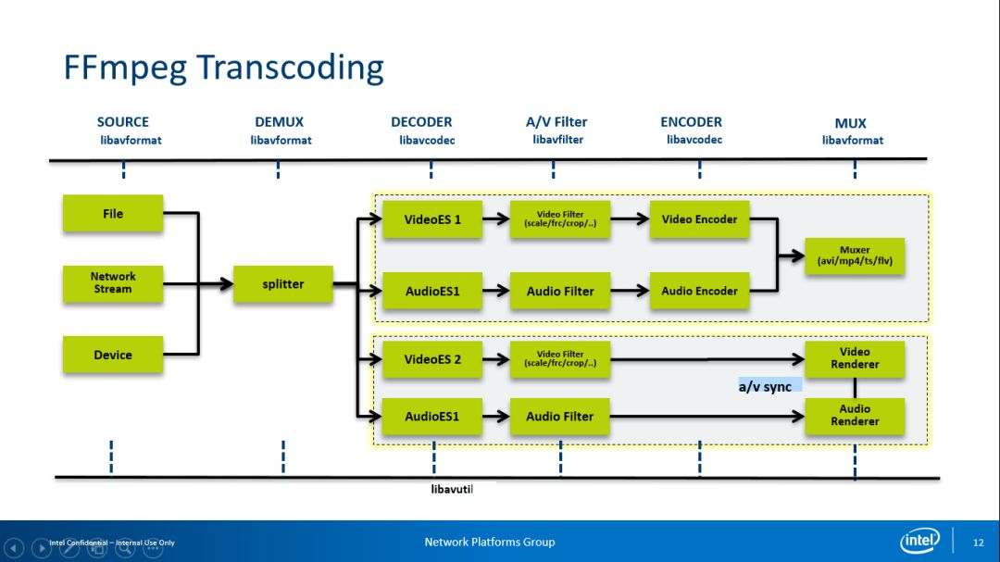

FFmpeg的应用场景之一是Transcoding转码，涉及Demux/Decoder/Encoder/Muxer,同时我们可以把Demux+Mux的流程看作是它的一个特例。另一应用场景是作为Player播放器，上图展示了Transcoding与Player两种应用场景的流程。

## 3、FFmpeg开发

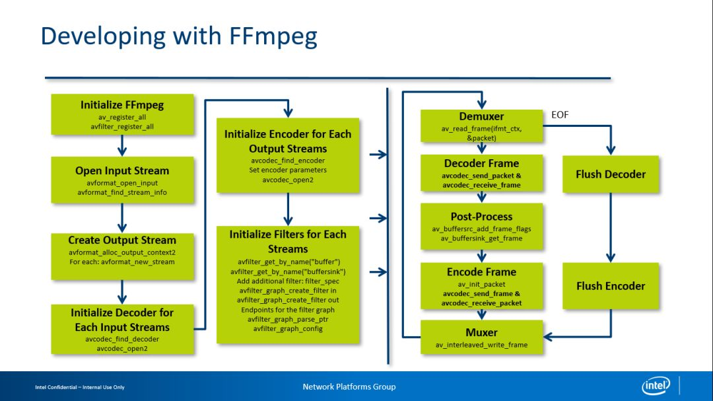

FFmpeg中比较重要的API包括如何进行Decoder、Postprocess、Encoder等。如果你对此感兴趣，我认为最好的办法是去认真看一看FFmpeg里一些很好的例子。最近两年FFmpeg把过去的API进行了重构，如果我以原来的FFmpeg API为基础进行解码，其做法是输入一个已经压缩过的Frame数据并希望得到一个解码的Frame，但实际上此过程存在的限制是需要确保输入的Frame与解码出的数据一一对应。后来随着开发的深入，特别是H.264提供的MVC这种模式以后，有时我们输入一个Frame后需要分左右解码两个帧，此时它的API便无法支持这种场景。因此最近FFmpeg的API被从输入一个Frame输出一个Packet修改为两个API，这样便可解除它们之间的耦合。当然由于输入与解码变成了两个分离的步骤，导致代码中需要大量的While循环来判断此解码过程是否结束。

## 4、硬件加速

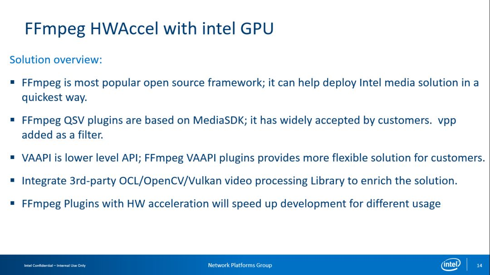

我在英特尔负责FFmpeg硬件加速的工作，因此更关注FFmpeg的硬件加速在英特尔GPU上的表现。我们一直在考虑如何更快地将英特尔的硬件加速方案推荐给客户使用，让用户能够有机会体验到硬件加速的强大功能。现在英特尔提出的两种通过FFmpeg驱动GPU的硬件加速方案，

其中一种方案基于MediaSDK，我想如果你用过英特尔的GPU便应该会对其有所了解，已经有很多客户基于MediaSDk进行了部署，其中，MediaSDK的VPP部分作为AVFilter也在FFmpeg内部；

另一种更为直接的方案是VA-API，VA-API类似于Windows上提供的DXV2或是MacOS上提供的Video Toolbox等基于OS层面的底层硬件加速API，我现在的大部分的工作专注于此领域。FFmpeg同样集成了OpenCL的一些加速，它使得你可以借助GPU进行转码工作并在整套流程中不涉及GPU与CPU的数据交换，这个方案方案会带来明显的性能提升。我们虽希望从解码到VPP再到编码的整条流程都可以在GPU内完成，但GPU的一些功能上的缺失需要其他硬件加速功能来弥补，此时就可考虑使用OpenCL优化。其次是因为OpenCV已经进行了大量的OpenCL加速，所以当面对这种图像后处理的硬件加速需求时可以考虑把OpenCV集成到FFmpeg中，但在OpenCV发展到v3.0后其API从C切换到了C++，而FFmpeg自身对C++的API支持并不友好，这也导致了FFmpeg的官方版本中只支持OpenCV到v2.4。如果你对此感兴趣，可以尝试基于在OpenCV v3.0以上的版本做一个新的C Warper，再考虑集成进FFmpeg。但如果你对性能要求足够高，直接使用VA-API和OpenCL去做优化，保证整个流程能够在GPU内部完整运行，达到最好的性能表现。

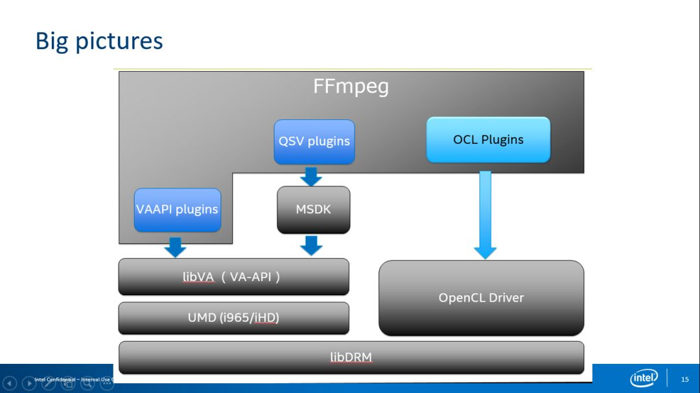

上图是对GFFmpeg硬件加速的流程概览图，大部分人可能对英特尔的两套方案有比较清晰的认识，最关键的点在于QSV方案依赖于MediaSDK，而VA-API则可以理解为将整个MediaSDK做的工作完整的放进了FFmpeg的内部，与FFmpeg融为一体，FFmpeg开发者与社区更推荐后者。现在的OCL方案最近也正不停的在有一些Patch进来，这里主要是对AVFilter的处理的过程进行硬件加速。需要说明一下，因为社区曾经有尝试用OpenCL加速X.264使其成为一个更快的Codec，但结果并不是特别好。所以用OpenCL去硬件加速Encoder，其整体性能提升并不是特别明显。

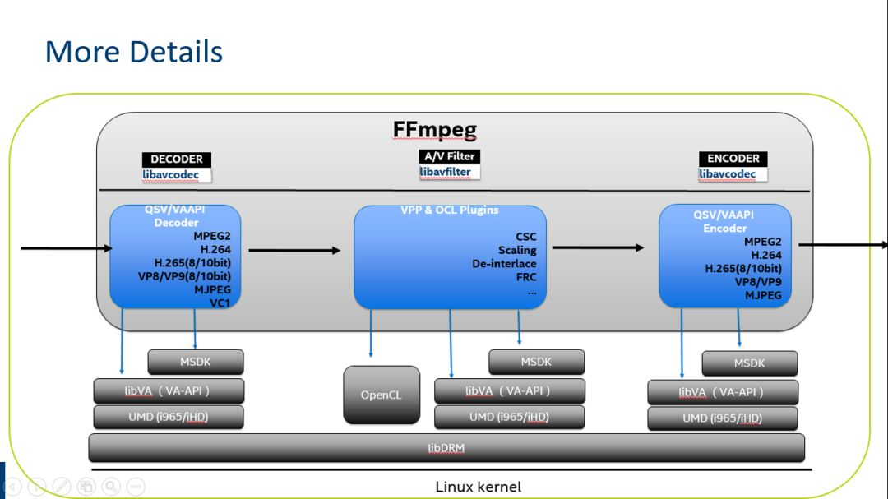

上图展示了更多细节，我们可以看到每种方案支持的Codec与VPP的功能与对应的Decoder和Encoder。

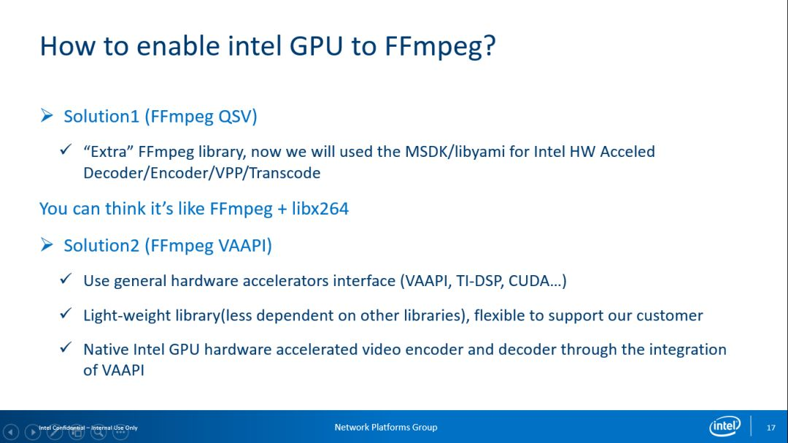

这两种方案的差异在于实际上是QSV Call第三方的Library，而VA-API直接基于VA-API 的Interface，使用FFmpeg的Native 实现而并不依赖任何第三方外部库。

VA-API

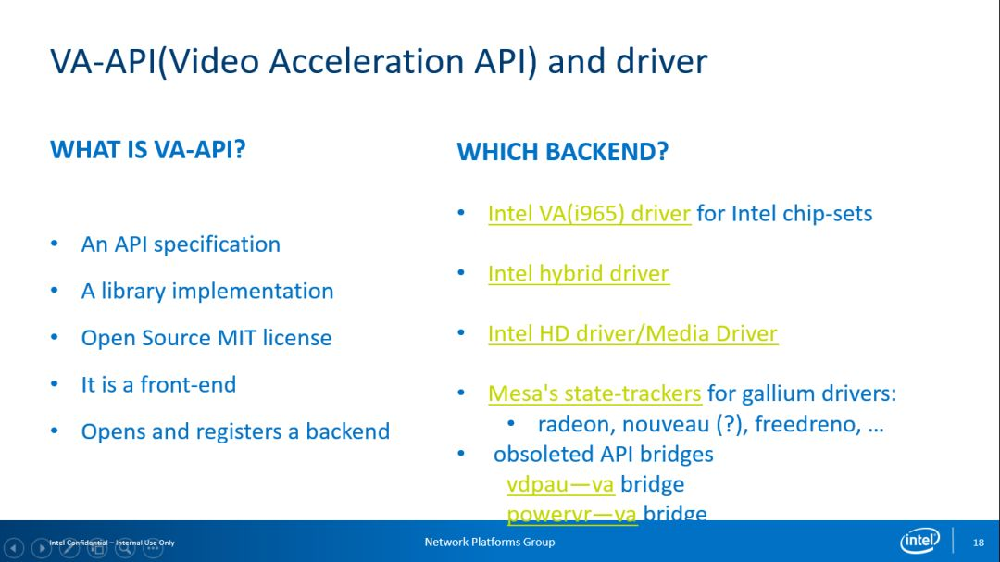

经常会有人提出疑问：

VA-API是什么？它的本质类似于Microsoft在Windows上提出的DXVA2，也就是希望用一套抽象的接口去隐藏底层硬件细节，同时又暴露底层硬件的基本能力。VA-API有多个可用后端驱动，最常见的是原先英特尔OTC提供的VA （i965）的驱动，现如今在Linux发行版本中也存在；而Hybird驱动则更多被用于当硬件的一些功能还没有准备好的情景，需要先开发一个仿真驱动；等硬件部分准备完成后再使正式驱动。第三个是iHD/Media driver，这部分驱动在去年年底时Intel便已经开源，这一套驱动对比i965驱动其图像质量和性能表现更优但稳定性较差。现在我一直在此领域工作，希望它能够更好地支持FFmpeg。Mesa’s State-Trackers主要支持AMD的GPU，但是由于现在只有Decoder而Encoder处在试验阶段一直未开放，所以AMD的GPU在FFmpeg上无法进行Encoder加速。
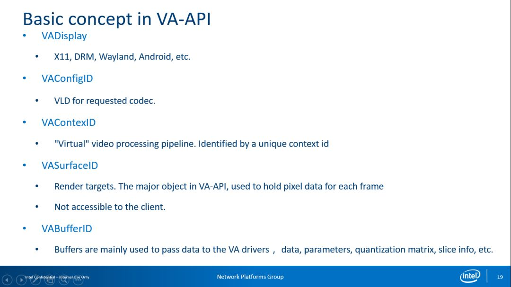

上图是VA-API的一些基本概念，在这里我就不做过多阐述。

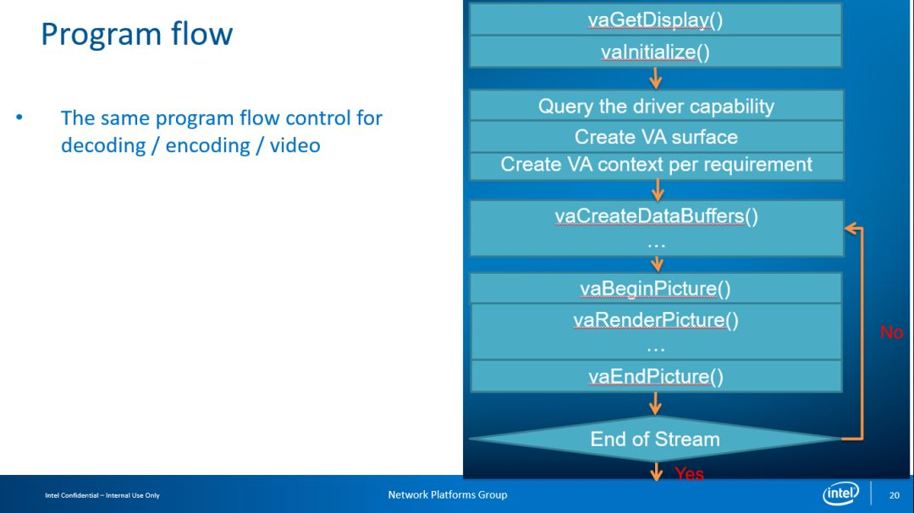

这是基于VA-API 一个基本流程。FFmpeg的VA-API也是基于此流程做的。

开放问题

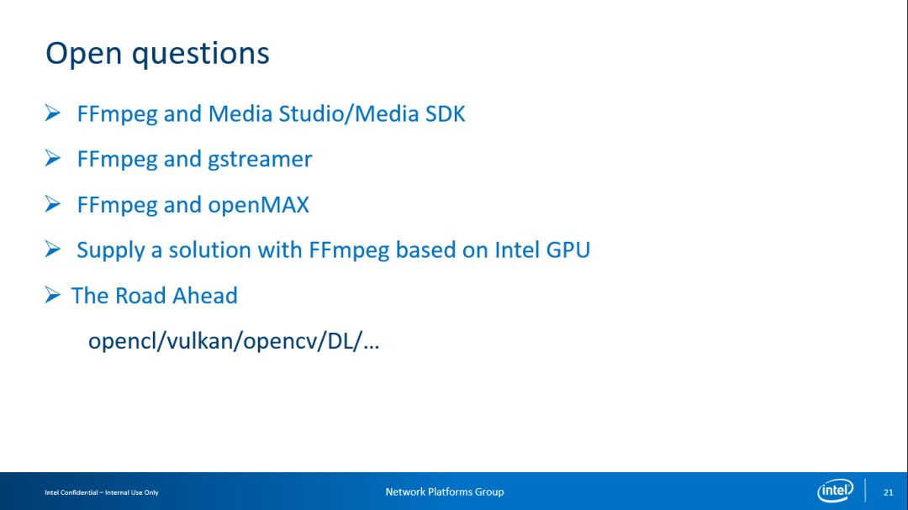

FFmpeg的QSV硬件加速方案究竟有什么优缺点？如果将 FFmpeg与GStreamer比较，什么情况下选择FFmmpeg什么情况下选择GStreamer，这是我一直在反反复复考虑的内容，还有FFmpeg与OpenMAX的差别这些（Android使用了OpenMAX）。对于未来趋势，我们期待基于FFmpeg与英特尔的GPU构建一个全开源的解决方案，将整个开发流程透明化；在之后我们也考虑OpenCL的加速 ，顺带说一句，作为OpenCL最初的支持者的Apple，在不久前的WWDC上称要放弃OpenCL，不过从现实来看，如果想在GPU或异构上进行硬件加速开发，OpenCL仍然是最优的选择。其他方案直到现在还没有OpenCL的广泛适应度。实际上OpenCL本身的推出并不是特别的成功，在OpenCL过去的十年发展中并没有出现杀手级应用；另一个趋势是，Vulkan作为OpenGL的后继者开始流行，因此业界也在考虑直接把OpenCL作为Vulkan部分合并在一起。另外，OpenCV有大量的OpenCL优化，如果你不愿意重写OpenCL的优化，可以考虑用FFmpeg与 OpenCV一起加速来构建整个流程。

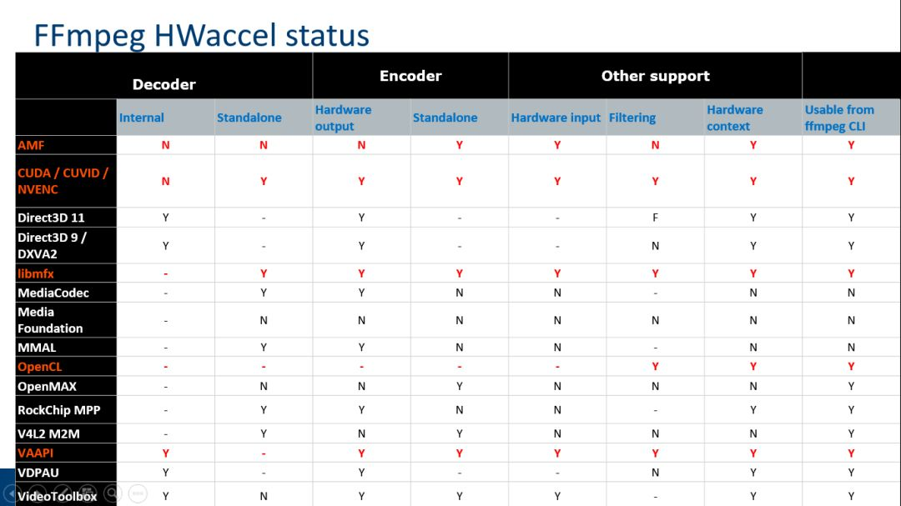

上图展示了你所见的基于各个OS与硬件厂商的硬件加速状态。大部分专注于硬件加速的开发者更关心播放器的表现，在Windows上进行硬件编码的需求并不强。

>1. VA-API是一个开启硬件加速视频处理的开源library/API，它使用ＧＰＵ加速视频处理从而减轻ＣＰＵ负担．
>
>

## 5, Q&A

**Q1：FFmpeg  Server最近的一些大改动是什么？**

A： FFmpeg  Server的代码在最新版本的FFmpeg里已经不存在了，主要是由于维护者并不积极。现在又有开发者正在重写FFmpeg Server并且已经Review到第三轮，我相信最快需要一两个月它又会回到FFmpeg里面，但和以前的FFmpeg Server完全不一样。

**Q2：FFmpeg 4.0已经有VA-API的方案吗？**

A：VA-API的Encoder从3.3.1开始支持，这部分的代码从2016年到2018年一直在进行重构，在4.0.0时VA-API的Encoder都可以支持。届时是一个开箱即用的状态。

**Q3：安卓平台现在可以硬件加速吗？**

A： VA-API的方案是英特尔的，由于英特尔的产品生态缘故，安卓的解决方案是基于MediaCodec而非VA-API，其硬件加速就目前而言只有解码加速没有编码加速。

Q4：后台的多任务转码服务器需要用硬件来编码，那么可以同时进行多少任务？如果根据硬件的核心数量来决定，那么超过性能极限是否会导致创建编码器失败？

A：如果是基于CPU的编码方案，那么编码的性能与CPU的线程数有关，而FFmpeg性能并未和CPU的核心数量构成一个线性关系；如果是基于GPU的编码方案，包括1对n的转码，这需要以官方测试为准。英特尔在官方网站的GPU参数有相关数据，这与硬件平台有非常大的关系，具有强大性能的硬件平台可以保证良好的编解码运算处理能力。

Q5：还有一个跟WebRTC相关的问题，他说这个在WebRTC 在Chrome里FFmpeg实现硬件加速有哪些，可以替换其他版本的FFmpeg吗？

A：据我所知在ChromeOS中只有当自身API硬件加速不工作的情况下才会使用FFmpeg，Chrome可以说是把FFmpeg作为一个备选方案，并没有直接用作硬件加速。

Q6：英特尔 Collabration 的客户端SDK,支持喂数据给WebRTC的，这里硬件编码是用的WebRTC内部，还是自己替换的？

A：英特尔 Collabration的客户端我不知道这个事情，在Server端采用了三套方案，一套方案是MediaSDK进行硬件加速，第二套方案是VPX以支持VP8，VP9 ，其他还有支持另外格式的方案。我无法准确推断是否会用FFmpeg进行硬件加速与软件解码，之前与内部有过相关的的交流，但最终没有决定。

Q7：还有个问题，FFmpeg有哪些Filter是使用了硬件加速，有没有这方面的加速计划？

A：现在是有这个计划，以下图片可以说明

现在已经有一些基本的硬件加速，主要是一些ColorSpace的转换，有一些Scaling，再就是 Deinterlace，FRC现在考虑OpenCL去做，因为 iHD driver这块支持应当没有了。预计更多的OpenCL会进行加速，我们希望Decoder + Filter + Encoder的整个过程都在GPU内部运算完成从而减少CPU的性能损耗，同时也希望OpenCL具有一定的灵活度。

Q8：VA-API在Linux下支持哪些型号CPU？

A：这与驱动有关，总体来说i965支持更多的处理器，iHD支持英特尔Skylake架构以后的处理器

Q9：如何提升硬件编解码的质量？

A：这是硬件编解码方面的老大难问题，每一个做硬件编解码的人都会提出类似的问题。因特尔曾提出了一个被称为FEI的解决方案，其原理是仅提供GPU中与硬件加速相关的最基本功能，而像图像质量等方面的提升则基于搜索算法等非硬件加速功能。这就使得可以让用户考虑使用自己的算法，而与计算量相关的问题则交给GPU处理，但此方案并未出现一个特别成熟的应用。

Q10：基于CPU、GPU设置FFmpeg线程数，线程数和核心数有什么对应关系？

A：其实对GPU而言处理速度已经足够快，运行多进程的转码对GPU而言基本没有什么影响。根据实测来看，例如运行4进程的转码，对CPU和GPU的消耗没有特别大的区别。但在这种情况下如果是用GPU进行，我的建议是用进程会更好管理。其次是FFmpeg自身1对n的特性使得在价格上比较敏感，这也是我们一直致力改进的重点。相信改进之后会为1对n转码带来一个比较大的提升，但就目前而言仍处于内部设计的初级阶段。

## 6,参考链接

1. [原文： FFmpeg Maintainer赵军：FFmpeg关键组件与硬件加速](https://blog.csdn.net/vn9PLgZvnPs1522s82g/article/details/81091555)
2. https://www.jianshu.com/p/7f675764704b
3. http://ffmpeg.org/documentation.html
4. [ffmpeg基础使用](https://www.jianshu.com/p/ddafe46827b7)
5. [英特尔QSV技术在FFmpeg中的实现与使用](http://www.elecfans.com/d/789787.html)

## 7,扩展

1. [Nasm编译器及简单使用方法](https://www.jianshu.com/p/0b1d7d3e7f80)