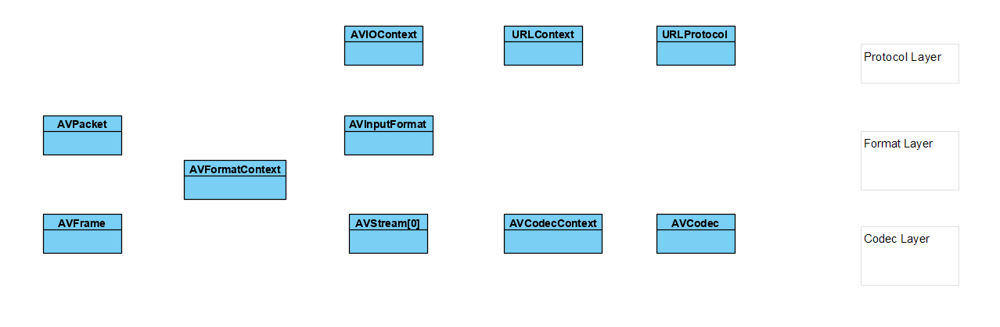

本文主要描述 FFmpeg 对外API中常用结构体

## 分类

FFMPEG中结构体很多。最关键的结构体可以分成以下几类：

a)  解协议（http,rtsp,rtmp,mms）

AVIOContext，URLProtocol，URLContext主要存储视音频使用的协议的类型以及状态。URLProtocol存储输入视音频使用的封装格式。每种协议都对应一个URLProtocol结构。（注意：FFMPEG中文件也被当做一种协议“file”）

b)        解封装（flv,avi,rmvb,mp4）

AVFormatContext主要存储视音频封装格式中包含的信息；AVInputFormat存储输入视音频使用的封装格式。每种视音频封装格式都对应一个AVInputFormat 结构。

c)        解码（h264,mpeg2,aac,mp3）

每个AVStream存储一个视频/音频流的相关数据；每个AVStream对应一个AVCodecContext，存储该视频/音频流使用解码方式的相关数据；每个AVCodecContext中对应一个AVCodec，包含该视频/音频对应的解码器。每种解码器都对应一个AVCodec结构。

d) 存数据

视频的话，每个结构一般是存一帧；音频可能有好几帧

解码前数据：AVPacket

解码后数据：AVFrame

## 关系图

## 常用结构体解析

- AVFrame

AVFrame结构体一般用于存储原始数据（即非压缩数据，例如对视频来说是YUV，RGB，对音频来说是PCM），此外还包含了一些相关的信息。比如说，解码的时候存储了宏块类型表，QP表，运动矢量表等数据。编码的时候也存储了相关的数据。因此在使用FFMPEG进行码流分析的时候，AVFrame是一个很重要的结构体。

- AVPacket  	是存储压缩编码数据相关信息的结构体
- AVFormatContext是包含码流参数较多的结构体

- AVIOContext是FFMPEG管理输入输出数据的结构体

- AVStream是存储每一个视频/音频流信息的结构体
- AVCodec是存储编解码器信息的结构体

## 参考链接

1. [FFMPEG结构体分析：AVCodecContext](https://blog.csdn.net/leixiaohua1020/article/details/14214859)

https://blog.csdn.net/leixiaohua1020/article/details/11693997