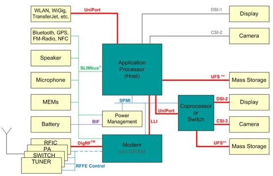
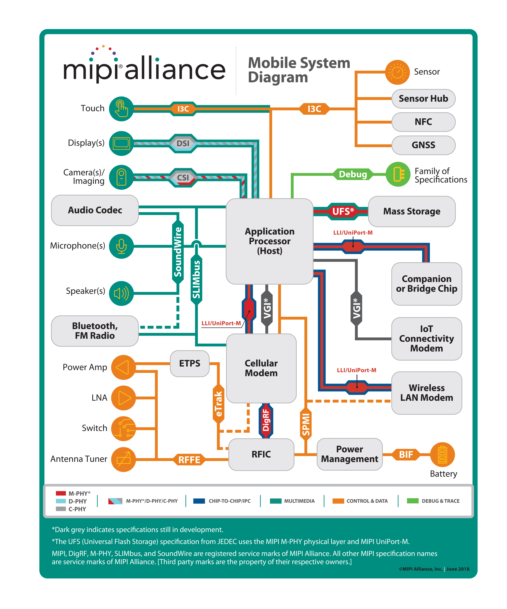
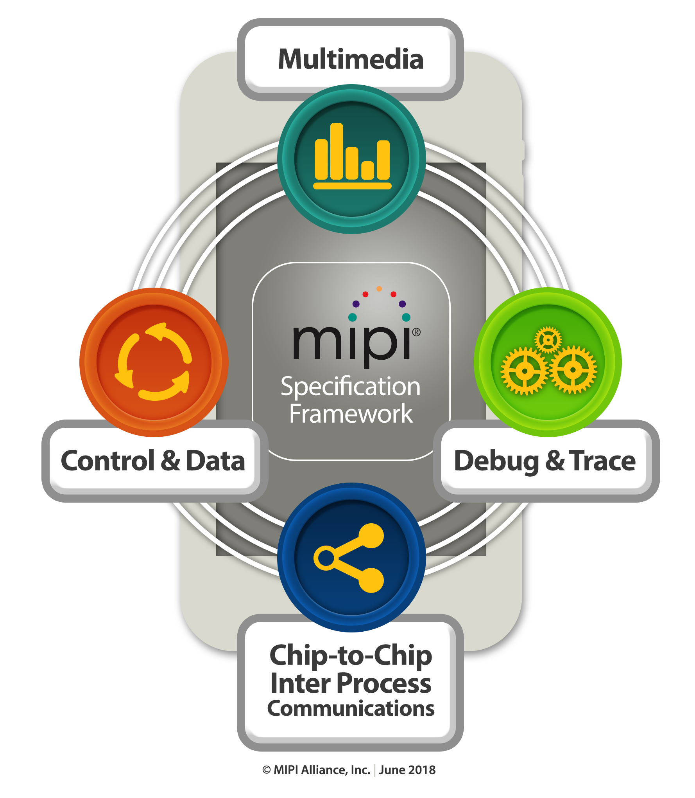
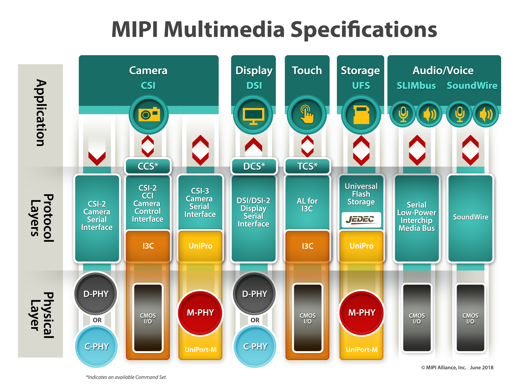

```

```


电子行业的协议往往是由大公司或者联盟所主导制定的。也只有大量的需求和实际的开发经验才能促使技术的发展和统一。在手机上有一个针对元器件接口的重要协议联盟MIPI联盟。

我们往往会说camera器件的接口是MIPI，LVDS的或者并口等等。其实这更多的是一种口头化的表示，往往当我们说MIPI的时候。我们指的是符合MIPI-CSI2协议的接口。 

#### camera领域中常见的接口协议。

- 并口：早期camera的分辨率不大的时候camera的主要接口是并口。后来MIPI制定了CPI（Camera Parallel Interface）协议来规范这个接口。

- LVDS： Camera link标准是由美国自动化工业学会AIA定制、修改、发布。其根本还是基于LVDS的传输原理。AIA的成员主要是视觉配件制造商，系统集成商，终端使用者和OEM厂商。目前在工业相机中使用的比较多。

- MIPI：由于MIPI联盟的成员多为手机和移动设备的制造或者供应商。因此MIPI协议族在移动设备领域占据了很大的地位。一般现在我们说的MIPI是指CSI2协议。之前该协议主要是建立在D-phy物理层协议的，目前新的C-phy物理层协议也在逐渐被采用。而我们常说的camera I2C接口在MIPI中有专门的一个CCI（Camera control interface）来对应


#### MIPI联盟 (MIPI Alliance)

MIPI联盟最初由四家半导体及手机巨头，ARM，Nokia，STMicroelectronics 和 TexasInstruments，于2003年创立。该组织的创立，为手机模组小型化的发展打下了坚实的基础。直到今日，MIPI组织已经在全球范围内发展了300余家成员，拥有18个工作组，其中有12个活跃的工作组

MIPI成员包括众多手持设备厂商，OEM厂商，软件供应商，半导体厂商，IP工具提供商，测试设备商，相机制造商和PC厂商。在过去的十几年里，MIPI联盟已经在手机生态圈起草了45项规格。这些规格现已不仅仅应用于每个人的手机中，在平板电脑（PAD），PC，工业电子设备，医疗领域也有广泛应用。

MIPI的全称是移动工业处理机接口（英文：  Mobile Industry Processor  Interface），所以MIPI是英文全称的首字母缩写。MIPI联盟是一个非盈利性组织。从联盟名称我们就可以看出，它建立的目的是统一移动设备的软硬件接口规格，简化移动设备从分离元器件到产品的工作，使各个厂商的处理器及芯片能以统一的规格协同工作。MIPI联盟起草的规格满足了移动设备在苛刻条件下工作要求，包括：高带宽，低功耗和低电磁干扰。

MIPI联盟目的是把手机内部的接口如摄像头、显示屏接口、射频/基带接口等标准化，从而减少手机设计的复杂程度和增加设计灵活性。MIPI联盟下面有不同的WorkGroup，分别定义了一系列的手机内部接口标准，比如摄像头接口CSI、显示接口DSI、射频接口DigRF、麦克风/喇叭接口SLIMbus等。统一接口标准的好处是手机厂商根据需要可以从市面上灵活选择不同的芯片和模组，更改设计和功能时更加快捷方便。

下图是按照MIPI的规划下一代智能手机的内部架构：




MIPI联盟有18个的工作组，分别聚焦于不同的领域。它们分别是：

1. Analog Control Interface，关注模拟控制接口；
2. Battery Interface (MIPI BIF; akind of smart battery interface)，关注电池接口；
3. Camera: camera Serial Interface， 关注相机串行接口；
4. Debug，关注调试接口；
5. DigRF，关注RF接口；
6. Display (Display Serial Interface)，关注显示串行接口；
7. High Speed SynchronousInterface，关注高速同步接口；
8. Low Latency Interface，关注低延时接口；
9. Low Speed Multipoint Link (SLIMbus)，关注低速多点连接；
10. Marketing，参与市场活动；
11. PHY，关注物理层；
12. Reduced Input/Output WorkingGroup (RIO)，关注降低输入/输出的工作量；
13. RF Front-End Working Group(RFFE)，RF前端工作组；
14. Sensor Work Group (I3C)，传感器工作组；
15. Software Investigation Group，软件调查工作组；
16. Technical Steering Group，技术导向工作组（制定技术方向）；
17. Test Working Group，测试工作组；
18. UniPro,including M-PHY,used by Mobile PCIe

#### MIPI联盟涉及范围





MIPI工作组的任务只是聚焦于移动设备的接口技术规格，如电气信号特性和接口的通信协议。工作组并不会对应用处理器（AP）和外设的所有接口制定相关标准。其它的标准委员会通过JEDEC，USB， PCI等组织进行定义。

MIPI联盟的成员根据贡献程度不同，被分为四类：

- 采用者：应用MIPI规格开发MIPI兼容产品。所有的公司都可以申请成为MIPI联盟的采用者。
- 贡献者：有所有采用者的权利，外加参与工作组定义MIPI规格的机会。
- 发起人：由委员会从贡献者中选出。每一位发起人拥有所有的贡献者权利，外加一个董事会的选举席位。
- 创始人：拥有永久的董事会席位和所有的发起人权利







#### 参考链接

1. [mipi联盟官网](https://mipi.org/about-us)