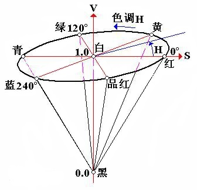

```
得道多助
```

#### `RGB`

RGB是从颜色发光的原理来设计定的，通俗点说它的颜色混合方式就好像有红、绿、蓝三盏灯，当它们的光相互叠合的时候，色彩相混，而亮度却等于两者亮度之总和，越混合亮度越高，即加法混合。

​    红、绿、蓝三个颜色通道每种色各分为256阶亮度，在0时“灯”最弱——是关掉的，而在255时“灯”最亮。当三色灰度数值相同时，产生不同灰度值的灰色调，即三色灰度都为0时，是最暗的黑色调；三色灰度都为255时，是最亮的白色调。

​    在电脑中，RGB的所谓“多少”就是指亮度，并使用整数来表示。通常情况下，RGB各有256级亮度，用数字表示为从0、1、2...直到255。注意虽然数字最高是255，但0也是数值之一，因此共256级。

#### `HSV`

HSV 即使用**色相（Hue）、饱和度（Saturation）、明度（Value）**来表示色彩的一种方式。

- 色相：将颜色使用0到360度表示，就是平常所说的颜色名称，如红色、蓝色。色相与数值按下表对应：

  | 红   | 黄   | 绿   | 青色 | 蓝色 | 品红 | 红   |
  | ---- | ---- | ---- | ---- | ---- | ---- | ---- |
  | 0    | 60   | 120  | 180  | 240  | 300  | 360  |

- 饱和度：是指色彩的纯度，饱和度越低则颜色越黯淡( 0<= S < 1)；

- 明度：即颜色的明暗程度。数值越高越接近白色，数值越低越接近黑色 ( 0 <= V < 1)；


 


#### RGB HSV转换

从 RGB 色彩表示转换到 HSV 色彩表示通过以下方式计算：

R,G,B的值在[0, 1]之间：

```bash
Max = max(R,G,B)
Min = min(R,G,B)

H =  { 0                            (if Min=Max)
       60 x (G-R) / (Max-Min) + 60  (if Min=B)
       60 x (B-G) / (Max-Min) + 180 (if Min=R)
       60 x (R-B) / (Max-Min) + 300 (if Min=G)
       
V = Max

S = Max - Min
```

从 HSV 色彩表示转换到 RGB 色彩表示通过以下方式计算：

```bash
C = S

H' = H / 60

X = C (1 - |H' mod 2 - 1|)

(R,G,B) = (V - C) (1,1,1) + { (0, 0, 0)  (if H is undefined)
                              (C, X, 0)  (if 0 <= H' < 1)
                              (X, C, 0)  (if 1 <= H' < 2)
                              (0, C, X)  (if 2 <= H' < 3)
                              (0, X, C)  (if 3 <= H' < 4)
                              (X, 0, C)  (if 4 <= H' < 5)
                              (C, 0, X)  (if 5 <= H' < 6)
```

#### 示例代码

请将色相反转（色相值加180），然后再用 RGB 色彩空间表示图片。

```python
import cv2
import numpy as np

# Read image
img = cv2.imread("imori.jpg").astype(np.float32) / 255.

# RGB > HSV
out = np.zeros_like(img)

max_v = np.max(img, axis=2).copy()
min_v = np.min(img, axis=2).copy()
min_arg = np.argmin(img, axis=2)

H = np.zeros_like(max_v)

H[np.where(max_v == min_v)] = 0
## if min == B
ind = np.where(min_arg == 0)
H[ind] = 60 * (img[..., 1][ind] - img[..., 2][ind]) / (max_v[ind] - min_v[ind]) + 60
## if min == R
ind = np.where(min_arg == 2)
H[ind] = 60 * (img[..., 0][ind] - img[..., 1][ind]) / (max_v[ind] - min_v[ind]) + 180
## if min == G
ind = np.where(min_arg == 1)
H[ind] = 60 * (img[..., 2][ind] - img[..., 0][ind]) / (max_v[ind] - min_v[ind]) + 300
    
V = max_v.copy()
S = max_v.copy() - min_v.copy()

# Transpose Hue
H = (H + 180) % 360

# HSV > RGB

C = S
H_ = H / 60
X = C * (1 - np.abs( H_ % 2 - 1))
Z = np.zeros_like(H)

vals = [[Z,X,C], [Z,C,X], [X,C,Z], [C,X,Z], [C,Z,X], [X,Z,C]]

for i in range(6):
    ind = np.where((i <= H_) & (H_ < (i+1)))
    out[..., 0][ind] = (V-C)[ind] + vals[i][0][ind]
    out[..., 1][ind] = (V-C)[ind] + vals[i][1][ind]
    out[..., 2][ind] = (V-C)[ind] + vals[i][2][ind]

out[np.where(max_v == min_v)] = 0
out = (out * 255).astype(np.uint8) 

# Save result
cv2.imwrite("out.jpg", out)
cv2.imshow("result", out)
cv2.waitKey(0)
cv2.destroyAllWindows()

```


#### 参考链接

https://github.com/KuKuXia/Image_Processing_100_Questions