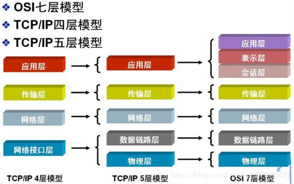
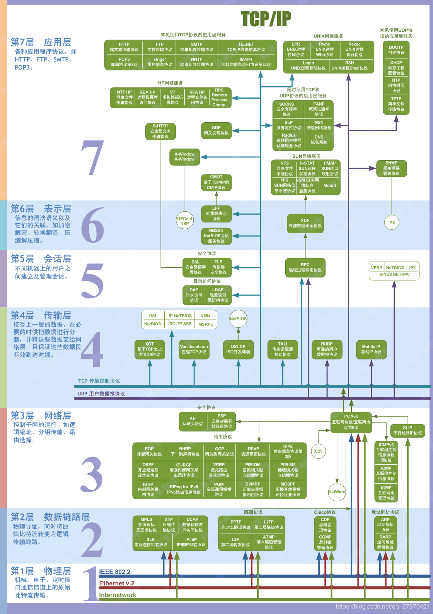

二、七层参考模型概述

2.1、物理层

    在OSI参考模型中，物理层（Physical Layer）是参考模型的最低层。物理层的作用是实现相邻计算机节点之间比特流的透明传送，尽可能屏蔽掉具体传输介质和物理设备的差异。“透明传送比特流”表示经实际电路传送后的比特流没有发生变化，对传送的比特流来说，这个电路好像是看不见的。

2.2、数据链路层

    数据链路层（Data Link Layer）是OSI模型的第二层，负责建立和管理节点间的链路。该层的主要功能是：通过各种控制协议，将有差错的物理信道变为无差错的、能可靠传输数据帧的数据链路。在计算机网络中由于各种干扰的存在，物理链路是不可靠的。因此，这一层的主要功能是在物理层提供的比特流的基础上，通过差错控制、流量控制方法，使有差错的物理线路变为无差错的数据链路，即提供可靠的通过物理介质传输数据的方法。数据链路层的具体工作是接收来自物理层的位流形式的数据，并封装成帧，传送到上一层；同样，也将来自上层的数据帧，拆装为位流形式的数据转发到物理层；并且，还负责处理接收端发回的确认帧的信息，以便提供可靠的数据传输。

2.3、网络层

    网络层（Network Layer）是OSI模型的第三层，它是OSI参考模型中最复杂的一层。它在下两层的基础上向资源子网提供服务。其主要任务是：通过路由选择算法，为报文或分组通过通信子网选择最适当的路径。具体地说，数据链路层的数据在这一层被转换为数据包，然后通过路径选择、分段组合、顺 序、进/出路由等控制，将信息从一个网络设备传送到另一个网络设备。一般地，数据链路层是解决同一网络内节点之间的通信，而网络层主要解决不同子网间的通信。例如在广域网之间通信时，必然会遇到路由（即两节点间可能有多条路径）选择问题。

2.4、传输层

    传输层（Transport Layer）是OSI模型的第4层。因此该层是通信子网和资源子网的接口和桥梁，起到承上启下的作用。该层的主要任务是：向用户提供可靠的端到端的差错和流量控制，保证报文的正确传输。传输层的作用是向高层屏蔽下层数据通信的细节，即向用户透明地传送报文。该层常见的协议：TCP/IP中的TCP协议和UDP协议。传输层提供会话层和网络层之间的传输服务，这种服务从会话层获得数据，并在必要时，对数据进行分割。然后，传输层将数据传递到网络层，并确保数据能正确无误地传送到网络层。因此，传输层负责提供两节点之间数据的可靠传送，当两节点的联系确定之后，传输层则负责监督工作。综上，传输层的主要功能如下：监控服务质量。

2.5、会话层

    会话层（Session Layer）是OSI模型的第5层，是用户应用程序和网络之间的接口，主要任务是：向两个实体的表示层提供建立和使用连接的方法。将不同实体之间的表示层 的连接称为会话。因此会话层的任务就是组织和协调两个会话进程之间的通信，并对数据交换进行管理。 用户可以按照半双工、单工和全双工的方式建立会话。当建立会话时，用户必须提供他们想要连接的远程地址。而这些地址与MAC（介质访问控制子层）地址或网络层的逻辑地址不同，它们是为用户专门设计的，更便于用户记忆。

2.6表示层

    表示层（Presentation Layer）是OSI模型的第六层，它对来自应用层的命令和数据进行解释，对各种语法赋予相应的含义，并按照一定的格式传送给会话层。其主要功能是“处理用户信息的表示问题，如编码、数据格式转换和加密解密”等。

2.7、应用层

    应用层（Application Layer）是OSI参考模型的最高层，它是计算机用户，以及各种应用程序和网络之间的接口，其功能是直接向用户提供服务，完成用户希望在网络上完成的各种工作。它在其他6层工作的基础上，负责完成网络中应用程序与网络操作系统之间的联系，建立与结束使用者之间的联系，并完成网络用户提出的各种网络服务及 应用所需的监督、管理和服务等各种协议。此外，该层还负责协调各个应用程序间的工作。

三、TCP/IP详情图

