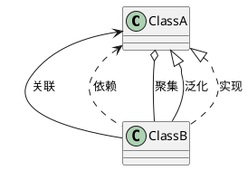

- 类图显示了系统的静态结构 
- 类：**类图**中的主要元素，用**矩形**表示。
- 矩形的**上层表示类名**、**中层表示属性**、**下层表示方法**。 
- 类之间的关系：**关联、依赖、聚集、泛化和实现**五种。

五种类间关系的图形表示介绍：

| 关联         | 依赖         | 聚集     | 泛化 extends       | 实现 implements    |
| ------------ | ------------ | -------- | ------------------ | ------------------ |
| 带实线的箭头 | 带虚线的箭头 | 菱形箭头 | 带实线的三角形箭头 | 带虚线的三角形箭头 |

## 参考链接

1. [PlantUML 之类图](https://blog.csdn.net/junhuahouse/article/details/80767632)