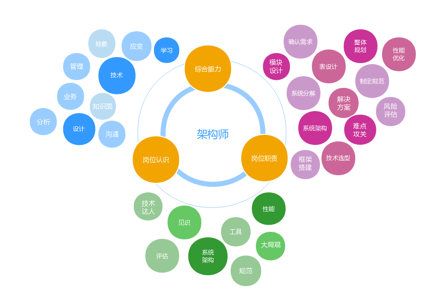

**1. 好的架构师,一定是好的程序员**

没写过N年代码,何来指点江山?

没做过N年架构实践,何以指导避坑?

只有框架,没有细节,何以服众?

bad case : 项目失败了,架构师点评技术团队"能力差"

bad case : 项目失败了,技术团队点评架构师"只会忽悠"

**2. 跨域知识**

如果只是一个方向能力强,顶多算技术高手

除了一个/几个方向的专家, 对端, 站点, 服务, 数据等多方面均要有所了解

对研发, 测试, 运维, 安全均要有所了解

除了技术, 对业务, 产品, 项目管理均要有所了解

**3. "把问题讲清楚"是一项很重要的能力**

懂得把复杂的事物进行抽象,简单化

懂得把抽象的事物进行形象,具体化

懂得把形象的事物落到白板上,画出来

懂得把白板上的事物讲出来

bad case : 有些架构师,自己懂, 但讲不出来.

**4. 落地能力, 沟通能力, 执行力**

光讲清楚还不够, 能落地实现, 才是真功夫

同样是技术人,沟通切忌颐指气使, 发号施令

别把高大上的名词天天挂在嘴上, 落地了什么, 才是价值

## 参考链接

https://www.cnblogs.com/ukzq/p/11411444.html