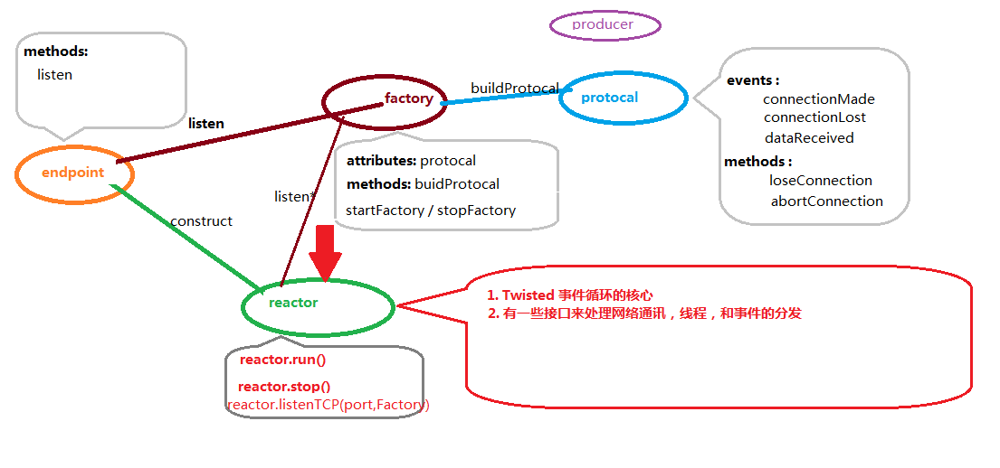

```

```


> twisted 的基本框架
>


# twisted 的基本框架





 twisted网络框架的三个基础模块：Protocol, ProtocolFactory, Transport.这三个模块是构成twisted服务器端与客户端程序的基本。

- Protocol：Protocol对象实现协议内容，即通信的内容协
- ProtocolFactory: 是工厂模式的体现，在这里面生成协议
- Transport: 是用来收发数据，服务器端与客户端的数据收发与处理都是基于这个模块  


根据在猎聘网上搜索的结果，tornado 的结果明显多于 twisted，做为一个练手的框架  而且是web服务器，我打算还是选择易于上手的tornado。

#### 参考链接

1. [](https://www.cnblogs.com/xuelu/p/4127112.html)
2. [非常简单的Python HTTP服务](https://www.cnblogs.com/xuelu/p/4127112.html)
3. https://blog.csdn.net/scrat_kong/article/details/88132364
4. [对比Tornado和Twisted两种异步Python框架](https://www.cnblogs.com/whiterock/p/7593378.html)

5. python 网络框架twisted基础学习及详细讲解](https://blog.csdn.net/nginxs/article/details/77197505)

参考链接

https://blog.csdn.net/nginxs/article/details/77197505

https://twistedmatrix.com/trac/


