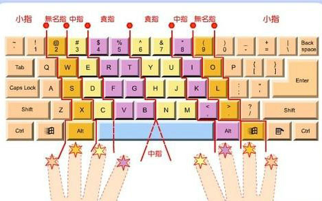

```
以正治国，以奇用兵，以无事取天下
																		-庄子
```


**盲打最关键的就是熟悉人的每个手指和键盘上字母的对应关系**，




第一天先练习A-G，不断地敲击这几个字母，

第二天敲H-N和O-T，反复地敲，

第三天敲最后的U-Z，

最后一天把A-Z反复地敲，

最后开始学习在主键盘区敲1-9，这时间大约用了4天时间。只要你记住了字母键位，其他的就不是问题了。


在使用金山打字通 练一练看看 ：）