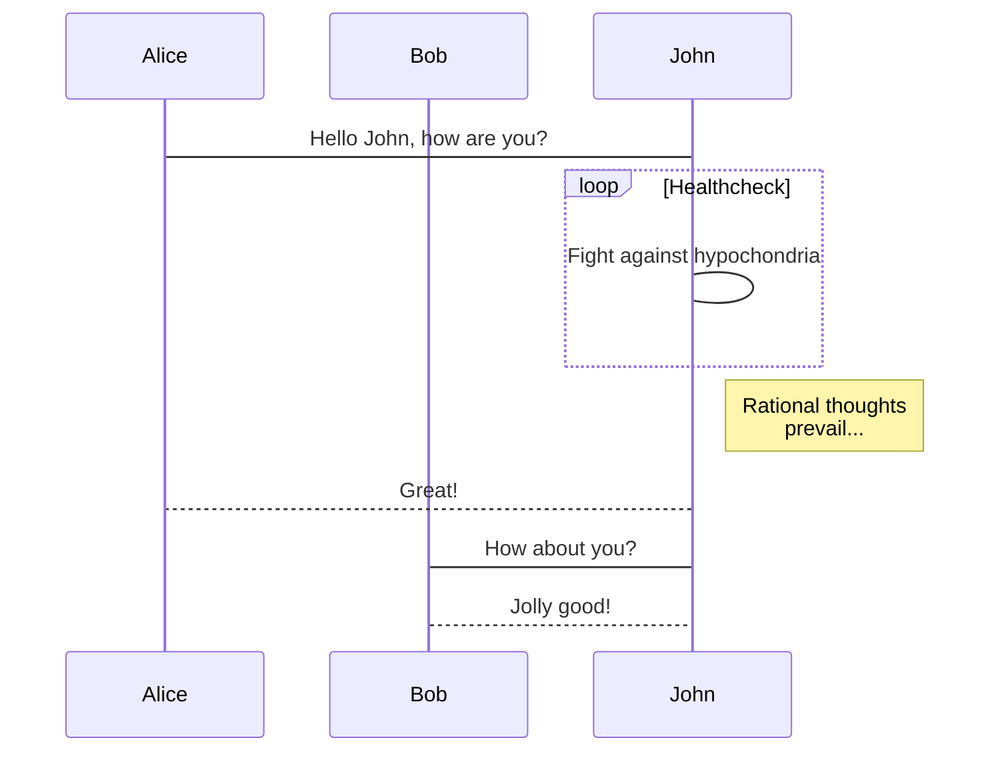

#### 参考链接

1. [Typora画流程图、时序图(顺序图)、甘特图（转）](https://www.jianshu.com/p/7ddbb7dc8fec)
2. [Draw Diagrams With Markdown](http://support.typora.io/Draw-Diagrams-With-Markdown/)
3. [mermaidjs](https://mermaidjs.github.io/)
4. https://blog.csdn.net/wangyaninglm/article/details/52887045

