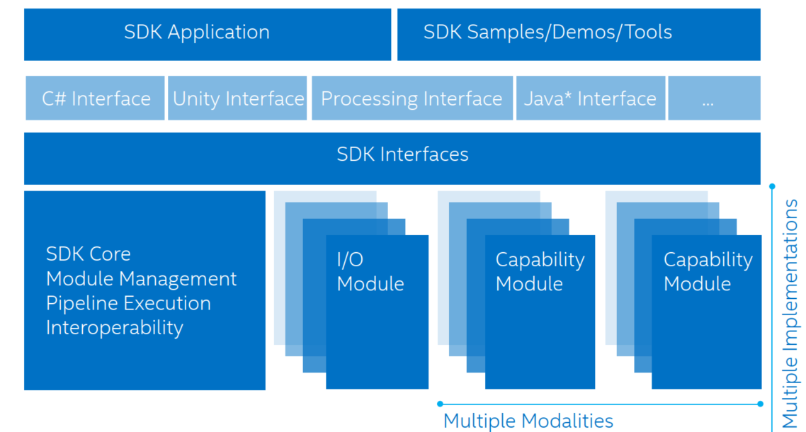

## Intel RealSense SDK Architecture 

- SDK core： SDK 由简单几部分组成，最基础组件是SDK core，它的主要功能之一是：管理两类型的模块

  - 输入输出模块
  - 能力模块

  两类模块提供SDK的功能实现。

- I/O modules ： i/o  模块从设备抓取数据，发送数据到输出设备或者能力模块。能力模块包含各种模式检测和识别算法 比如：脸部跟踪和识别，手部跟踪，姿势识别 和语音识别和合成。

- SDK core 的另一个核心职能是 管理execution pipeline 。有可能有多个模块 同时包含在管道中，因此管道必须有一个管理器。如果你想用在您的应用程序中多个摄像头或其他输入设备，您可能需要多个管道，每个管道都有自己的管道经理。

## 参考链接

1. [RealSenseSDKdesignGuidelinesGold.pdf](https://software.intel.com/sites/default/files/managed/0b/0a/RealSenseSDKdesignGuidelinesGold.pdf)